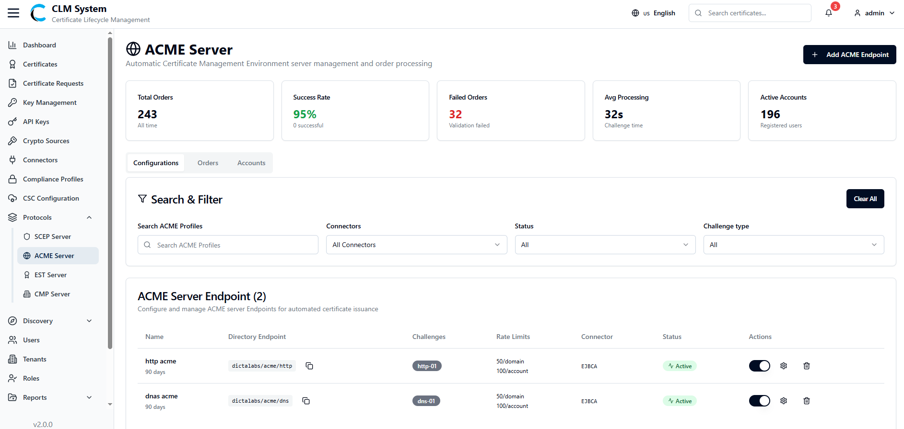
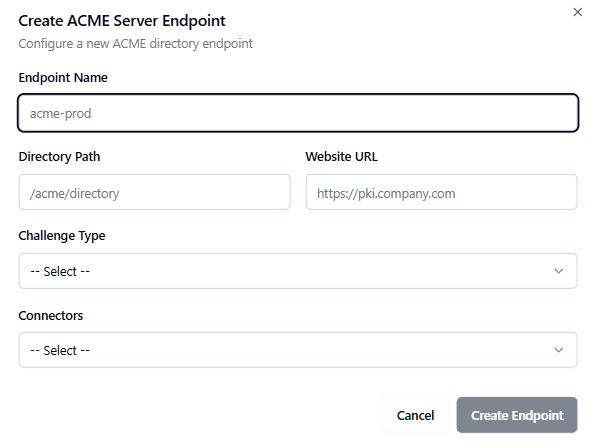

# Managing ACME Server

## Overview
*(Paste the full ACME Server Overview from the PDF — describe what the ACME protocol is, its purpose in CLM, and how it automates certificate issuance and renewal for integrated systems.)*

## Accessing ACME Server
*(Insert the detailed instructions for navigating to the ACME Server module in the CLM Admin Portal.)*

## Search and Filter
*(Paste the content explaining how to search, sort, or filter ACME profiles.)*
- Use the search bar to locate ACME profiles by name or associated CA.  
- Apply filters for status, creation date, or challenge type (HTTP-01, DNS-01, etc.).  

## ACME Profiles List
*(Paste the description of the ACME profiles list view — include column headings and available management actions.)*
- Profile Name  
- Associated CA  
- Challenge Type  
- Status  
- Actions (View, Edit, Delete)

## Creating a New ACME Profile
*(Paste the detailed process for adding a new ACME profile, converting numbered steps to bullet points.)*
- Click **Add Profile** or **Create New ACME Profile**.  
- Enter profile name and select the issuing CA.  
- Choose the challenge type (e.g., HTTP-01, DNS-01).  
- Define authorization and certificate renewal settings.  
- Save the profile.  

## Navigate to the ACME Server Page
*(Include any detailed navigation screenshots or explanation from the PDF.)*

## Fill in the ACME Profile Form
*(Paste detailed breakdown of each configuration field in the form.)*
- Profile Name  
- Description  
- Associated CA  
- Challenge Type  
- Domain Validation Settings  
- Validity and Renewal Options  

## Save the ACME Profile
*(Include instructions on saving and validation.)*
- Review the details entered.  
- Click **Save** to finalize the new ACME profile.  
- Verify that the profile appears in the list view.  

## Post-Creation
*(Paste any content from the PDF about testing or verifying ACME integrations after profile creation.)*
- Test certificate issuance using an ACME client (e.g., Certbot).  
- Verify enrollment logs.  
- Confirm successful issuance and renewal.  

