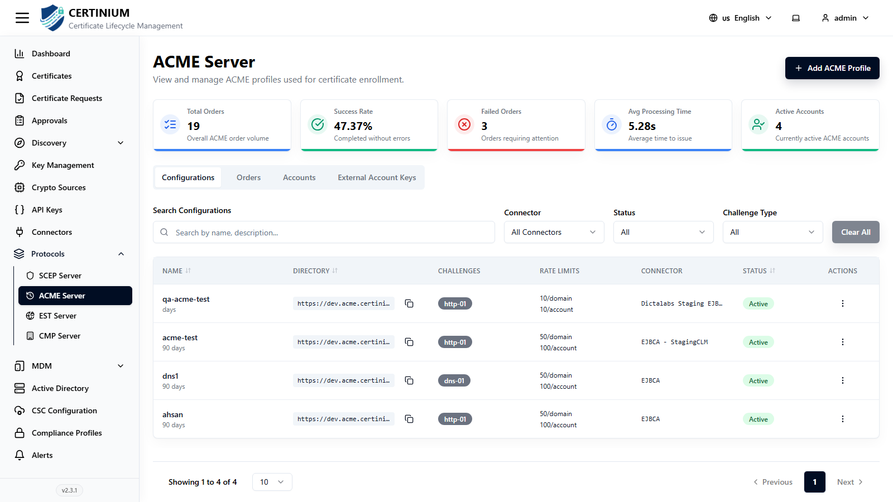
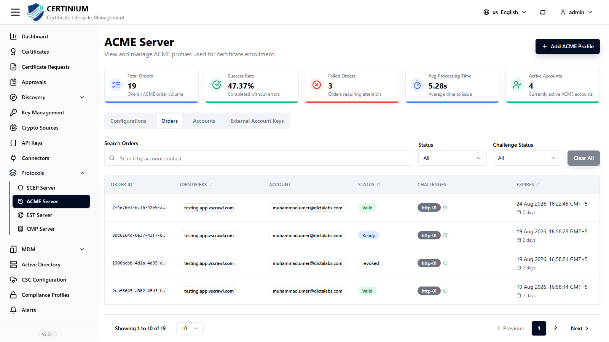
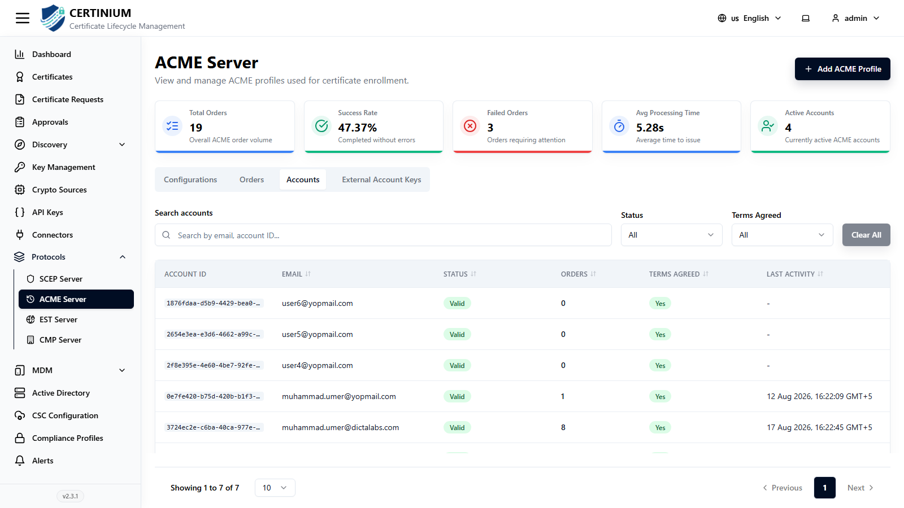
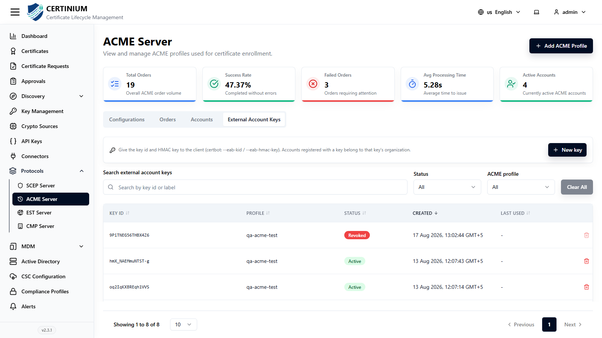
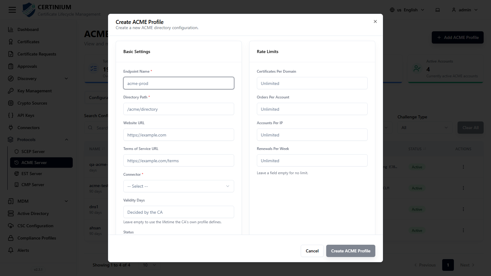

# ACME Server

**ACME** (Automatic Certificate Management Environment) profiles let clients (certbot and similar tools) enroll for certificates automatically, following the same protocol used by Let's Encrypt.

## Accessing ACME Server

From the sidebar, select **Protocols → ACME Server**.

### ACME Server overview

Summary cards show **Total Orders**, **Success Rate**, **Failed Orders**, **Avg Processing Time**, and **Active Accounts**.

The page has four tabs:

### Configurations tab

The list of ACME profiles: **Name**, **Directory** (endpoint URL), **Challenges** supported, **Rate Limits**, **Connector**, **Status**, and row actions. Filter by **Connector**, **Status**, or **Challenge Type**.

### Orders tab

Every certificate order placed against your ACME profiles: **Order ID**, **Identifiers** (domains), **Account** (the requesting ACME account email), **Status** (e.g. Ready, Valid, revoked), **Challenges** and their pass/fail state, and **Expires**. Filter by **Status** or **Challenge Status**.

### Accounts tab

The ACME accounts that have registered against your profiles — one per unique client key/contact email.

### External Account Keys tab

External Account Binding (EAB) keys, used to tie an ACME client's account registration to a specific organization. Give the **Key ID** and **HMAC key** to the client (e.g. `certbot --eab-kid / --eab-hmac-key`) — accounts registered with a given key automatically belong to that key's organization. Click **New key** to generate one, scoped to an ACME profile. Filter by **Status** or **ACME profile**.

## Creating a new ACME profile

Click **Add ACME Profile** (from any tab) to open the profile form:

**Basic Settings**

- **Endpoint Name*** — e.g. `acme-prod`.
- **Directory Path*** — e.g. `/acme/directory`.
- **Website URL**, **Terms of Service URL**
- **Connector*** — the CA/connector issuing certificates through this profile.
- **Validity Days** — leave blank to let the CA decide.
- **Status** — Active or Inactive.

**Rate Limits** (leave blank for unlimited)

- **Certificates Per Domain**
- **Orders Per Account**
- **Accounts Per IP**
- **Renewals Per Week**

**Supported Challenges** — which ACME challenge types are accepted, e.g. `http-01`, `dns-01`.

**Key Types & Security**

- **Supported Key Types** — e.g. RSA, ECDSA.
- **Certificate Approval** — e.g. "Issue immediately" or route through [Approvals](approvals.md).
- **Require Terms Acceptance** — clients must accept the Terms of Service URL above.
- **Require External Account Binding** — clients must present a valid EAB key/HMAC pair (see the External Account Keys tab) to register.

Click **Create ACME Profile** to save.
