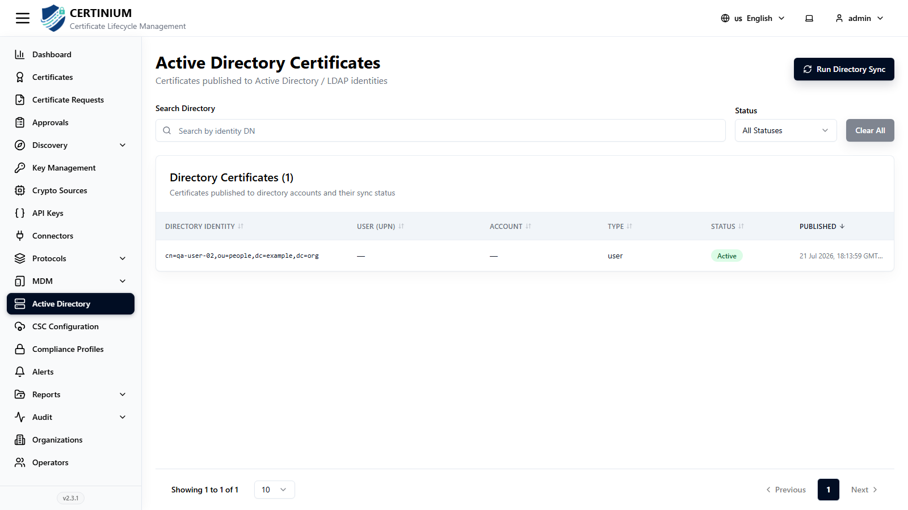

# Active Directory

!!! note "Optional integration"
    Only relevant if you publish certificates to an on-prem **Active Directory / LDAP** environment. Skip this section otherwise.

**Active Directory** shows certificates CLM has published to Active Directory / LDAP identities — for example, via a [SCEP](scep_server.md) or [EST](est_server.md) profile with **Publish to AD** enabled.

## Accessing Active Directory

From the sidebar, select **Active Directory**.

### Search and filter

- **Search Directory** — search by identity DN.
- **Status** — narrow by publish status.
- **Clear All** — resets all filters.

### Directory Certificates list

| Column | Description |
|---|---|
| Directory Identity | The full distinguished name of the AD/LDAP identity the certificate was published to. |
| User (UPN) | The identity's user principal name, if applicable. |
| Account | The associated account, if applicable. |
| Type | The identity type, e.g. `user`. |
| Status | Sync status, e.g. Active. |
| Published | When the certificate was published to the directory. |

Use **Run Directory Sync** (top right) to re-sync certificate-publishing status against Active Directory on demand.

!!! note
    This page tracks certificates CLM has *published* to AD. To *discover* certificates that already exist in AD/AD CS, use [Discovery → AD CS](discovery.md#active-directory-ad-cs-discovery) instead.
