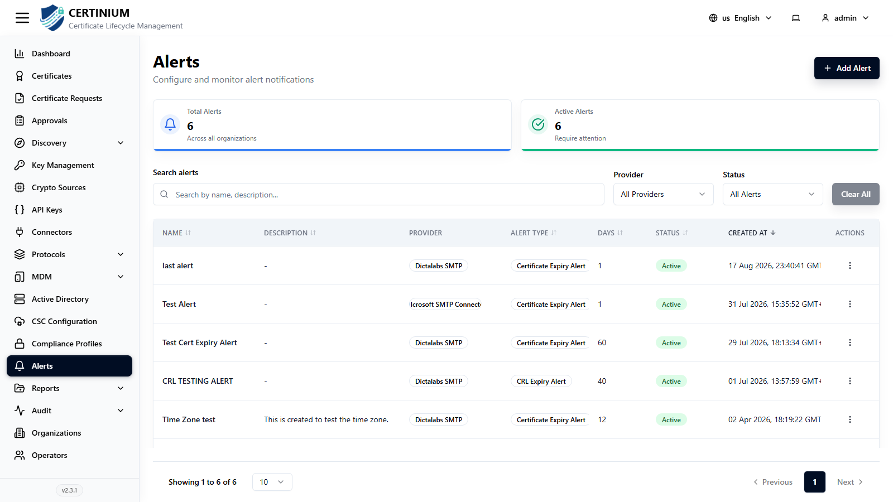
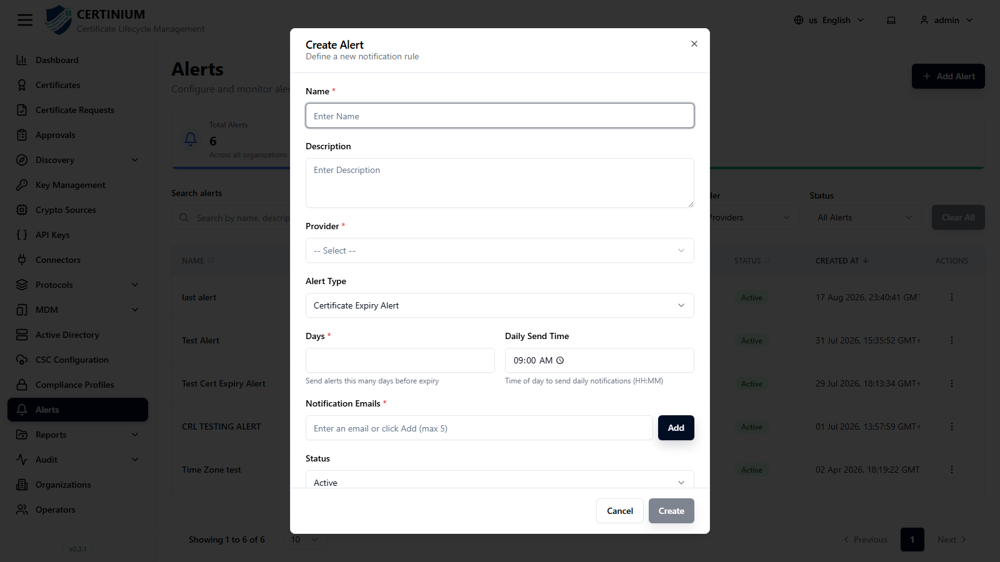

# Alerts

**Alerts** configures automated email notifications for certificate and CRL expiry.

## Accessing Alerts

From the sidebar, select **Alerts**.

### Alerts overview

Summary cards show **Total Alerts** and **Active Alerts** (across all organizations).

### Search and filter

- **Search alerts** — by name or description.
- **Provider**, **Status** — narrow the list.
- **Clear All** — resets all filters.

### Alerts list

| Column | Description |
|---|---|
| Name | Alert name. |
| Description | Optional description. |
| Provider | Which SMTP [connector](connectors.md) sends the alert email. |
| Alert Type | `Certificate Expiry Alert` or `CRL Expiry Alert`. |
| Days | How many days before expiry the alert fires. |
| Status | Active or Inactive. |
| Created At | Creation timestamp. |
| Actions | Row-level actions. |

## Creating a new alert

1. Click **Add Alert** (top right).
2. Fill in the form:

    

    - **Name***, **Description**
    - **Provider*** — an SMTP connector (see [Connectors](connectors.md)) to send the alert through.
    - **Alert Type** — `Certificate Expiry Alert` or `CRL Expiry Alert`.
    - **Days*** — how many days before expiry to send the alert.
    - **Daily Send Time** — the time of day the alert is sent, if it fires daily.
    - **Notification Emails*** — up to 5 recipient addresses; type an address and click **Add** for each.
    - **Status** — Active or Inactive.

3. Click **Create** to save.
