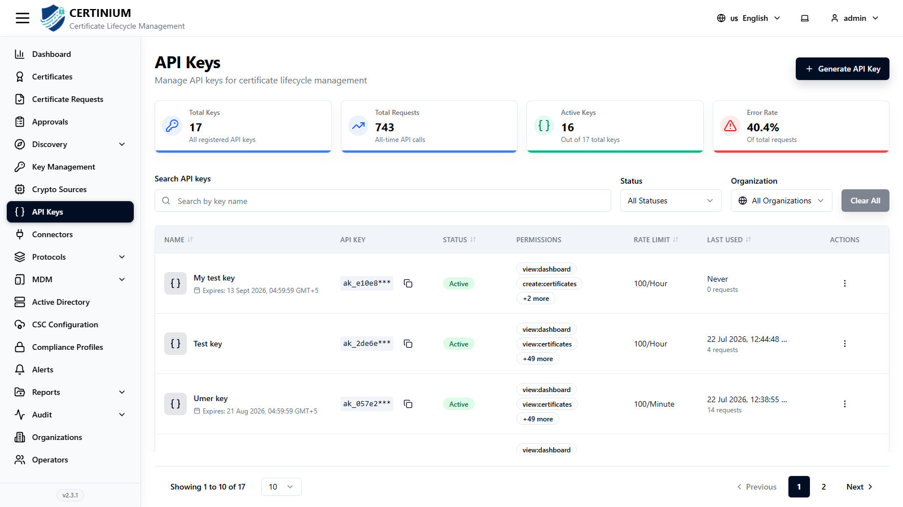
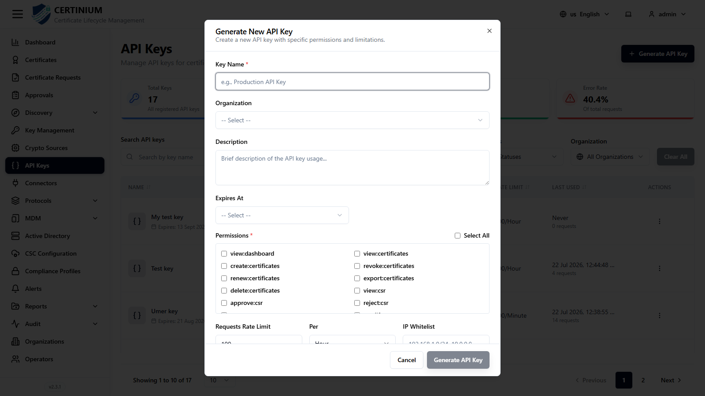

# API Keys

**API Keys** let external systems and scripts call the CLM API directly, without an interactive login. Each key carries its own scoped set of permissions, an optional expiry, and a rate limit.

!!! note "Optional integration"
    Only relevant if you need programmatic/API access to CLM rather than working entirely through the UI. Skip this section otherwise. See [CSC Configuration](csc_configuration.md) for the signing-API configuration page.

## Accessing API Keys

From the sidebar, select **API Keys**.



### API Keys overview

Summary cards show **Total Keys**, **Total Requests**, **Active Keys**, and **Error Rate**.

### Search and filter

- **Search API keys** — by key name.
- **Status**, **Organization** — narrow the list.
- **Clear All** — resets all filters.

### API Keys list

| Column | Description |
|---|---|
| Name | The key's label, plus its expiry date if set. |
| API Key | A masked preview of the key value (the full value is only shown once, at creation). |
| Status | Active or Inactive. |
| Permissions | The first couple of granted permissions, plus a "+N more" count. |
| Rate Limit | e.g. `100/Hour`, `100/Minute`. |
| Last Used | Timestamp and request count, or "Never". |
| Actions | Row-level actions. |

## Generating a new API key

1. Click **Generate API Key** (top right).
2. Fill in the form:

    

    - **Key Name*** — e.g. "Production API Key".
    - **Organization** — scopes the key to one organization.
    - **Description**
    - **Expires At** — set an expiry, or leave open-ended.
    - **Permissions*** — a fixed checklist of scoped permission strings, mirroring the same permission set used by [Roles](roles.md) (e.g. `view:certificates`, `create:csr`, `manage:roles`, `view:reports`). Use **Select All** to grant every permission, or pick individually.
    - **Requests Rate Limit** and **Per** (Hour/Minute/Day) — caps how many requests the key can make in the given window.
    - **IP Whitelist** — optionally restrict the key to specific IPs or CIDR ranges (e.g. `192.168.1.0/24, 10.0.0.0/8`).

3. Click **Generate API Key** to save. The full key value is displayed once — copy and store it securely, since CLM only shows the masked value afterward.

!!! warning
    Treat an API key like a password. Anyone with the key value and its granted permissions can act against your CLM instance without needing a separate operator login.

### Using an API key

Send the key as a bearer token on each request:

```
Authorization: Bearer <your-api-key>
```

Calls that exceed the granted permissions, rate limit, or IP whitelist are rejected by the API.
