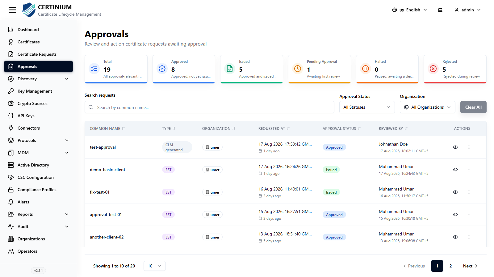

# Approvals

**Approvals** is where administrators review and act on certificate requests that were flagged as **Requires Approval** — from [Certificate Requests](certificate_requests.md), or from a protocol profile ([SCEP](scep_server.md), [EST](est_server.md), [CMP](cmp_server.md)) or [connector](connectors.md) with **Require Manual Approval** enabled.

## Accessing Approvals

From the sidebar, select **Approvals**.

### Approvals overview

Summary cards show the full lifecycle of approval-relevant requests:

- **Total** — all approval-relevant requests.
- **Approved** — approved, not yet issued.
- **Issued** — approved and issued.
- **Pending Approval** — awaiting first review.
- **Halted** — paused, awaiting a decision.
- **Rejected** — rejected during review.

### Search and filter

- **Search requests** — by common name.
- **Approval Status**, **Organization** — narrow the list.
- **Clear All** — resets all filters.

### Approvals list

| Column | Description |
|---|---|
| Common Name | The request's common name. |
| Type | Where the request came from, e.g. `EST`, `SCEP`, or `CLM generated`. |
| Organization | Owning organization. |
| Requested At | When the request was submitted, with a relative "time ago". |
| Approval Status | Approved, Rejected, Discarded, or Pending. |
| Reviewed By | The operator who made the decision, and when. |
| Actions | An eye icon opens the request detail; the **⋮** menu exposes decision actions for requests still awaiting review. |

## Reviewing a request

Click the eye icon on any row to open its detail view, where you can inspect the request's full subject information before deciding. For a request still in **Pending Approval**, use the row's action menu to approve, reject, or halt it. Once a decision is recorded, the **Approval Status** and **Reviewed By** columns update immediately, and — if approved — the request becomes eligible for issuance from [Certificates](certificates.md).
