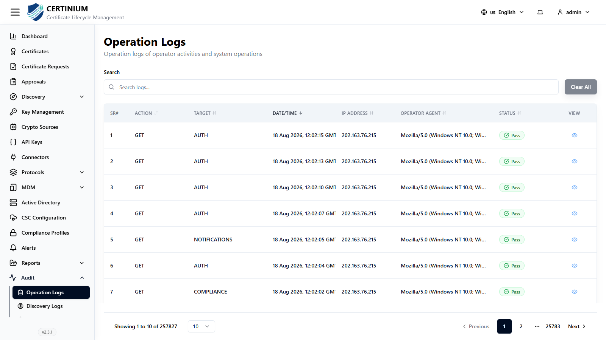
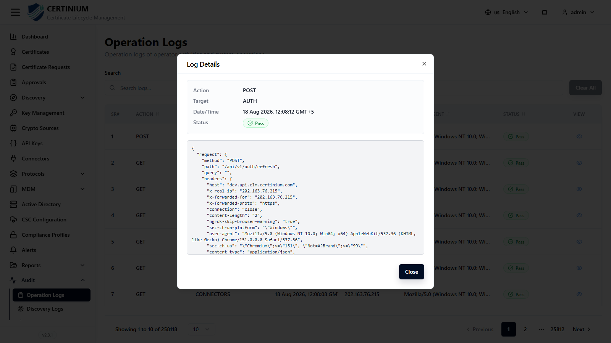
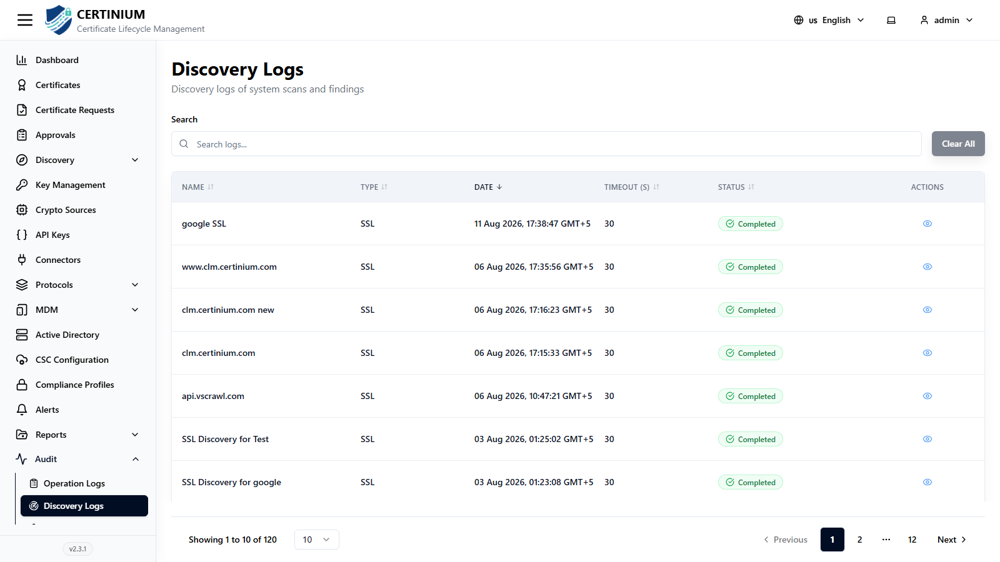
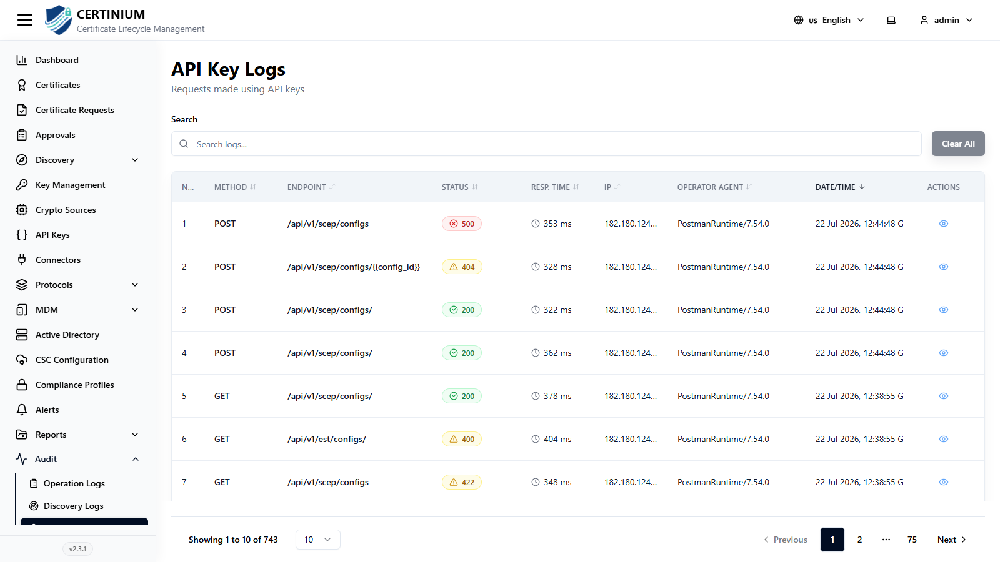

# Audit

**Audit** provides the full history of activity in CLM, split across three logs: **Operation Logs**, **Discovery Logs**, and **API Key Logs**.

## Operation Logs

Every action performed by an operator or the system.

From the sidebar, select **Audit → Operation Logs**.

| Column | Description |
|---|---|
| Sr# | Row number. |
| Action | The HTTP method / action performed, e.g. `GET`, `POST`. |
| Target | What the action targeted, e.g. `AUTH`. |
| Date/Time | When the action occurred. |
| IP Address | Source IP. |
| Operator Agent | The client's user agent string. |
| Status | `Pass` or a failure indicator. |
| View | Opens the full log detail. |

Click the **eye** icon on any row to see the full detail, including the raw request:

The detail dialog shows **Action**, **Target**, **Date/Time**, **Status**, and a raw JSON block with the request method, path, query string, and headers — useful when investigating exactly what a client sent.

## Discovery Logs

Every [Discovery](discovery.md) scan that has run.

From the sidebar, select **Audit → Discovery Logs**.

| Column | Description |
|---|---|
| Name | The discovery task's name. |
| Type | Which discovery type ran (SSL, SSH, AWS, etc.). |
| Date | When the scan ran. |
| Timeout (s) | The configured timeout for that run. |
| Status | Scan outcome. |
| Actions | View details or results. |

## API Key Logs

Every request made using an [API key](api_keys.md).

From the sidebar, select **Audit → API Key Logs**.

| Column | Description |
|---|---|
| No. | Row number. |
| Method | HTTP method used. |
| Endpoint | The API endpoint called. |
| Status | HTTP response status. |
| Resp. Time | Response time. |
| IP | Source IP. |
| Operator Agent | The calling client's user agent string. |
| Date/Time | When the call was made. |
| Actions | View full request/response detail. |

All three logs support **Clear All** to reset any active filters, and column-header sorting where indicated.
