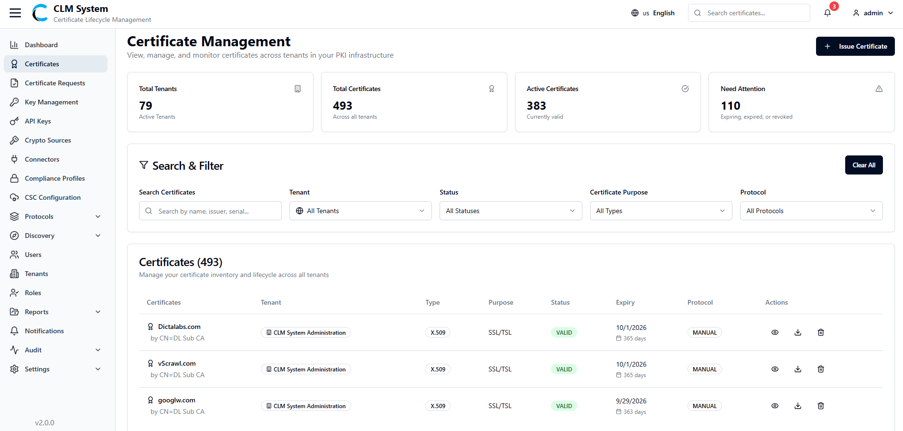
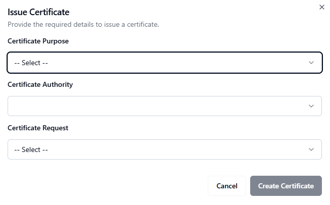
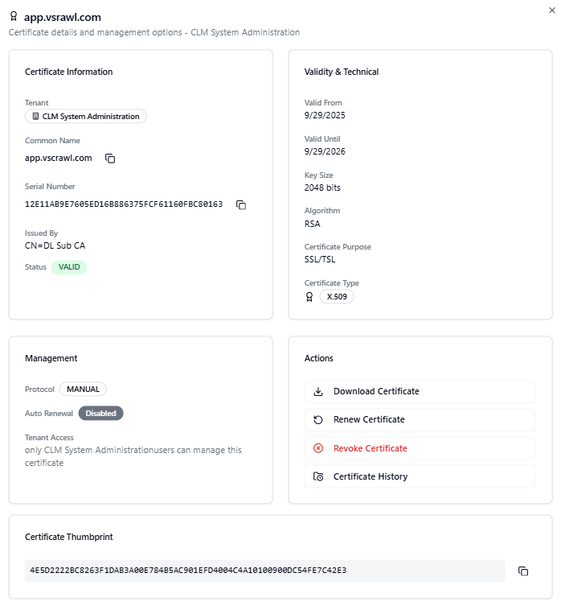
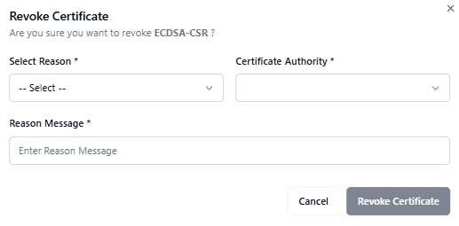
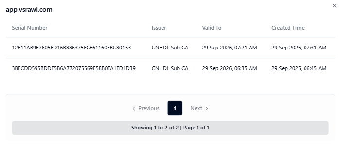

# Certificate Management

## Overview
*(Paste the full Certificate Management Overview text from the PDF — describe how CLM handles issued certificates, their lifecycle management, and related operations.)*

## Accessing Certificate Management
*(Insert the detailed instructions for accessing the Certificate Management module in the CLM Admin Portal.)*

## Search and Filter
*(Paste the explanation of search and filter features for managing certificates.)*
- Use the search bar to find certificates by Common Name, Serial Number, or Subject DN.  
- Apply filters for status (Active, Expired, Revoked), validity period, or issuing CA.  

## Certificates List
*(Paste the content describing the list view for certificates — include all relevant columns and actions.)*
- Common Name  
- Serial Number  
- Issuer  
- Expiry Date  
- Status  
- Actions (View, Renew, Revoke, Download)

## Creating a New Certificate
*(Paste the complete step-by-step process for manually creating or issuing a new certificate, converting numbered steps into bullet points.)*
- Click **Add Certificate** or **Create New Certificate**.  
- Provide certificate details such as Common Name, Subject DN, and validity period.  
- Select the certificate profile and crypto source.  
- Specify key usage and extended key usage fields as needed.  
- Save to issue the certificate.  

## Managing Certificates
*(Paste the content explaining certificate lifecycle actions — renewals, revocations, downloads, and view details.)*
- Open an existing certificate from the list.  
- Review its details, validity, and usage.  
- Choose **Renew** to issue a replacement certificate before expiry.  
- Select **Revoke** to invalidate a certificate immediately.  
- Download certificate or bundle (PEM/PFX) as required.  

## Certificate Details
*(Paste additional details from the PDF about the certificate detail view or audit trail.)*
- View the certificate chain and signing CA.  
- Check key usage, policies, and audit information.  

## Certificate Renewal Workflow
*(Include any special section from the PDF covering renewal workflows, approval stages, or automation.)*

