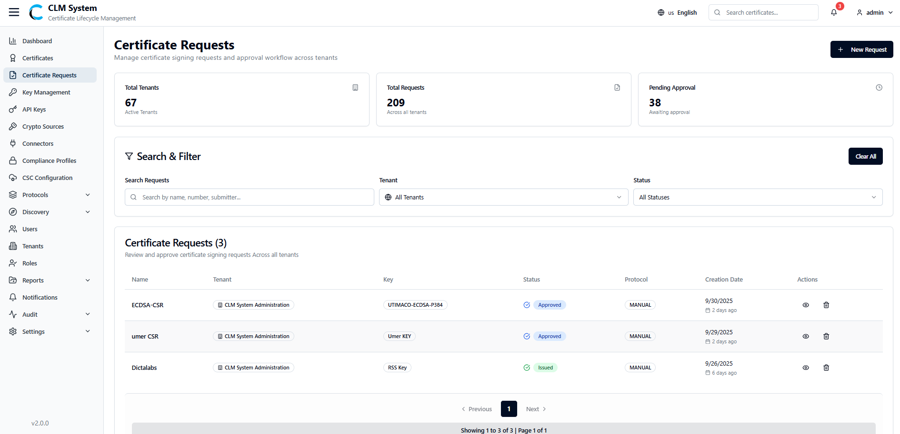
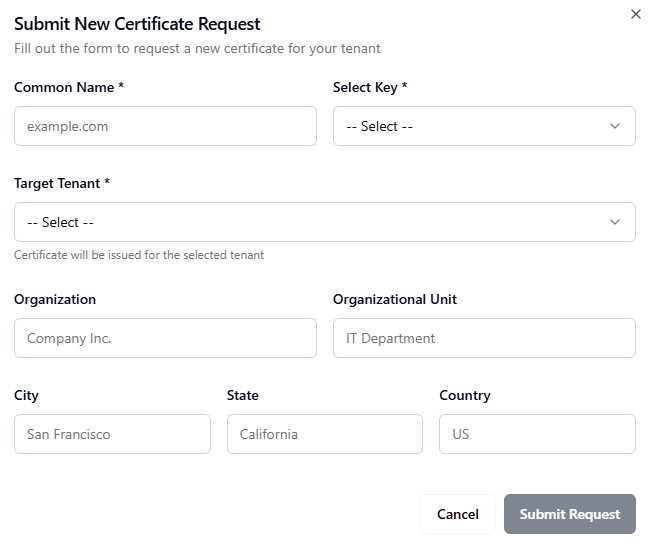

# Certificate Requests

## Overview
*(Paste the full Certificate Requests Overview text from the PDF — explain what certificate requests are, their role in CLM, and how administrators manage them.)*

## Accessing Certificate Requests
*(Insert the complete instructions from the PDF for navigating to the Certificate Requests section in the CLM Admin Portal.)*

## Search and Filter
*(Paste the explanation of search and filter capabilities for certificate requests.)*
- Use the search bar to locate certificate requests by requester name, request ID, or status.  
- Apply filters for type (New, Renewal, Revocation), validity, or creation date.  

## Certificate Requests List
*(Paste the section from the PDF describing the list view, columns, and available management actions.)*
- Request ID  
- Common Name  
- Requester  
- Certificate Type  
- Status  
- Actions (View, Approve, Reject, Delete)

## Creating a New Certificate Request
*(Paste the complete step-by-step process for submitting or creating a new certificate request, converting numbered steps into bullet points.)*
- Click **Add Request** or **Create New Certificate Request**.  
- Provide request details such as Common Name, Subject DN, and validity period.  
- Select the certificate profile or template.  
- Attach CSR (if required) or let CLM generate one automatically.  
- Review and submit the request.  

## Viewing and Managing Requests
*(Paste the text describing how to open, review, approve, or reject certificate requests.)*
- Select a certificate request from the list.  
- Review its details and attached CSR or metadata.  
- Approve to issue, or reject with comments.  

## Request History and Audit
*(Paste any content related to tracking certificate request history, logs, or audit trails.)*

