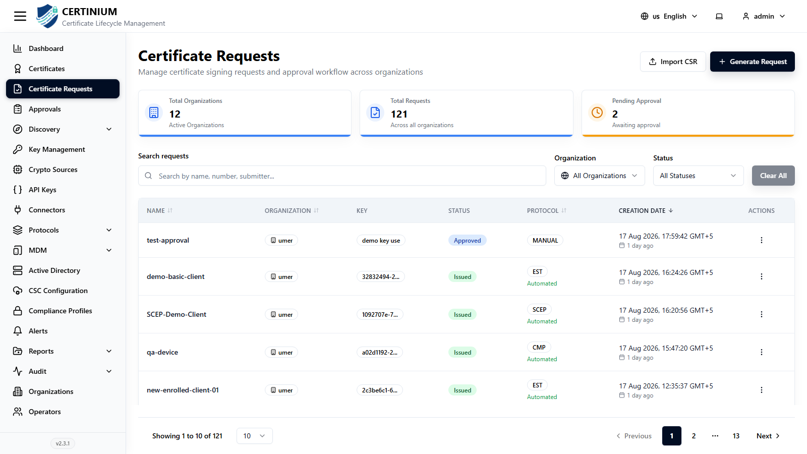
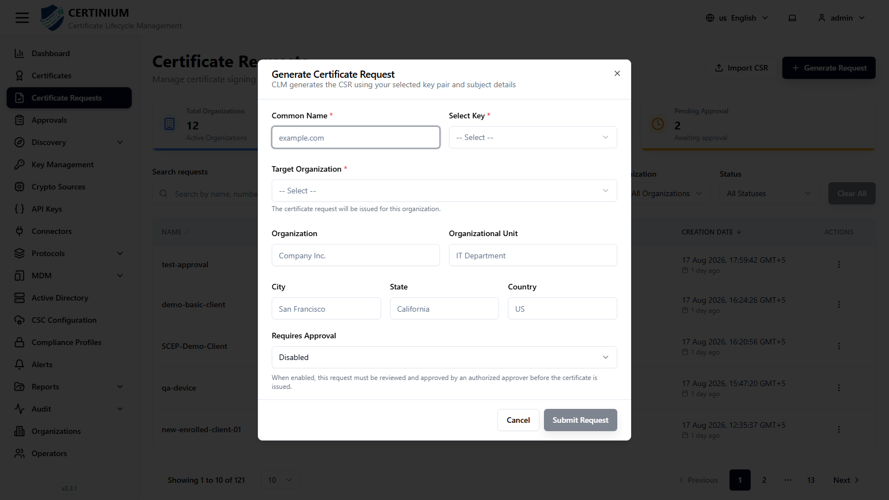
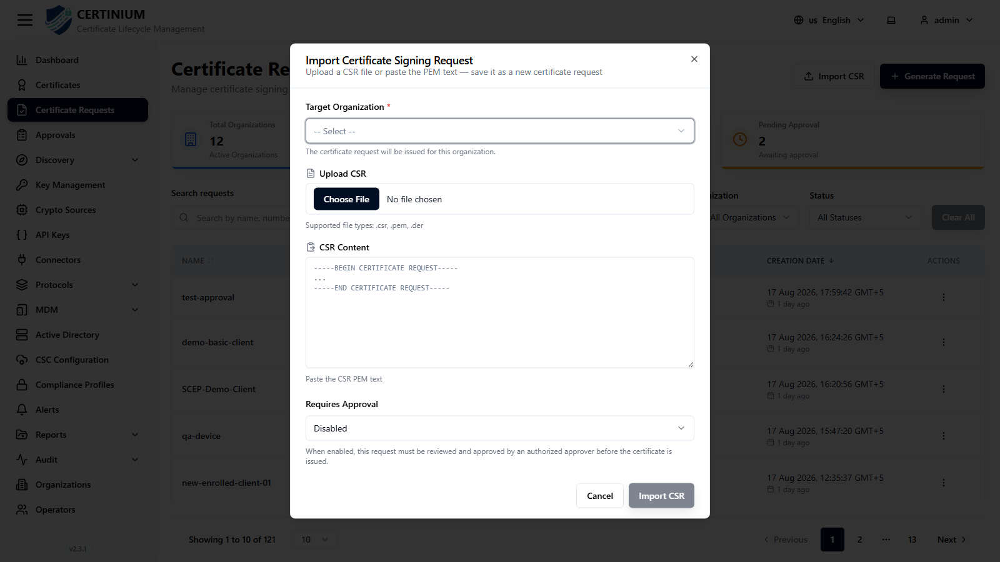

# Certificate Requests

**Certificate Requests** tracks certificate signing requests (CSRs) from creation through approval and issuance.

## Accessing Certificate Requests

From the sidebar, select **Certificate Requests**.

### Certificate Requests overview

Summary cards show **Total Organizations**, **Total Requests**, and **Pending Approval**.

### Search and filter

- **Search requests** — by name, request number, or submitter.
- **Organization**, **Status** — narrow the list.
- **Clear All** — resets all filters.

### Certificate Requests list

| Column | Description |
|---|---|
| Name | The request's common name. |
| Organization | Owning organization. |
| Key | The associated [key](key_management.md), truncated. |
| Status | e.g. Pending, Approved, Issued. |
| Protocol | How the request was created — e.g. `EST` / `ACME` (Automated) for protocol-driven requests, or `Manual` for ones created directly in this screen. |
| Creation Date | When the request was submitted. |
| Actions | Row-level actions. |

## Generating a new request

1. Click **Generate Request** (top right).
2. Fill in the form:

    

    - **Common Name*** — e.g. `example.com`.
    - **Select Key*** — the key pair this request is for.
    - **Target Organization***
    - **Organization**, **Organizational Unit**, **City**, **State**, **Country** — standard X.500 subject fields for the certificate.
    - **Requires Approval** — if enabled, the request must go through the [Approvals](approvals.md) workflow before it can be issued.

3. Click **Submit Request** to save.

## Importing an existing CSR

If a CSR was generated outside CLM, you can import it instead:

1. Click **Import CSR** (top right).
2. Fill in the form:

    

    - **Target Organization***
    - **Upload CSR** — upload a `.csr`, `.pem`, or `.der` file, **or**
    - **CSR Content** — paste the PEM-encoded CSR text directly.
    - **Requires Approval** — same behavior as above.

3. Click **Import CSR** to save.

Once a request is Approved (or doesn't require approval) it can be turned into an issued certificate from [Certificates](certificates.md) → **Issue Certificate**.
