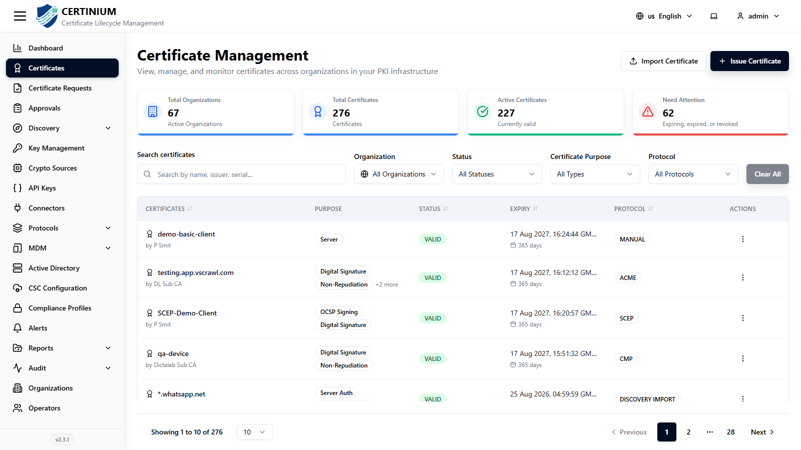
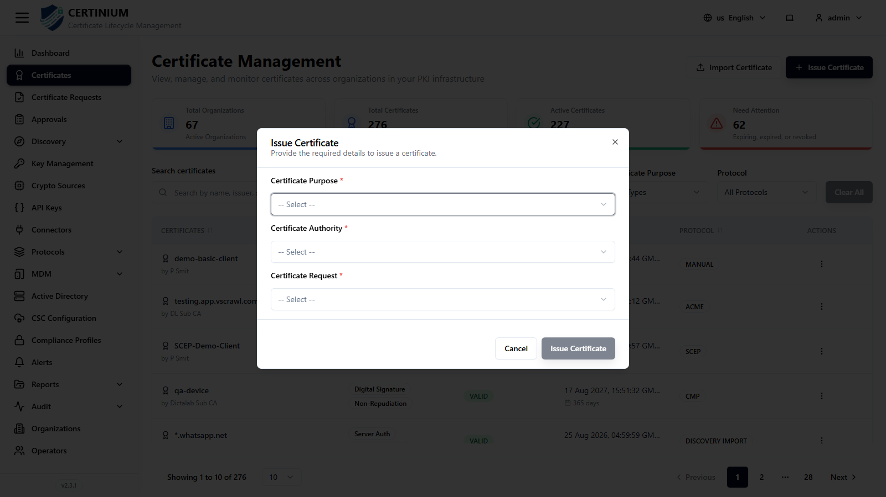
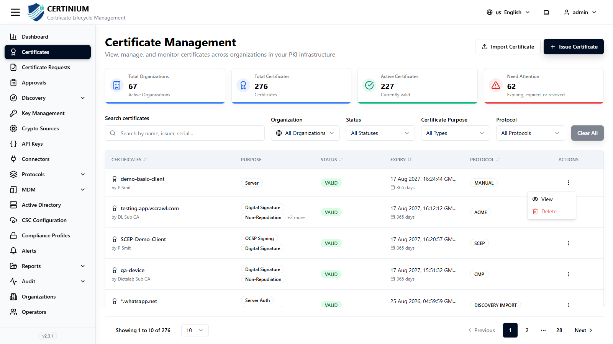
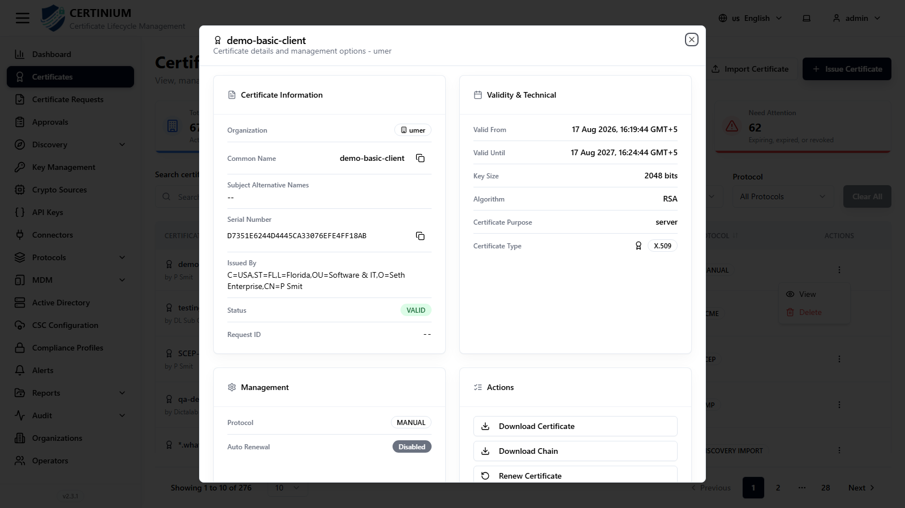

# Certificates

**Certificates** is where issued certificates are viewed, issued, imported, renewed, and revoked across your PKI infrastructure. The sidebar label is **Certificates**; the page itself still shows "Certificate Management" as its on-screen heading.

## Accessing Certificates

From the sidebar, select **Certificates**.

### Certificates overview

Summary cards show **Total Organizations**, **Total Certificates**, **Active Certificates**, and **Need Attention** (expiring, expired, or revoked).

### Search and filter

- **Search certificates** — by name, issuer, or serial number.
- **Organization**, **Status**, **Certificate Purpose**, **Protocol** — narrow the list.
- **Clear All** — resets all filters.

### Certificates list

| Column | Description |
|---|---|
| Certificates | Common name and the certificate's owner/subject. |
| Purpose | One or more purpose tags, e.g. `Server`, `OCSP Signing`, `Digital Signature`, `Server Auth`. |
| Status | e.g. `VALID`. |
| Expiry | Expiry date/time, plus days remaining. |
| Protocol | How the certificate was created — `MANUAL`, `EST`, `ACME`, `SCEP`, `CMP`, or `DISCOVERY IMPORT` (found by a [Discovery](discovery.md) scan). |
| Actions | **View** or **Delete** from the row's **⋮** menu. |

## Issuing a certificate

1. Click **Issue Certificate** (top right, also available as a Dashboard Quick Action).
2. Fill in the form:

    

    - **Certificate Purpose***
    - **Certificate Authority*** — which CA (via a [connector](connectors.md)) issues the certificate.
    - **Certificate Request*** — the approved [certificate request](certificate_requests.md) to issue against.

3. Click **Issue Certificate** to save.

## Importing a certificate

Click **Import Certificate** (top right) to upload an existing certificate file directly — this opens your browser's file picker rather than a form, so have the certificate file ready before clicking.

## Viewing and managing a certificate

Open the row's **⋮** menu and choose **View** to see the certificate's full detail page:

- **Certificate Information** — organization, common name, SANs, serial number, issuer, status, request ID.
- **Validity & Technical** — valid-from/valid-until dates, key size, algorithm, certificate purpose, certificate type.
- **Management** — protocol and auto-renewal status.
- **Actions**:
    - **Download Certificate**
    - **Download Chain**
    - **Renew Certificate**
    - **Revoke Certificate**
    - **Certificate History** — a chronological log of everything that's happened to this certificate (issuance, renewals, revocation).
- **Compliance** — how the certificate scores against your active [Compliance Profile](compliance_profiles.md).
- **Certificate Thumbprint**

!!! tip
    Renew and revoke actions live on this detail page, not on the list row — open **View** first.
