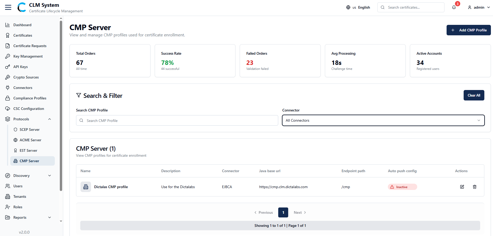
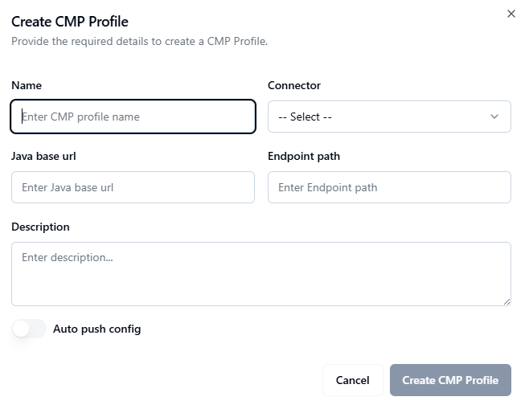

# Managing CMP Server

## Overview
*(Paste the full CMP Server Overview from the PDF — describe what CMP (Certificate Management Protocol) is, its function in CLM, and how it supports automated certificate enrollment and lifecycle operations.)*

## Accessing CMP Server
*(Insert the full instructions from the PDF on how to navigate to the CMP Server module in the CLM Admin Portal.)*

## Search and Filter
*(Paste the text explaining search and filter features available for CMP profiles.)*
- Use the search bar to locate specific CMP profiles by name or associated CA.  
- Apply filters for profile status, creation date, or authentication mode.  

## CMP Profiles List
*(Paste the section from the PDF describing the CMP profiles list view — include the relevant table columns and available actions.)*
- Profile Name  
- Associated CA  
- Authentication Mode  
- Status  
- Actions (View, Edit, Delete)

## Creating a New CMP Profile
*(Paste the complete step-by-step instructions for creating a new CMP profile, using bullet points instead of numbers.)*
- Click **Add Profile** or **Create New CMP Profile**.  
- Enter the profile name and select the associated CA.  
- Configure authentication details such as shared secret or client certificate.  
- Define certificate issuance parameters and key usage.  
- Save to create the CMP profile.  

## Navigate to the CMP Server Page
*(Include navigation instructions or screenshots if shown in the PDF.)*

## Fill in the CMP Profile Form
*(Paste a detailed breakdown of each field shown in the form.)*
- Profile Name  
- Description  
- Associated CA  
- Authentication Method  
- Certificate Policies  
- Validity Period  

## Save the CMP Profile
*(Include saving and validation steps from the PDF.)*
- Review configuration details carefully.  
- Click **Save** to finalize profile creation.  
- Confirm that the new profile appears in the list.  

## Post-Creation
*(Paste any section describing verification, testing, or monitoring steps.)*
- Test the CMP profile using a CMP client.  
- Review enrollment or issuance logs.  
- Validate certificate lifecycle operations.  

