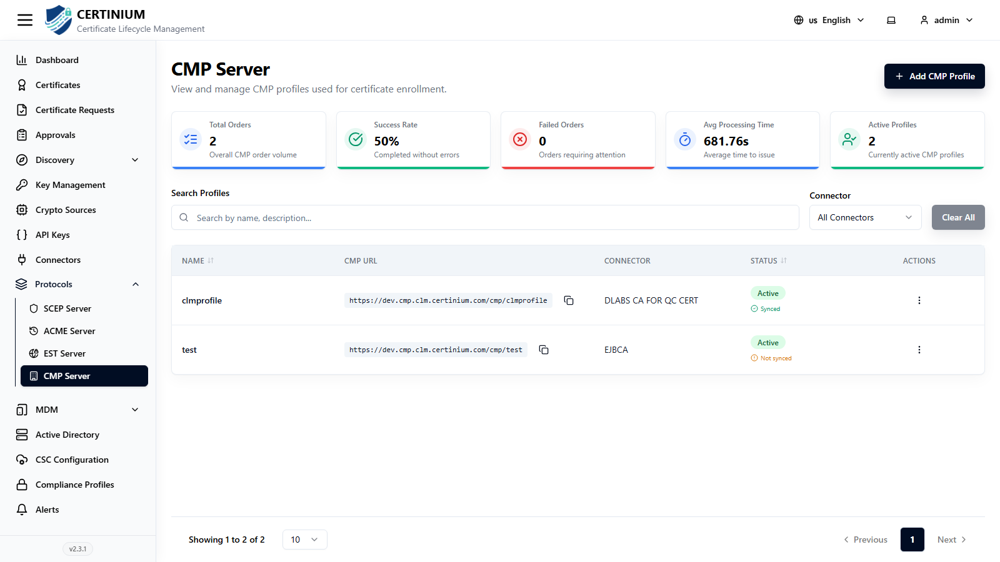
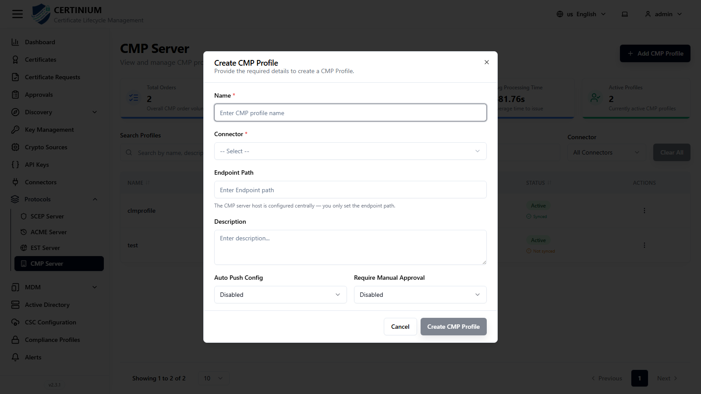
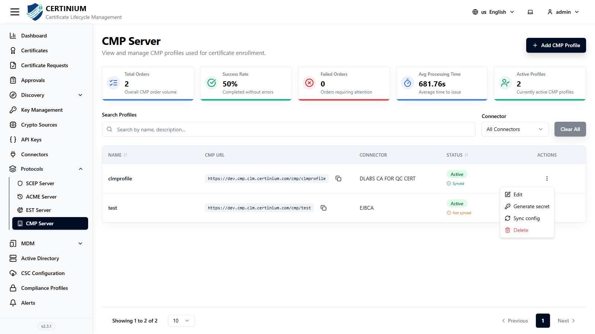

# CMP Server

**CMP** (Certificate Management Protocol) profiles let clients enroll for certificates using the CMP protocol against a configured endpoint.

## Accessing CMP Server

From the sidebar, select **Protocols → CMP Server**.

### CMP Server overview

Summary cards show **Total Orders**, **Success Rate**, **Failed Orders**, **Avg Processing Time**, and **Active Profiles**.

### Search and filter

- **Search Profiles** — by name or description.
- **Connector** — narrow the list.
- **Clear All** — resets all filters.

### CMP profiles list

| Column | Description |
|---|---|
| Name | Profile name. |
| CMP URL | The CMP endpoint, with a copy-to-clipboard shortcut. |
| Connector | The [connector](connectors.md)/CA backing this profile. |
| Status | Active or Inactive, plus a sync indicator — **Synced** or **Not synced** — showing whether the profile's configuration has been pushed to the CMP endpoint. |
| Actions | See [Row actions](#row-actions) below. |

## Creating a new CMP profile

1. Click **Add CMP Profile** (top right).
2. Fill in the form:

    

    - **Name*** — the CMP profile name.
    - **Connector***
    - **Endpoint Path**
    - **Description**
    - **Auto Push Config** — automatically push configuration/updates to the CMP endpoint.
    - **Require Manual Approval** — route enrollments through [Approvals](approvals.md).

3. Click **Create CMP Profile** to save.

## Row actions

Click the **⋮** menu on any CMP profile row:

- **Edit** — update the profile's connector, endpoint path, or approval settings.
- **Generate secret** — issue a new shared secret for the profile.
- **Sync config** — push the profile's current configuration to the CMP endpoint (clears a **Not synced** status).
- **Delete** — permanently remove the profile.
