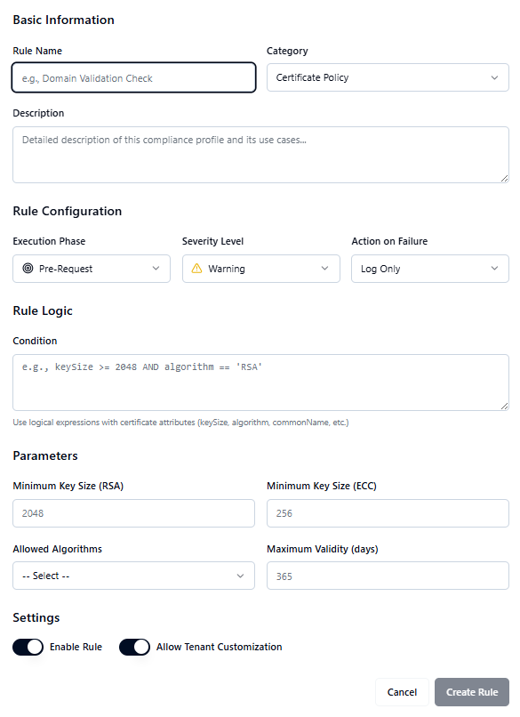

# Managing Compliance Profiles

View and manage compliance profiles with pre-request and post-issuance rules.

In the sidebar, navigating to **Compliance Profiles** under the **Compliance** tab, the admin can see the following metrics displayed in cards on top:

- **Total Profiles**
    
- **Active Rules**
    
- **Regulatory Profiles**

Below the cards, there are three tabs:

1. **Compliance Profiles**
    
    - Search and filter section where the user can search Compliance Profiles and apply filters.
        
    - A list of all Compliance Profiles is displayed below the search section.

2. **Compliance Rules**
    
    - Search and filter section where the user can search Compliance Rules and apply filters.
        
    - A list of all Compliance Rules is displayed below the search section.

3. **Analytics**
    
    - A graph showing **Rule Execution Statistics** with percentages for:
        
        - Rules Passed
            
        - Rules with Warnings
            
        - Rules Blocked
            
    - **Top Failing Rules** are displayed with execution statistics for deeper insights.

## Creating a Compliance Rule

In the **Compliance Profiles** screen, click the **Create Rule** button located at the top-right corner. A **Create Rule** form will open, allowing administrators to define rule details, configuration, and logic.

**Basic Information**

- **Rule Name** – Enter a unique name for the compliance rule.
    
- **Category** – Select or define the category (e.g., Key Policy, Algorithm Policy).
    
- **Description** – Provide a brief explanation of the rule.

**Rule Configuration**

- **Execution Phase (Dropdown)** – Choose when the rule should apply: _Pre-Request_ or _Post-Issuance_.
    
- **Severity Level (Dropdown)** – Define the severity: _Warning_, _Blocking_, or _Informational_.
    
- **Action on Failure (Dropdown)** – Specify the system action if the rule fails:
    
    - Log Only
        
    - Deny Request
        
    - Approve with Warning
        
    - Send Notification

**Rule Logic**

- **Condition** – Define logical expressions using certificate attributes (e.g., _keySize > 2048_, _algorithm = RSA_, _commonName != null_).
    
- **Parameters**:
    
    - **Minimum Key Size (RSA)** – Define minimum RSA key size.
        
    - **Minimum Key Size (ECC)** – Define minimum ECC key size.
        
    - **Allowed Algorithms** – Choose allowed algorithms (_RSA_, _ECDSA_).
        
    - **Maximum Validity (days)** – Set the maximum certificate validity period.

**Create Rule**  
Once all required details are filled, click **Create Rule** to save the compliance rule.

## Creating a Compliance Profile

In the **Compliance Profiles** screen, click the **Create Profile** button located at the top-right corner. A **Create Profile** form will open, allowing administrators to configure compliance profiles with pre-request and post-issuance rules.

**Basic Information**

- **Profile Name** – Enter a unique name for the compliance profile.
    
- **Passing Score** – Set the minimum score required for a certificate to be considered compliant.
    
- **Description** – Provide a brief explanation of the compliance profile.
    

**Pre-Request Rules**

- Displays a list of available pre-request rules.
    
- Administrators can enable or disable each rule using a toggle switch.
    

**Post-Issuance Rules**

- Displays a list of available post-issuance rules.
    
- Administrators can enable or disable each rule using a toggle switch.
    

**Profile Summary**

- **Pre-Request Rules** – Shows the number of pre-request rules enabled.
    
- **Post-Issuance Rules** – Shows the number of post-issuance rules enabled.
    

**Create Profile**  
After configuring the profile, click **Create Profile** to save it. The new compliance profile will then appear in the Compliance Profiles list.

