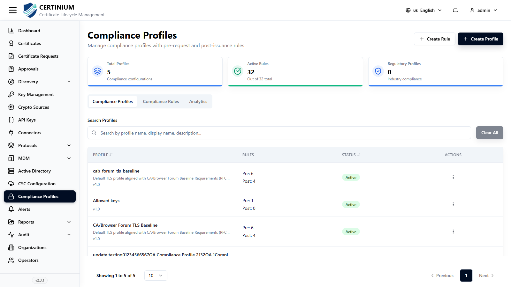
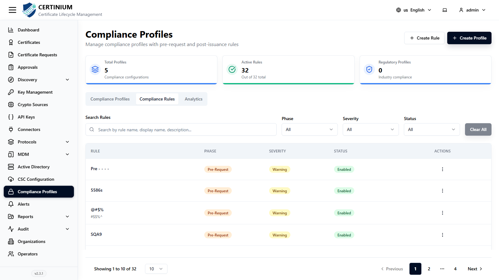
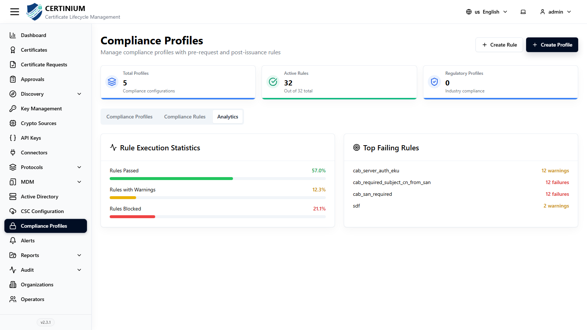
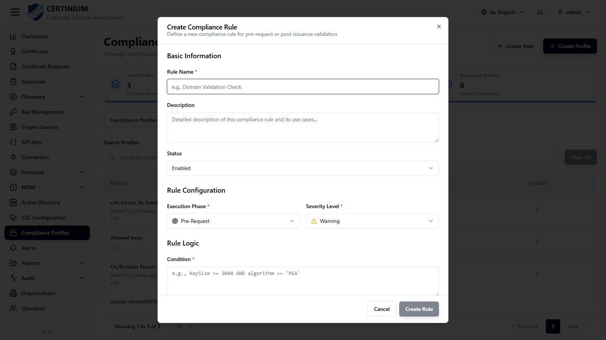
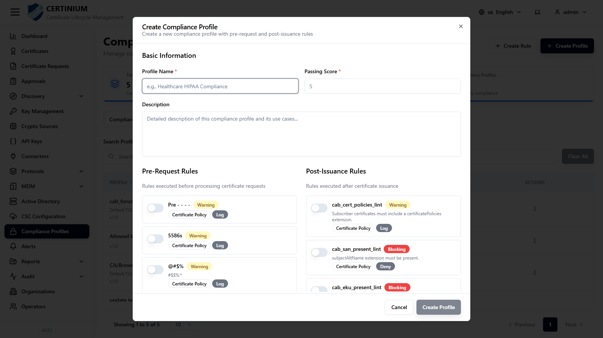

# Compliance Profiles

**Compliance Profiles** let you enforce organizational and regulatory policy on certificates — both before a request is issued (pre-request) and after (post-issuance) — by combining individual **rules** into a **profile**.

## Accessing Compliance Profiles

From the sidebar, select **Compliance Profiles**.

### Compliance overview

Summary cards show **Total Profiles**, **Active Rules** (out of total), and **Regulatory Profiles**.

Three tabs sit below the summary cards: **Compliance Profiles**, **Compliance Rules**, and **Analytics**.

### Compliance Profiles tab

Lists your compliance profiles:

| Column | Description |
|---|---|
| Profile | Name, description, and version. |
| Rules | Count of Pre-Request and Post-Issuance rules attached. |
| Status | Active or Inactive. |
| Actions | View, edit, or delete. |

### Compliance Rules tab

Lists every individual rule available to attach to a profile — real examples in this deployment include CA/Browser Forum baseline checks (allowed key algorithms, SAN required, max validity, RSA key size, EKU presence, etc.). Each rule shows its **Severity** (`Warning` or `Blocking`), **Category** (e.g. `certificate policy`, `cryptographic`, `identity`), and **Action** (e.g. `log`, `deny`, `approve`).

### Analytics tab

Shows **Rule Execution Statistics** (percentage of rule evaluations that passed, warned, or were blocked) and a **Top Failing Rules** list with execution counts — useful for spotting a policy that's too strict (or too loose) for your actual certificate population.

## Creating a compliance rule

1. Click **Create Rule** (top right, available from any tab).
2. Fill in the form:

    

    **Basic Information**

    - **Rule Name***, **Description**, **Status** (Enabled/Disabled).

    **Rule Configuration**

    - **Execution Phase*** — `Pre-Request` (evaluated before a request is issued) or `Post-Issuance` (evaluated against the resulting certificate).
    - **Severity Level*** — e.g. `Warning` (logged, doesn't block) or `Blocking` (denies the request/certificate).

    **Rule Logic**

    - **Condition*** — a logical expression over certificate attributes, e.g. `keySize > 2048`, `algorithm = RSA`, `commonName != null`.

3. Click **Create Rule** to save.

## Creating a compliance profile

1. Click **Create Profile** (top right, available from any tab).
2. Fill in the form:

    

    - **Profile Name***, **Passing Score***, **Description**.
    - **Pre-Request Rules** — toggle on each existing rule that should run before a request is issued.
    - **Post-Issuance Rules** — toggle on each existing rule that should run against the issued certificate.
    - **Profile Summary** — a live count of enabled Pre-Request and Post-Issuance rules as you toggle them.

3. Click **Create Profile** to save.

Once created, a compliance profile can be attached to a [connector](connectors.md) so every certificate issued through it is automatically evaluated, and its pass/fail state is visible on the [Dashboard](index.md#compliance-status) and on each certificate's [detail page](certificates.md#viewing-and-managing-a-certificate).
