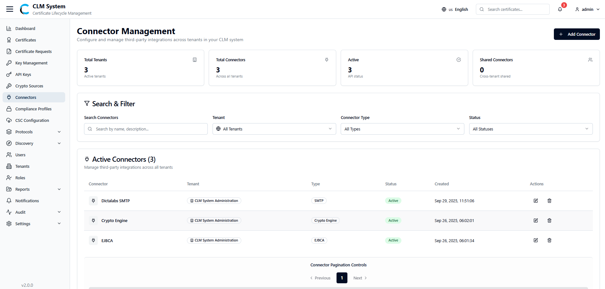
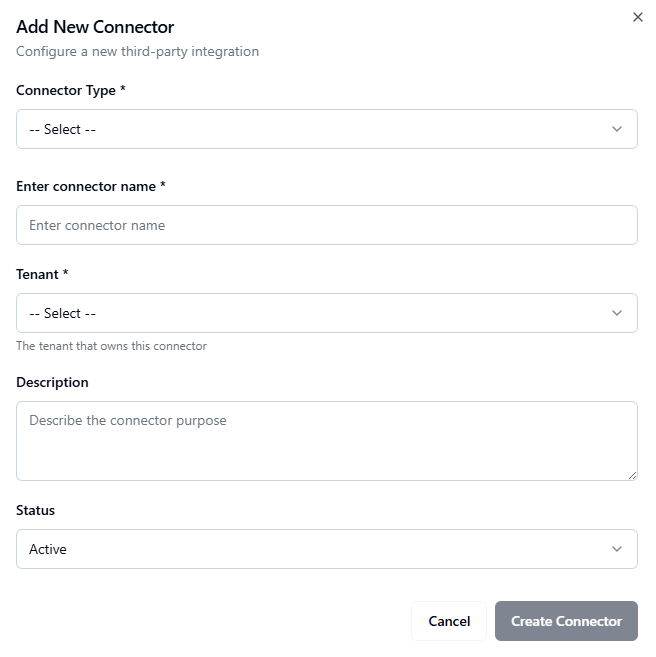
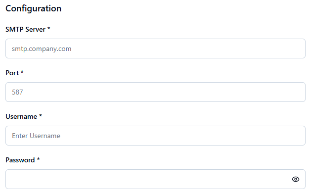
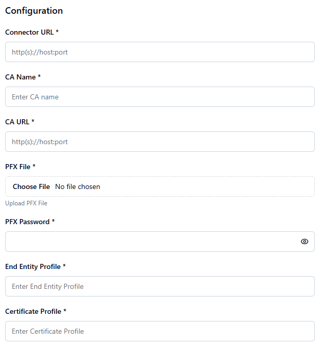
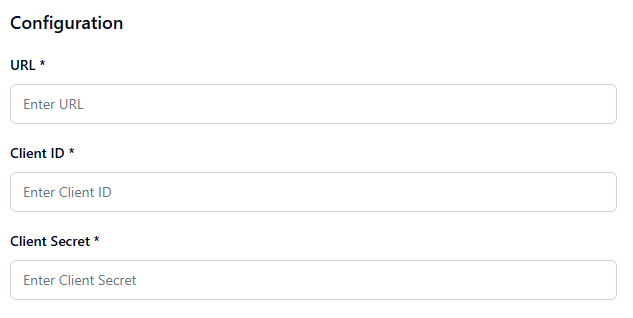

# Connector Management

The **Connector Management** module allows administrators to configure and manage third-party integrations across tenants in the CLM system. Connectors enable communication with external systems such as Certificate Authorities (CAs),EMAIL/SMTP Servers, Crypto Sources ,etc.

## Accessing Connectors
1. From the **sidebar menu**, navigate to **Connectors**.
    
2. The **Connectors page** opens, providing an overview of all configured connectors.

## Connectors Overview
At the top of the page, administrators can view summary information displayed in **cards**:

- **Total Tenants** – The number of tenants that have connectors configured.
    
- **Total Connectors** – The total number of connectors across the system.
    
- **Active Connectors** – The number of connectors currently active and functional.

## Search and Filter
Below the summary cards, a **Search and Filter** section allows administrators to:

- Search connectors by name, type, or tenant.
    
- Apply filters (e.g., by connector status, tenant association, or type).

## Connectors List
The **connectors list table** provides detailed information about each connector, typically including:

- **Connector Name**
    
- **Type**
    
- **Associated Tenant**
    
- **Status** (Active/Inactive)
    
- **Created**
    
- **Actions** (e.g., View, Edit, Delete)
    

This centralized view allows administrators to efficiently manage external system integrations and ensure smooth certificate lifecycle operations.

## Creating a New Connector
To configure a new connector in CLM:

1. **Navigate to the Connectors Page**
    
    - From the sidebar, select **Connectors**.
        
    - On the **top-right corner** of the page, click the **Add Connector** button.

2. **Fill in the Connector Form**  
    A form will appear with the following fields:
    
    - **Connector Type (Dropdown)** – Select the type of connector (e.g., SMTP Server, EJBCA).
        
    - **Connector Name** – Enter a unique name for the connector.
        
    - **Tenant (Dropdown)** – Select the tenant for which this connector will be associated.
        
    - **Description** – Provide a brief description of the connector’s purpose.
        
    - **Status (Dropdown)** – Choose whether the connector should be **Active** or **Inactive**.
        
3. **Connector-Specific Configuration**  
    Depending on the **Connector Type**, additional fields will be displayed:
    
    - **SMTP Server Connector**
        
        - SMTP Server
            
        - Port
            
        - Username
            
        - Password

**EJBCA Connector**

- Connector URL
    
- CA Name
    
- CA URL
    
- PFX File (upload)
    
- PFX Password
    
- End Entity Profile
    
- Certificate Profile

**Crypto Engine Connector**

- URL
    
- Client ID
    
- Client Secret

4. **Save the Connector**
    
    - After completing the configuration, click the **Create Connector** button.
        
    - The new connector will appear in the **Connectors List**.
    