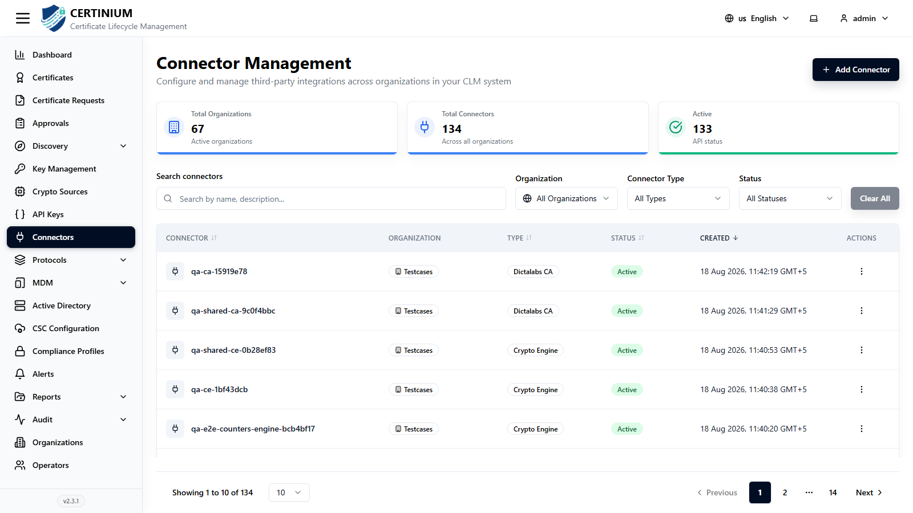
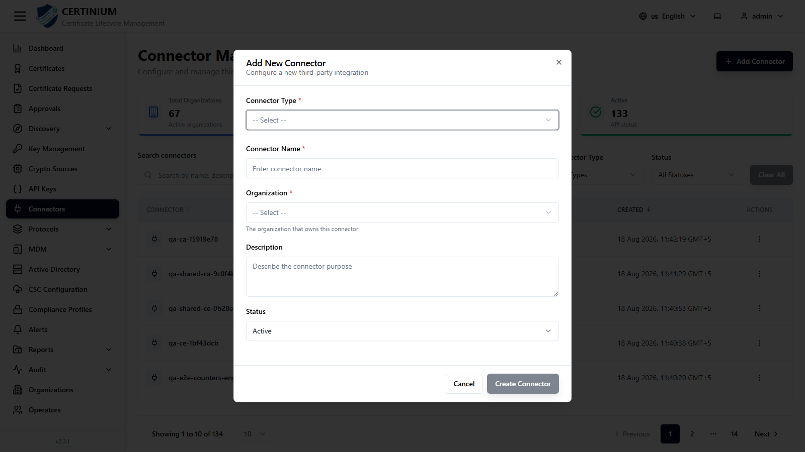
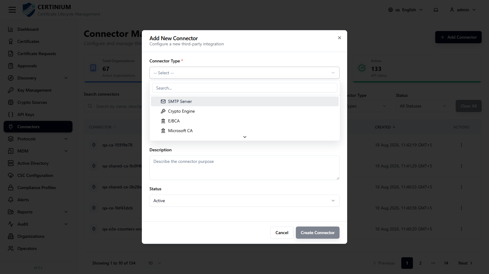
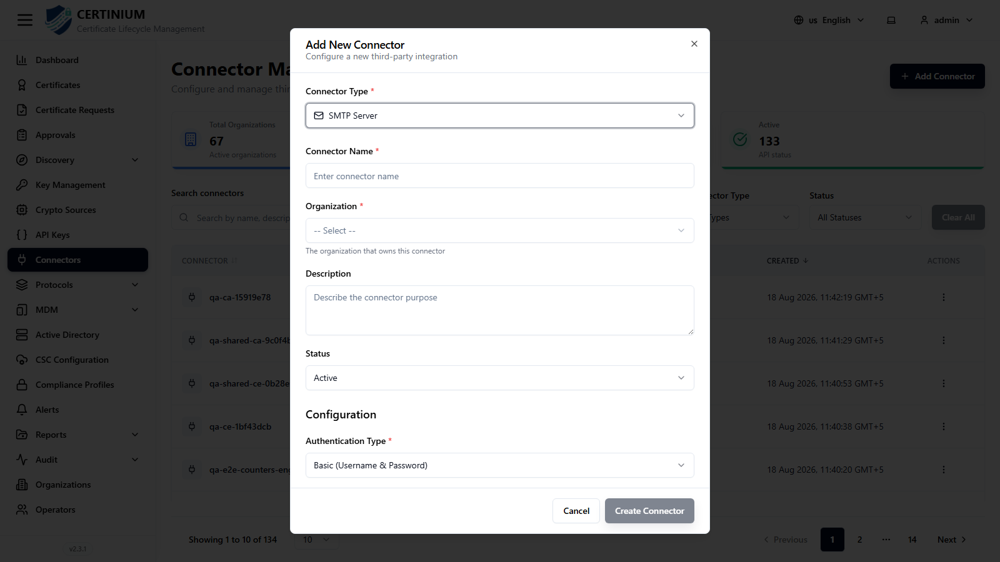
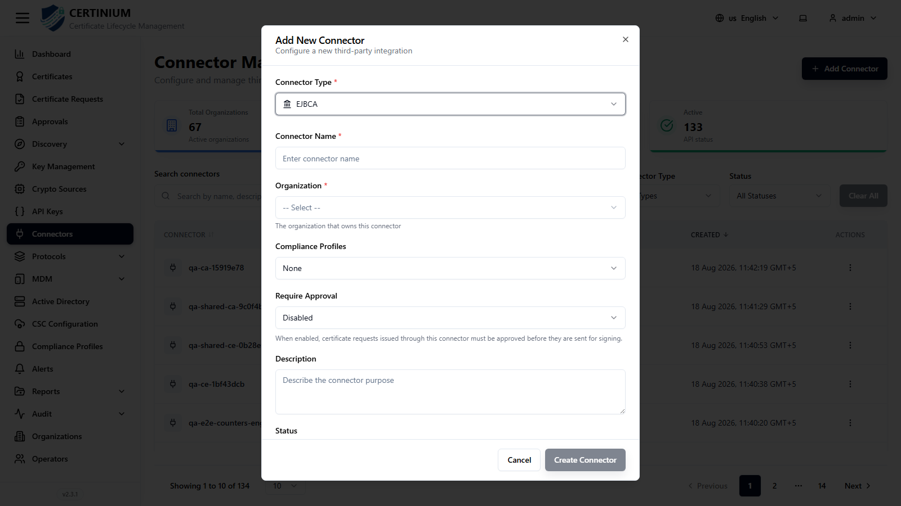
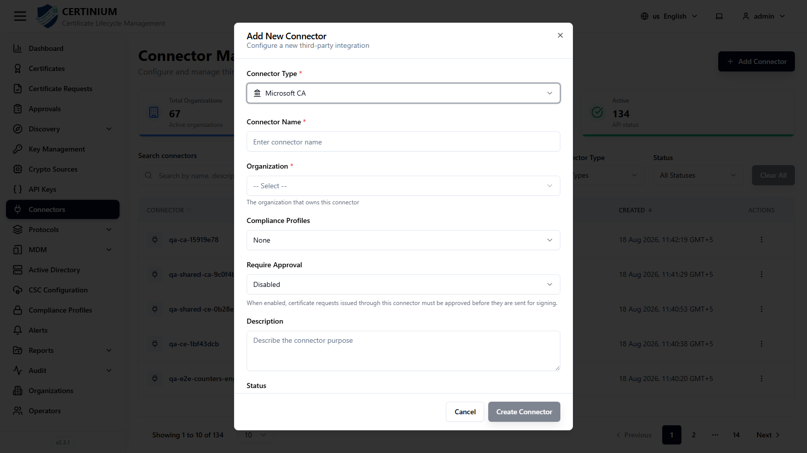
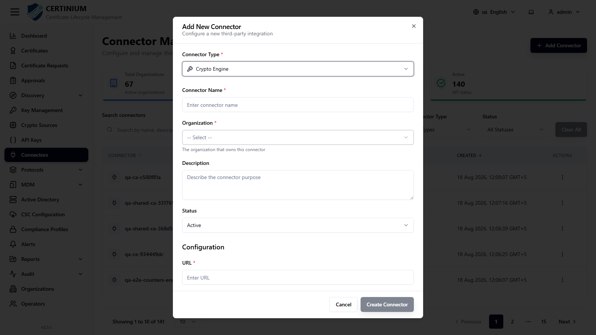

# Connectors

**Connectors** are the integrations CLM uses to talk to the outside world — certificate authorities, mail servers, crypto engines, directories, and more. Certificate requests, crypto sources, and protocol profiles are all built on top of a connector.

## Accessing Connectors

From the sidebar, select **Connectors**.

### Connectors overview

Summary cards show **Total Organizations**, **Total Connectors**, and **Active** connector count.

### Search and filter

- **Search connectors** — by name or description.
- **Organization**, **Connector Type**, **Status** — narrow the list.
- **Clear All** — resets all filters.

### Connectors list

| Column | Description |
|---|---|
| Connector | Name of the connector. |
| Organization | Owning organization. |
| Type | Connector type (see below). |
| Status | Active or Inactive. |
| Created | Creation timestamp. |
| Actions | View, edit, or delete. |

## Creating a new connector

1. Click **Add Connector** (top right).
2. Fill in the base fields:

    

    - **Connector Type*** — select from the list below.
    - **Connector Name***
    - **Organization***
    - **Compliance Profiles** — optionally attach a compliance profile to certificates issued through this connector.
    - **Require Approval** — if enabled, requests routed through this connector need an approval before issuance (see [Approvals](approvals.md)).
    - **Description**
    - **Status** — Active or Inactive.

3. Choosing a **Connector Type** reveals a type-specific **Configuration** section. The available types are:

    

    - SMTP Server
    - Crypto Engine
    - EJBCA
    - Microsoft CA
    - Dictalabs CA
    - Microsoft Intune
    - Active Directory / LDAP
    - SYSLOG
    - Single Sign-On

    Most connector types provide a **Test Connection** button so you can validate credentials before saving.

4. Click **Create Connector** to save.

### Example: SMTP Server connector

Used to send outbound email (password resets, alerts, notifications).

- **Authentication Type*** (e.g. Basic — Username & Password)
- **SMTP Server*** (host)
- **Port***
- **Username***
- **Password***

### Example: EJBCA connector

Connects CLM to an EJBCA certificate authority for issuance.

- **CA Name***
- **CA URL***
- **PFX File*** — client authentication certificate for the EJBCA API.
- **PFX Password***
- **End Entity Profile***
- **Certificate Profile***

### Example: Microsoft CA connector

Connects CLM to a Microsoft Certificate Authority via a middleware service.

- **Middleware URL***
- **Request Mode***
- **Template Name***
- **API Key**
- **Port**
- **Save Certificate** (toggle)

### Example: Crypto Engine connector

Connects CLM to a crypto engine service — the backend that actually performs key generation and signing for a [Crypto Source](crypto_sources.md). If you're evaluating CLM without an external HSM or cloud KMS, this is the connector you need first: a software-backed crypto source still requires a Crypto Engine connector in front of it.

- **URL*** — the crypto engine service's endpoint.
- **Client ID***
- **Client Secret***

Use **Test Connection** to confirm CLM can reach the crypto engine before saving. Once this connector exists, it becomes available in the **Connectors** dropdown on [Crypto Sources](crypto_sources.md) → **Add Crypto Source**.

The remaining connector types (Dictalabs CA, Microsoft Intune, Active Directory/LDAP, SYSLOG, Single Sign-On) follow the same pattern: pick the type, fill in its specific configuration section, and test the connection before saving.
