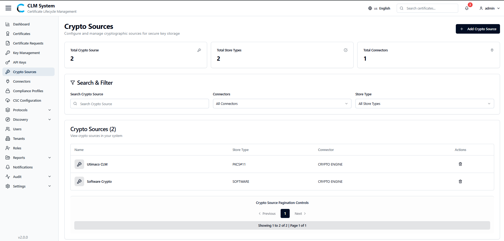
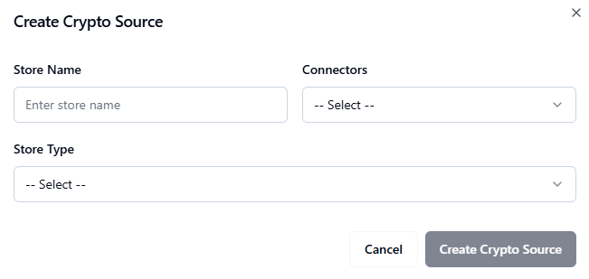
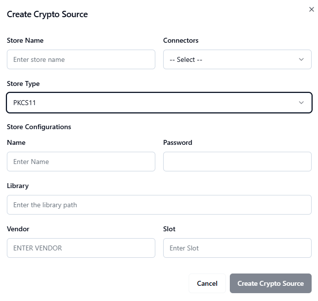
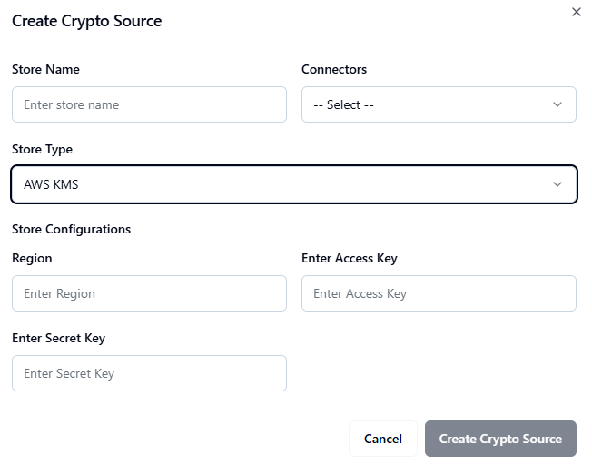
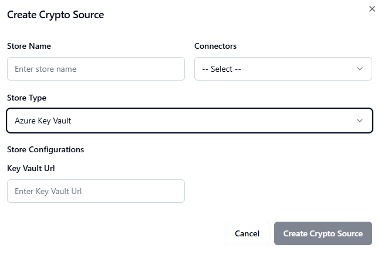

# Crypto Sources

The **Crypto Sources** module allows administrators to configure and manage cryptographic sources used for secure key generation and storage. Crypto sources may include Hardware Security Modules (HSMs), Key Vaults, or other secure storage backends that ensure private keys are managed according to compliance and security standards.
## Accessing Crypto Sources
1. From the **sidebar menu**, navigate to **Crypto Sources**.
    
2. The **Crypto Sources page** opens, displaying an overview of all configured sources.

## Crypto Sources Overview
At the top of the page, administrators can view summary information displayed in **cards**:

- **Total Crypto Sources** – The total number of cryptographic sources configured.
    
- **Total Store Types** – The number of different key storage types available
    
- **Total Connectors** – The number of active connectors linked to cryptographic sources.
## Search and Filter
Below the summary cards, a **Search and Filter** section allows administrators to:

- Search crypto sources by name, type, or tenant.
    
- Apply filters (e.g., by source type, connector, or status). 

## Crypto Sources List
The **crypto sources list table** provides detailed information about each configured source, typically including:

- **Source Name**
    
- **Store Type** (e.g., HSM, Key Vault, Local Store)
    
- **Associated Connector**
    
- **Status** (Active/Inactive)
    
- **Actions** (e.g. Delete)
    

This centralized view helps administrators securely manage all cryptographic key sources across the CLM system.

## Creating a New Crypto Source
Administrators can add a new crypto source (connector) to manage keys and certificates stored in external systems.

## Steps to Create a New Crypto Source
1. **Navigate** to the **Crypto Sources** section in the Admin Console.
    
2. Click the **Add Crypto Source** button.
    
    - A form will appear.

3. **Fill in the basic information**:
    
    - **Store Name** – Provide a unique name for the crypto source.
        
    - **Connector** – Select the desired connector from the dropdown.
        
    - **Store Type** – Choose the type of key store from the dropdown (`PKCS11`, `AWS KMS`, or `Azure Key Vault`).  
          
        
4. **Provide Store Configurations** based on the selected Store Type:
    
    - **If Store Type = PKCS11**
        
        - **Name** – Enter a name for the PKCS11 configuration.
            
        - **Password** – Provide the store password.
            
        - **Library** – Path to the PKCS11 library file.
            
        - **Vendor** – Vendor information for the library.
            
        - **Slot** – Specify the slot number.

**If Store Type = AWS KMS**

- **Region** – AWS region of the KMS instance.
    
- **Access Key** – AWS access key.
    
- **Secret Key** – AWS secret key (entered securely).

**If Store Type = Azure Key Vault**

- **Key Vault URL** – Provide the full URL of the Azure Key Vault.

3. **Click Create Connector** to save the new crypto source.
    
    - The crypto source will now appear in the list of available connectors.
        

- Ensure the credentials provided (e.g., AWS Access/Secret Keys) have appropriate permissions.
    
- For PKCS11, verify that the library path and slot number are correct.
    
- For Azure Key Vault, the application must have access permissions configured in Azure.
