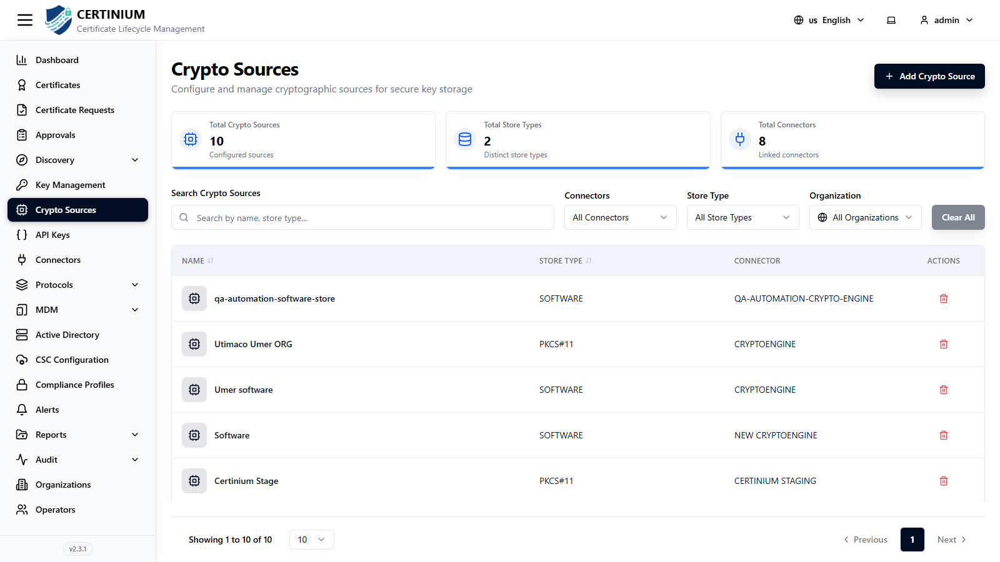
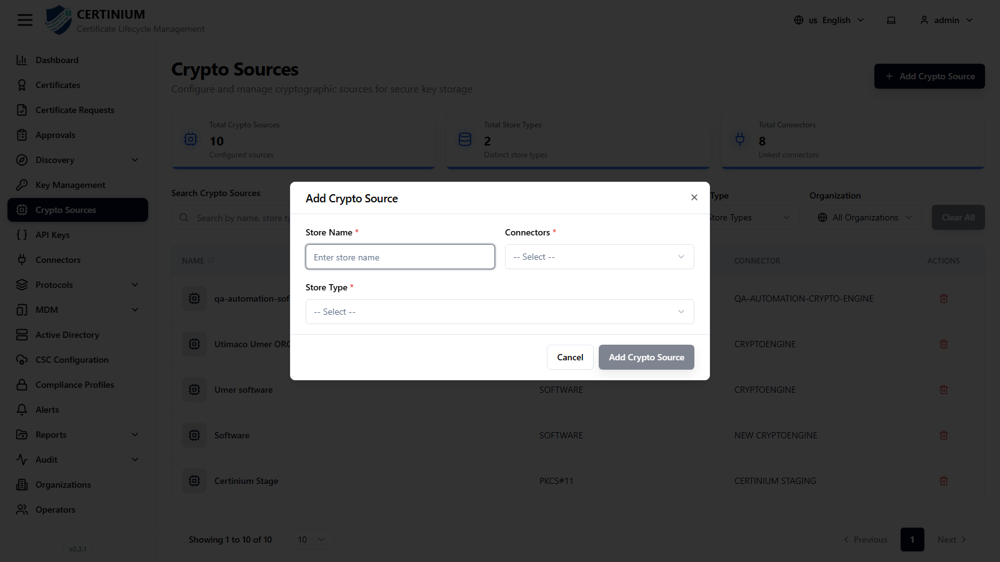
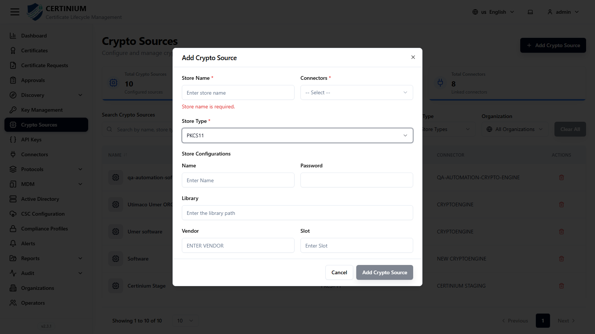
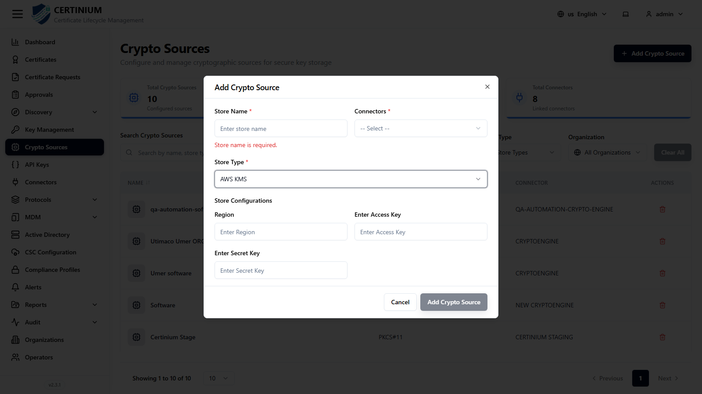
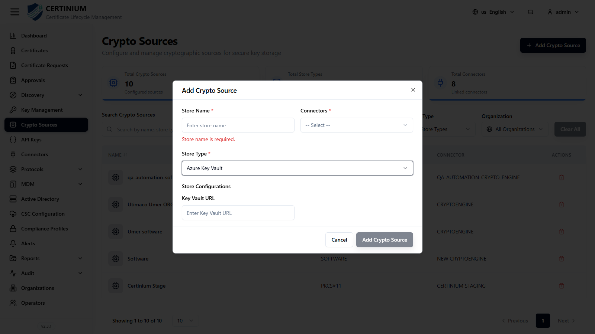

# Crypto Sources

**Crypto Sources** define where cryptographic keys are actually generated and stored — a software store, a PKCS#11-compatible HSM, or a cloud key management service. Every key you generate in [Key Management](key_management.md) is created on a specific crypto source.

## Accessing Crypto Sources

From the sidebar, select **Crypto Sources**.

### Crypto Sources overview

Summary cards show **Total Crypto Sources**, **Total Store Types**, and **Total Connectors**.

### Search and filter

- **Search Crypto Sources** — by name or store type.
- **Connectors**, **Store Type**, **Organization** — narrow the list.
- **Clear All** — resets all filters.

### Crypto Sources list

| Column | Description |
|---|---|
| Name | The crypto source's name. |
| Store Type | `PKCS#11`, `AWS KMS`, `Azure Key Vault`, or `SOFTWARE`. |
| Connector | The [connector](connectors.md) (typically a Crypto Engine connector) backing this store. |
| Actions | Delete. |

## Creating a new crypto source

1. Click **Add Crypto Source** (top right).
2. Fill in the base fields:

    

    - **Store Name***
    - **Connectors*** — the connector this store operates through.
    - **Store Type*** — `PKCS11`, `AWS KMS`, or `Azure Key Vault`.

3. Selecting a Store Type reveals its specific fields:

    **PKCS11**

    

    - **Name**, **Password**, **Library** (path to the PKCS#11 library on the crypto engine host), **Vendor**, **Slot**.

    **AWS KMS**

    

    - **Region**, **Access Key**, **Secret Key**.

    **Azure Key Vault**

    

    - **Key Vault URL**.

4. Click **Add Crypto Source** to save. The new store then appears as an option in the [Generate Key](key_management.md) form's Crypto Source dropdown.
