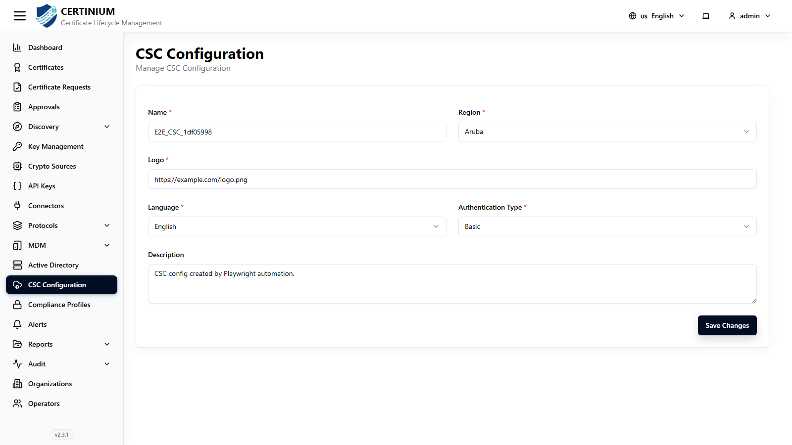

# CSC Configuration

**CSC Configuration** sets up CLM's Cloud Signature Consortium (CSC)–compliant remote signing API — used by external applications that need to request digital signatures against keys and certificates managed in CLM, rather than managing certificate lifecycle directly.

!!! note "Optional integration"
    Only relevant if an external application needs to request signatures against CLM via the CSC API. Skip this section otherwise. See [API Keys](api_keys.md) for the general-purpose CLM data API.

## Accessing CSC Configuration

From the sidebar, select **CSC Configuration**.

## Configuring CSC

- **Name*** — a label for this CSC configuration.
- **Region*** — the region identifier presented to signing clients.
- **Logo*** — a URL to the logo image shown to end users during the signing flow.
- **Language*** — default language for the signing UI/messages.
- **Authentication Type*** — how signing clients authenticate (e.g. Basic).
- **Description** — optional free-text notes.

Click **Save Changes** to apply.

!!! tip
    The exact CSC v2 signing endpoints, request bodies, and authentication requirements exposed by your deployment can change between releases — refer to your CLM instance's own API reference/documentation (typically published from the backend) rather than a hardcoded list, to make sure you're integrating against what's actually deployed.
