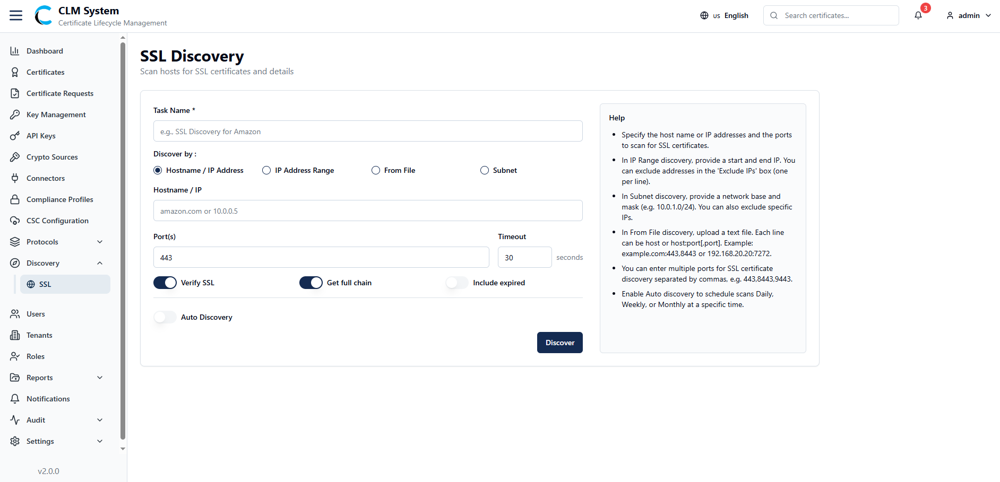

# Discovery-SSL Tab

The **SSL Discovery** feature allows administrators to **scan hosts for SSL certificates and retrieve details** about them. This helps in monitoring certificate validity, identifying expired or weak certificates, and automating SSL asset discovery.

## Overview

- **Purpose**: To discover SSL certificates across hosts, IP ranges, subnets, or uploaded files.
    
- **Use Cases**:
    
    - Inventory all SSL certificates in the network.
        
    - Identify certificates nearing expiry.
        
    - Detect weak or invalid SSL configurations.
        
    - Automate SSL scanning for compliance and monitoring.

## Create SSL Discovery Task

When creating a new **SSL Discovery Task**, the admin must configure the following fields:

### Task Details

- **Task Name** – Unique name for the discovery task.

### Discovery Type (Discover By)

Admin can select one of the following options:

1. **Hostname / IP Address**
    
    - Field: **Hostname / IP** (Single host or IP to scan).
        
2. **IP Address Range**
    
    - Fields:
        
        - **Start IP**
            
        - **End IP**
            
        - **Exclude IPs** (one per line).
            
3. **From File**
    
    - Field: **Upload list file**
        
    - Format: One per line → `host` or `host:port[,port]`

4. **Subnet**
    
    - Fields:
        
        - **Network Base**
            
        - **Mask**
            
        - **Exclude IPs** (one per line).

### Advanced Settings

- **Port(s)** – Specify ports to scan (comma-separated).
    
- **Timeout** – Timeout duration for scan requests.
    
- **Verify SSL (toggle)** – If enabled, verifies SSL handshake.
    
- **Get Full Chain (toggle)** – Retrieves full certificate chain (leaf + intermediates + root).
    
- **Include Expired (toggle)** – Includes expired SSL certificates in the scan results.
    
- **Auto Discovery (toggle)** – Enables automated recurring discovery based on schedule.

