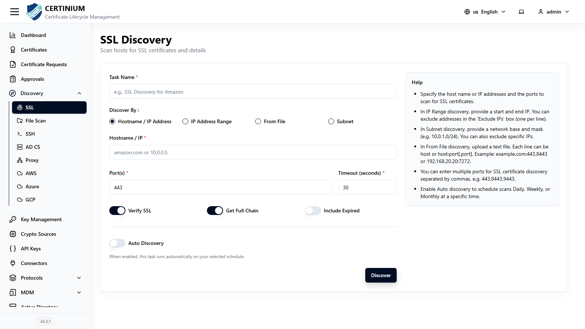
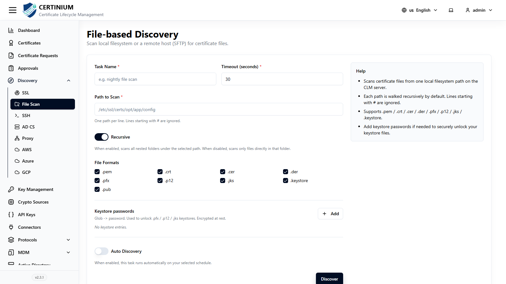
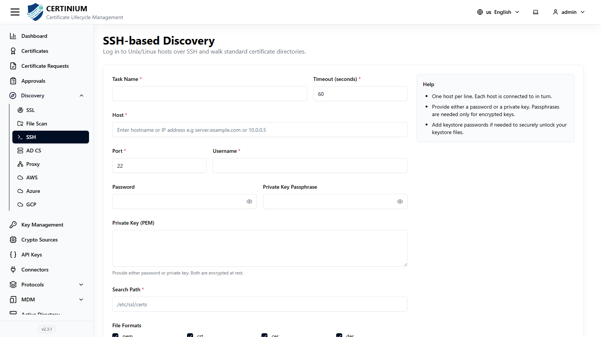
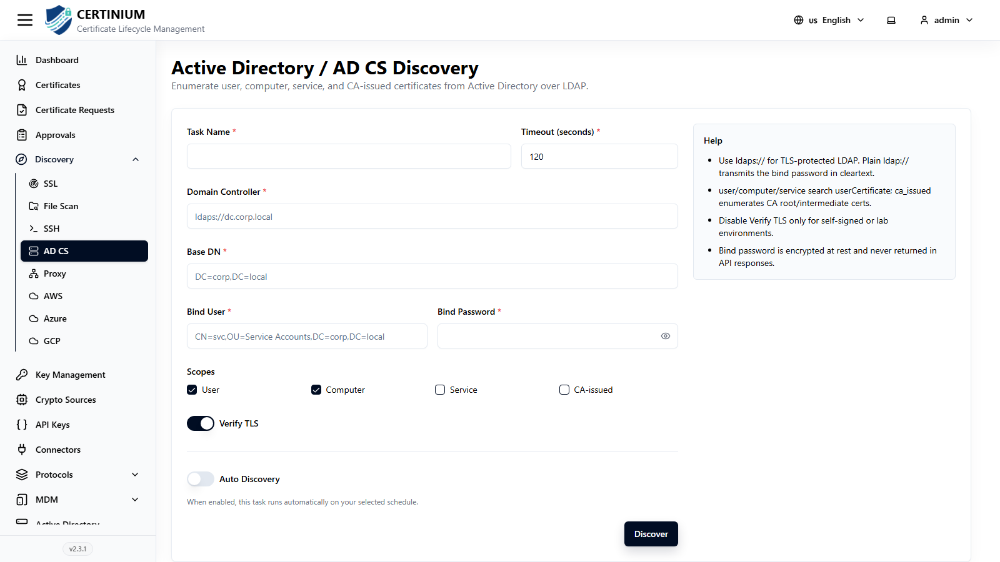
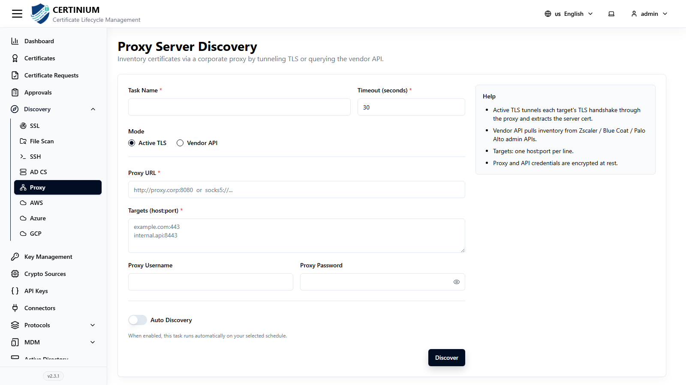
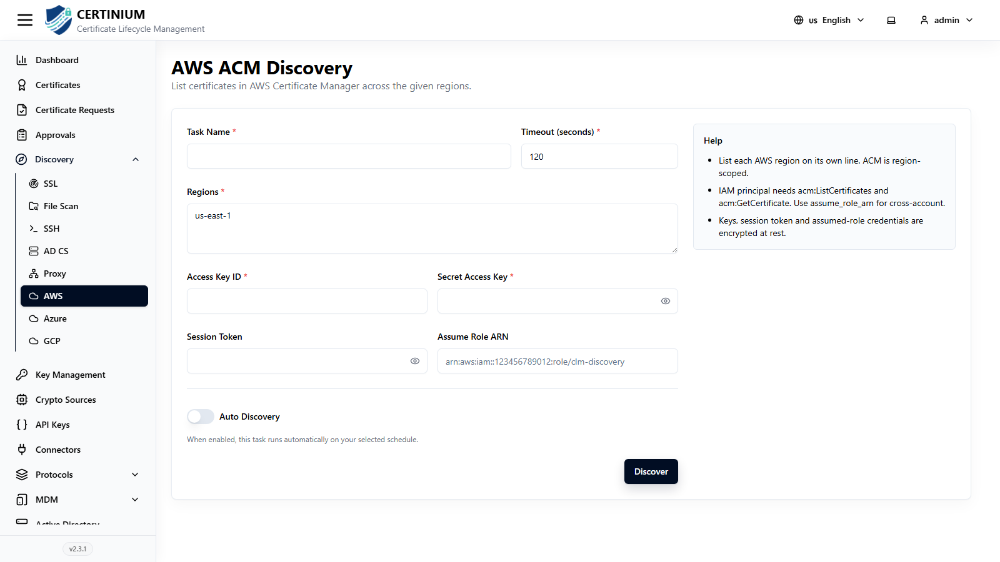
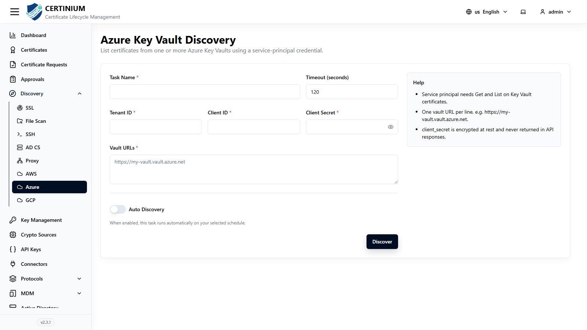
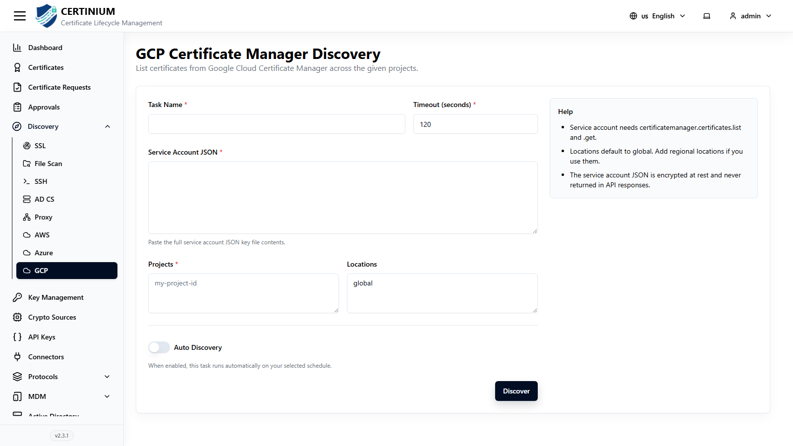

# Discovery

**Discovery** finds certificates that already exist in your environment — on network hosts, filesystems, SSH servers, Active Directory, proxies, and cloud key stores — so they can be inventoried, tracked for expiry, and brought under CLM's management.

Each discovery type has its own dedicated page under the **Discovery** sidebar group. Every page is a self-contained task form with an on-screen **Help** panel, a **Discover** button to run the scan immediately, and an **Auto Discovery** toggle to run it on a recurring schedule instead (scheduled discovery tasks then appear under [Settings → Scheduler](settings.md)). Certificates found by any discovery type appear in [Certificates](certificates.md) tagged with protocol `DISCOVERY IMPORT`, and every run is recorded in [Audit → Discovery Logs](audit.md).

## SSL Discovery

Scans hosts for SSL/TLS certificates presented on their listening ports.

- **Task Name***, **Port(s)***, **Timeout (seconds)***
- **Discover By** — choose one:
    - **Hostname / IP Address** — a single target.
    - **IP Address Range** — a start/end IP range, with an optional exclusion list.
    - **From File** — upload a list of hosts (one per line, `host` or `host:port[,port]`).
    - **Subnet** — a network base and mask, with an optional exclusion list.
- **Verify SSL**, **Get Full Chain**, **Include Expired** — toggles controlling how the scan validates and what it captures.
- **Auto Discovery** — run on a recurring schedule.

## File Scan (File-based Discovery)

Scans the local filesystem on the CLM server for certificate files.

- **Task Name***, **Timeout (seconds)***
- **Path to Scan*** — one path per line; lines starting with `#` are ignored.
- **Recursive** — scan nested folders, or only the given folder.
- **File Formats** — checklist of extensions to include: `.pem`, `.crt`, `.cer`, `.der`, `.pfx`, `.p12`, `.jks`, `.keystore`, `.pub`.
- **Keystore passwords** — add passwords used to unlock `.pfx`/`.p12`/`.jks` files during the scan.
- **Auto Discovery**

## SSH-based Discovery

Logs in to Unix/Linux hosts over SSH and walks standard certificate directories.

- **Task Name***, **Timeout (seconds)***
- **Host***, **Port***, **Username***
- **Password** or **Private Key (PEM)** (with optional **Private Key Passphrase**) — provide one of the two; both are encrypted at rest.
- **Search Path***, **File Formats**
- **Auto Discovery**

## Active Directory / AD CS Discovery

Enumerates user, computer, service, and CA-issued certificates from Active Directory over LDAP.

- **Task Name***, **Timeout (seconds)***
- **Domain Controller*** — e.g. `ldaps://dc.corp.local` (use `ldaps://` for TLS; plain `ldap://` sends the bind password in cleartext).
- **Base DN*** — e.g. `DC=corp,DC=local`.
- **Bind User***, **Bind Password***
- **Scopes** — which certificate sources to enumerate: **User**, **Computer**, **Service**, **CA-issued** (root/intermediate CA certificates).
- **Verify TLS**, **Auto Discovery**

This is distinct from the [Active Directory](active_directory.md) page, which shows certificates CLM has *published* to AD/LDAP identities rather than certificates *discovered* from AD.

## Proxy Server Discovery

Inventories certificates seen via a corporate proxy, either by tunneling a TLS handshake through it or by querying the proxy vendor's own API.

- **Task Name***, **Timeout (seconds)***
- **Mode** — **Active TLS** (tunnels each target's TLS handshake through the proxy and reads the server certificate) or **Vendor API** (pulls inventory from the proxy's admin API — e.g. Zscaler, Blue Coat, Palo Alto).
- **Proxy URL***, **Targets (host:port)*** (one per line), **Proxy Username**, **Proxy Password**
- **Auto Discovery**

## AWS ACM Discovery

Lists certificates in AWS Certificate Manager across the given regions.

- **Task Name***, **Timeout (seconds)***, **Regions*** (one per line)
- **Access Key ID***, **Secret Access Key***, optional **Session Token**, optional **Assume Role ARN** for cross-account access.
- The IAM principal needs `acm:ListCertificates` and `acm:GetCertificate`. Credentials are encrypted at rest.
- **Auto Discovery**

## Azure Key Vault Discovery

Lists certificates from one or more Azure Key Vaults using a service-principal credential.

- **Task Name***, **Timeout (seconds)***
- **Tenant ID***, **Client ID***, **Client Secret***
- **Vault URLs*** — one per line, e.g. `https://my-vault.vault.azure.net`.
- The service principal needs `Get` and `List` on Key Vault certificates.
- **Auto Discovery**

## GCP Certificate Manager Discovery

Lists certificates from Google Cloud Certificate Manager across the given projects.

- **Task Name***, **Timeout (seconds)***
- **Service Account JSON*** — paste the full service account JSON key file contents.
- **Projects*** — one project ID per line.
- **Locations** — defaults to `global`; add regional locations if you use them.
- The service account needs `certificatemanager.certificates.list` and `.get`.
- **Auto Discovery**

---

All credential fields across every discovery type are encrypted at rest and are never returned in API responses once saved.
