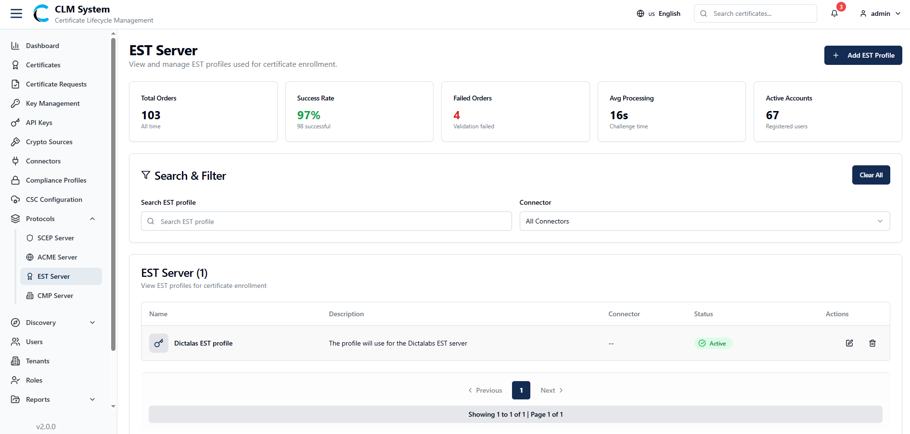
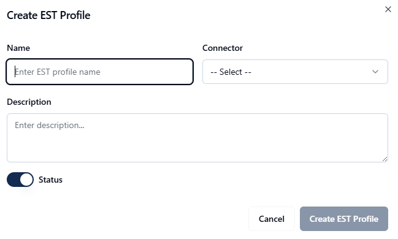

# Managing EST Server

The EST Server module allows administrators to configure and manage EST (Enrollment over Secure Transport) profiles used for certificate enrollment.

## Accessing EST Server

From the sidebar menu, navigate to **Protocols > EST Server**.

The EST Server page opens, showing an overview of all EST profiles in the system.

### EST Server Overview

At the top of the page, administrators can view summary information displayed in cards:

- **Total Orders** – The total number of certificate enrollment orders handled by the EST server.
    
- **Success Rate** – The percentage of successful enrollments.
    
- **Active Orders** – The number of orders currently in progress.
    
- **Failed Orders** – The number of enrollment orders that failed.
    
- **Avg Processing** – The average processing time for EST enrollment requests.
    
- **Active Accounts** – The total number of accounts actively using the EST service.

## Search and Filter

Below the summary cards, a **Search and Filter** section allows administrators to:

- Search EST profiles by name or keyword.
    
- Apply filters (e.g., by connector, status, or success rate).

## EST Profiles List

The EST profiles list table provides detailed information about each configured profile, typically including:

- **Profile Name**
    
- **Associated Connector**
    
- **Status (Active/Inactive)**
    
- **Description**
    
- **Actions (e.g., View, Edit, Disable, Delete)**
    

This view enables administrators to efficiently manage and monitor all EST profiles across the CLM system.

## Creating a New EST Profile

To define a new EST profile in CLM, follow these steps:

### 1. Navigate to the EST Server Page

From the sidebar menu, go to **Protocols > EST Server**.

On the top-right corner of the page, click the **Add EST Profile** button.

### 2. Fill in the EST Profile Form

A form will appear with the following fields:

- **Name** – Enter a unique name for the EST profile.
    
- **Connector (Dropdown)** – Select the connector to be associated with this EST profile.
    
- **Description** – Provide a brief description of the EST profile’s purpose.
    
- **Status** – Choose whether the profile should be Active or Inactive.

### 3. Save the Profile

After completing the form, click the **Create Profile** button.

### 4. Post-Creation

The new EST profile will appear in the EST Profiles List with its details.  
Administrators can later edit, disable, or delete the profile as needed.

