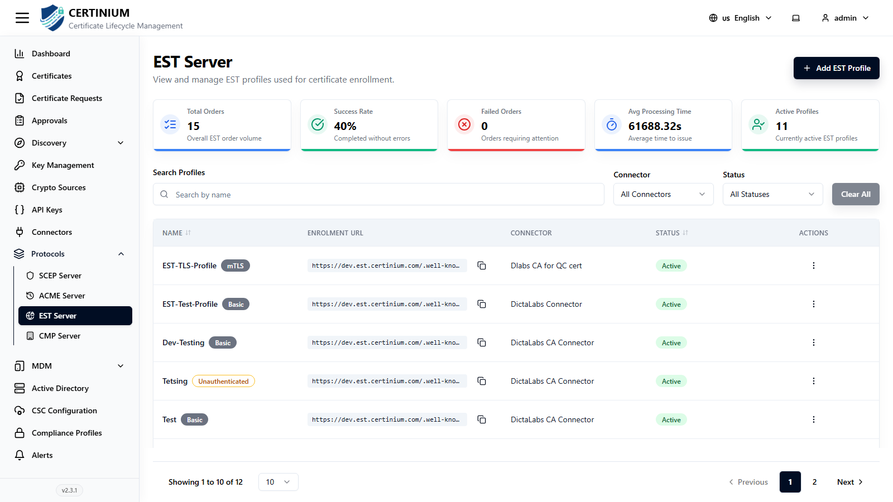
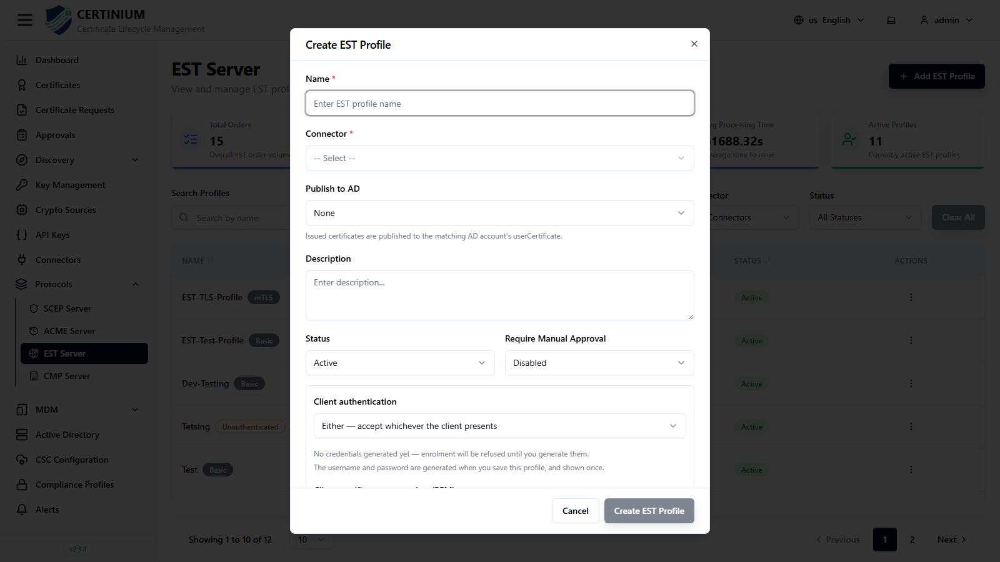

# EST Server

**EST** (Enrollment over Secure Transport) profiles let clients enroll for certificates over HTTPS, optionally using mutual TLS for client authentication.

## Accessing EST Server

From the sidebar, select **Protocols → EST Server**.

### EST Server overview

Summary cards show **Total Orders**, **Success Rate**, **Active Orders**, **Failed Orders**, **Avg Processing** time, and **Active Accounts**.

### Search and filter

- **Search** — by name or keyword.
- **Connectors**, **Status** — narrow the list.
- **Clear All** — resets all filters.

### EST profiles list

| Column | Description |
|---|---|
| Name | Profile name. |
| Enrolment URL | The EST enrollment endpoint clients connect to. |
| Connector | The [connector](connectors.md)/CA backing this profile. |
| Status | Active or Inactive. |
| Actions | View, edit, or delete. |

## Creating a new EST profile

1. Click **Add EST Profile** (top right).
2. Fill in the form:

    

    - **Name*** — the EST profile name.
    - **Connector***
    - **Publish to AD** — optionally publish issued certificates to Active Directory (see [Active Directory](active_directory.md)).
    - **Description**
    - **Status** — Active or Inactive.
    - **Require Manual Approval** — route enrollments through [Approvals](approvals.md).
    - **Client authentication** — how EST authenticates enrolling clients, e.g. "Either — accept whichever the client presents" (username/password or a client certificate).
    - **Client certificate trust anchor (PEM)** — when client-certificate authentication is used, paste the CA certificate(s) EST should trust for verifying the client's presented certificate.

3. Click **Create EST Profile** to save.
