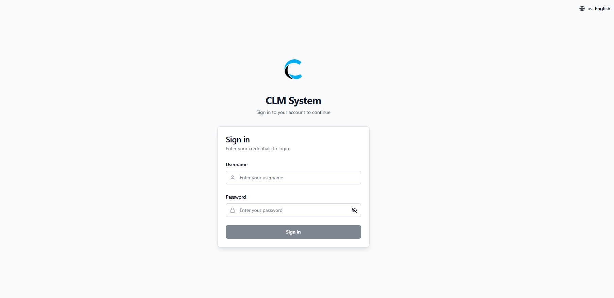
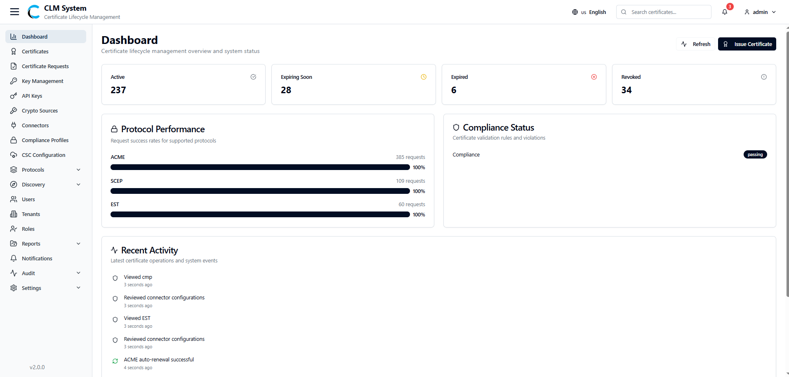

# CLM Admin Guide

## Overview
The **Certificate Life Management (CLM)** web application is a centralized platform designed to streamline the complete lifecycle of digital certificates within an organization. It enables administrators to request, issue, monitor, renew, and revoke certificates through a secure, user-friendly interface.

In modern IT environments, digital certificates are critical for securing communication, authenticating systems, and ensuring data integrity. Managing these certificates manually can be complex, error-prone, and risky—especially when dealing with large infrastructures or multiple certificate authorities (CAs). CLM addresses these challenges by offering:

- **Centralized Management** – A single interface to handle certificates from request to retirement.
    
- **Automation** – Reduce manual effort by automating renewals, alerts, and status tracking.
    
- **Compliance & Security** – Enforce organizational policies, ensure timely renewals, and maintain audit trails for compliance.
    
- **Visibility & Control** – Gain real-time insights into certificate status, expiration timelines, and usage across systems.
    

The CLM web application is designed for **administrators and security teams** who are responsible for ensuring secure, uninterrupted operations of enterprise systems. By using CLM, admins can minimize downtime caused by expired certificates, mitigate security risks, and maintain compliance with industry standards.

## Accessing CLM
Administrators can access the **Certificate Life Management (CLM)** application through a standard web browser.

- **URL:** `https://clm.companyname.com`
    
- **Supported Browsers:** Latest versions of Google Chrome, Microsoft Edge, Mozilla Firefox, and Safari.
    
- **Network Requirements:** Ensure your device has network access to the CLM server and that any VPN or firewall settings allow secure HTTPS traffic.
    

For security purposes, always verify that you are connecting to the official company CLM URL and that the connection is established over **HTTPS**.

## Login
After accessing the CLM application link, administrators are presented with the **Login Page**.

1. **Enter Credentials**
    
    - Provide your assigned **Username** and **Password** in the respective fields.
        
    - If your organization has enabled **Multi-Factor Authentication (MFA)**, you will be prompted to complete the additional verification (such as entering a one-time code or approving a push notification).
        
2. **Submit Login**
    
    - Click on the **Login** button to proceed.
        
3. **Successful Login**
    
    - Upon successful authentication, the system redirects you to the **Dashboard**, which is the starting point for all certificate management activities.
        
4. **Unsuccessful Login**
    
    - If the credentials are incorrect, the system will display an error message.
        
    - Ensure that the details are entered correctly. If the issue persists, contact the system administrator.
        

For security reasons, the system may lock the account temporarily after multiple failed login attempts.

## Dashboard
After a successful login, the administrator is redirected to the **CLM Dashboard**. The dashboard provides a centralized view of certificate operations, protocol performance, compliance status, and recent activities. It serves as the primary workspace for monitoring the overall health and security of the certificate environment.

### Certificate Statistics
The certificate statistics panel displays an overview of the current state of certificates within the system, categorized as:

- **Active** – Certificates currently valid and in use.
    
- **Expiring Soon** – Certificates approaching their expiry date (based on system-configured threshold).
    
- **Expired** – Certificates that are no longer valid.
    
- **Revoked** – Certificates that have been manually revoked or invalidated due to policy or security concerns.

### Protocol Performance
This section provides insights into the performance and health of various certificate enrollment and management protocols supported by CLM, such as:

- **ACME**
    
- **SCEP**
    
- **CMP**
    
- **EST**
    

Performance metrics include success rates, and number of request helping administrators quickly identify issues.

### Compliance Status
The compliance panel provides an overview of the active compliance profile.

- Displays the number of violations and their current status.
    
- Helps administrators ensure all certificates align with security policies and compliance requirements.

### Recent Activities
A real-time activity log summarizing the latest actions performed within CLM, such as:

- Certificate requests and issuances.
    
- Renewals and revocations.
    
- Administrative changes.
    

This feature provides visibility into system usage and aids in auditing and troubleshooting.

