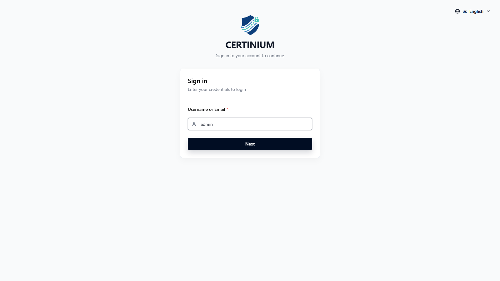
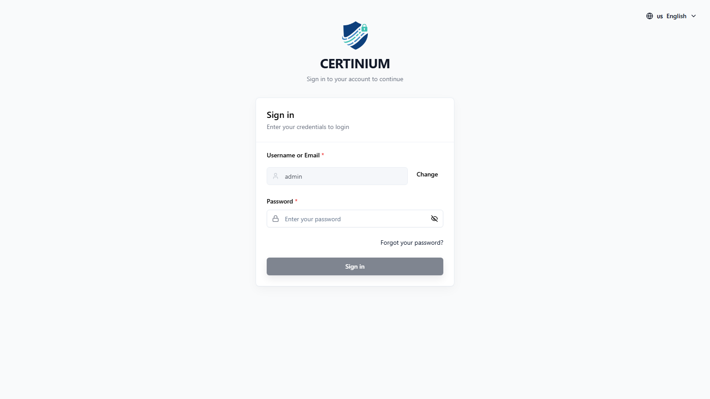
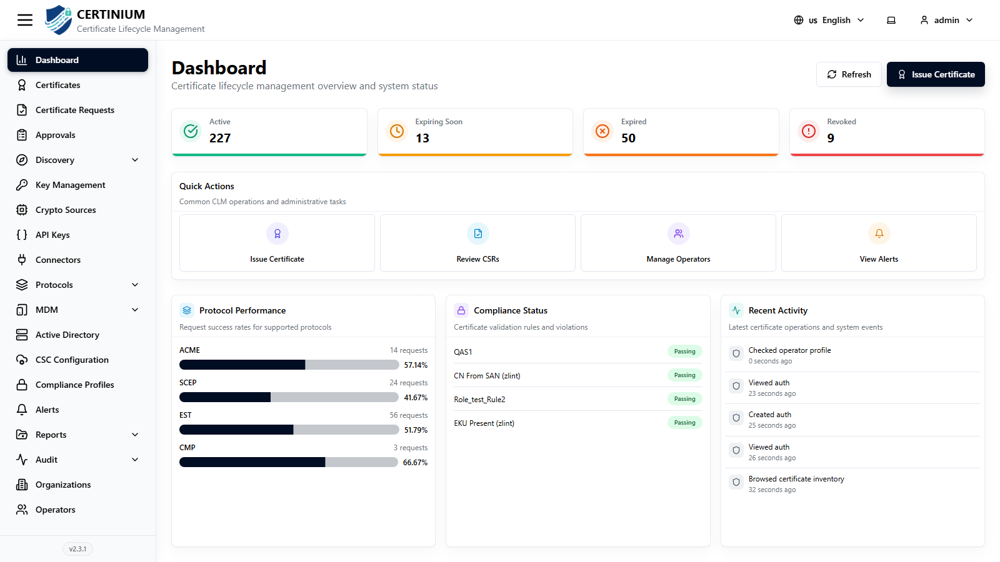

# CLM Admin Guide

## Overview

**Certinium** is a centralized **Certificate Lifecycle Management (CLM)** platform that streamlines the complete lifecycle of digital certificates within an organization. It lets administrators request, issue, discover, monitor, renew, and revoke certificates through a single secure interface.

In modern IT environments, digital certificates are critical for securing communication, authenticating systems and devices, and ensuring data integrity. Managing them manually across many certificate authorities, protocols, and cloud/on-prem stores is complex and risky. Certinium addresses this by offering:

- **Centralized management** — a single interface covering certificate requests, issuance, discovery, renewal, and revocation across every organization you manage.
- **Automation** — Discovery scans, auto-discovery schedules, protocol-based auto-enrollment (SCEP/ACME/EST/CMP), and MDM (Microsoft Intune) certificate delivery reduce manual work.
- **Compliance & security** — configurable compliance rules and profiles, an approval workflow for sensitive requests, and a full audit trail (operation, discovery, and API key logs).
- **Visibility & control** — dashboards, reports, and alerts give real-time insight into certificate status, expirations, and usage across every connected system.

This guide is written for **administrators** — the people responsible for configuring organizations, roles, operators, connectors, and the certificate infrastructure itself, as opposed to day-to-day certificate requesters.

## Accessing CLM

Administrators access Certinium through a standard web browser, at the URL provided by your organization (for example `https://clm.yourcompany.com`).

- **Supported browsers:** current versions of Google Chrome, Microsoft Edge, Mozilla Firefox, or Safari.
- **Network requirements:** your device needs HTTPS access to the CLM server; make sure any VPN or firewall rules allow this.

Always confirm you are connecting to your organization's official CLM URL over HTTPS before entering credentials.

## Login

Login is a two-step process.

**Step 1 — Username or Email**

Enter your username or email address and click **Next**.

**Step 2 — Password**

- Your username is shown (read-only); click **Change** to go back and re-enter it.
- Enter your **Password** and click **Sign in**.
- If the account doesn't have a password set (SSO or mutual-TLS accounts, see [Operators](operators.md)), this step is replaced by the appropriate login method.
- If your account has **Two-Factor Authentication (2FA)** enabled (see [User Profile](user_profile.md)), you'll be prompted for a 6-digit code from your authenticator app after your password is accepted.
- **Forgot your password?** — use the link on this screen to start a password-reset email flow.

On success you're redirected to the **Dashboard**. On failure, an error is shown; repeated failed attempts will temporarily lock the account.

## Dashboard

After login, administrators land on the **Dashboard** — a centralized view of certificate operations, protocol performance, compliance status, and recent activity.

### Certificate statistics

Four cards summarize the certificate inventory:

- **Active** — certificates currently valid and in use.
- **Expiring Soon** — certificates approaching their expiry date.
- **Expired** — certificates that are no longer valid.
- **Revoked** — certificates manually revoked or invalidated.

### Quick Actions

Shortcut cards to the most common administrative tasks:

- **Issue Certificate** — opens the Issue Certificate dialog (see [Certificates](certificates.md)).
- **Review CSRs** — jumps to [Certificate Requests](certificate_requests.md).
- **Manage Operators** — jumps to [Operators](operators.md).
- **View Alerts** — jumps to [Alerts](alerts.md).

### Protocol Performance

Request volume and success rate for each supported enrollment protocol: **ACME**, **SCEP**, **EST**, and **CMP**. See [Protocols](scep_server.md) for configuring each.

### Compliance Status

A live snapshot of your active [Compliance Profiles](compliance_profiles.md) — each rule shown with its current pass/fail state (e.g. "Passing").

### Recent Activity

A real-time feed of the latest actions across the system — logins, certificate operations, role/permission changes, connector updates, and more. For the full, filterable history see [Audit](audit.md).

Use **Refresh** (top right) to update all dashboard data on demand.

## Getting Started: your first certificate

Most of this guide's pages link forward to whatever they depend on, but if you're setting up CLM for the first time, this is the order that gets you from a fresh login to your first issued certificate:

0. *(Optional)* **[Settings](settings.md)** — set your Application Name, Company Name, Application URL, Support Email, and branding before inviting anyone else in.
1. **[Organizations](organizations.md)** — create at least one organization. Almost everything else in CLM is scoped to one.
2. **[Connectors](connectors.md)** — add a connector for the CA that will issue your certificates (e.g. EJBCA, Microsoft CA, or Dictalabs CA). If you'll store keys locally rather than in an external HSM/cloud KMS, also add a **Crypto Engine** connector.
3. **[Crypto Sources](crypto_sources.md)** — create a store (software, PKCS#11, AWS KMS, or Azure Key Vault) on top of that Crypto Engine connector.
4. **[Key Management](key_management.md)** — generate a key pair on that crypto source.
5. **[Certificate Requests](certificate_requests.md)** — generate a CSR against that key.
6. **[Approvals](approvals.md)** — if the request needs approval, approve it here.
7. **[Certificates](certificates.md)** — issue the certificate against your approved request and CA connector.

Once that end-to-end flow works, you're ready to explore the rest of the guide: [Discovery](discovery.md) to find certificates that already exist in your environment, the [Protocols](scep_server.md) pages to let clients and devices enroll automatically instead of requesting through the UI, and [Roles](roles.md) / [Operators](operators.md) to bring in the rest of your team.

### Optional integrations

A few sections are only relevant if you use the specific system they integrate with — skip them unless they apply to you:

- **[MDM](mdm.md)** — only if you manage devices with Microsoft Intune.
- **[Active Directory](active_directory.md)** — only if you publish certificates to on-prem Active Directory / LDAP identities.
- **[CSC Configuration](csc_configuration.md)** — only if an external application needs to request signatures against CLM via the Cloud Signature Consortium API.
- **[API Keys](api_keys.md)** — only if you need programmatic/API access to CLM rather than working entirely through the UI.
