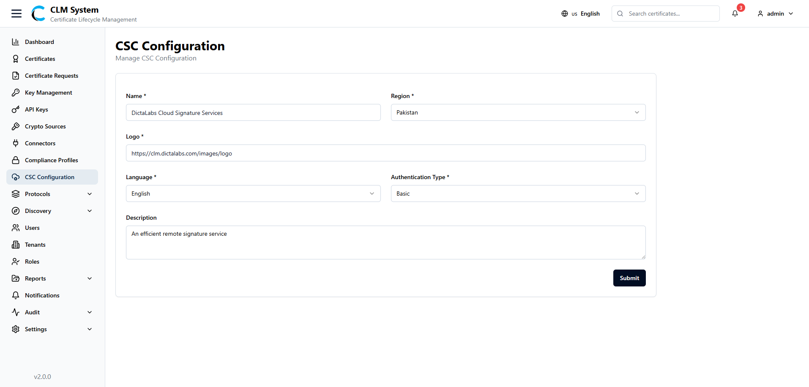
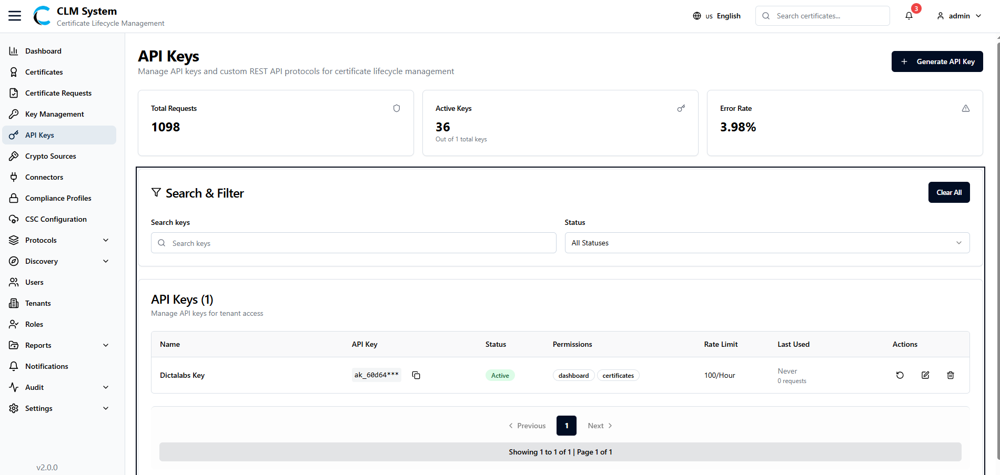
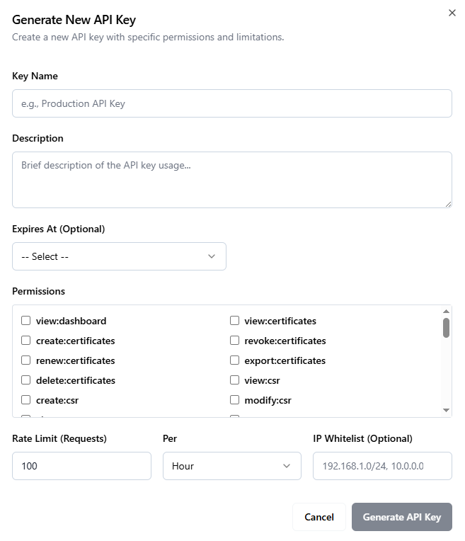

# API Integration

This section explains how to integrate external systems with the CLM (Certificate Lifecycle Management) platform using its APIs. The platform provides two primary integration capabilities to meet diverse business needs:

- **CSC Signing APIs** – Integrate remote digital signing capabilities directly into your own applications and workflows.
    
- **CLM Data APIs** – Retrieve, manage, and synchronize certificate-related data within your external systems.

### CSC Configuration

In the **CSC Configuration** tab, administrators can set up and manage CSC providers.  

The configuration form includes the following fields:

- **Name** – The name of the CSC provider.
- **Region** – The operational region of the provider.
- **Logo** – Upload or set the logo for easy identification.
- **Language** – Select the preferred language for communication.
- **Authentication Type** – Choose the authentication mechanism.
- **Description** – Provide additional details about the CSC configuration.

### Usage of CSC for Signing

Below are the supported CSC endpoints with their request methods, authentication details, and usage descriptions.

---
### /csc/v2/info

**Description:**  
Retrieves general information about the CSC service, such as capabilities, supported algorithms, and service metadata.

**Method:** POST  
**Authentication:** None  
**Request Body:** _(Empty)_  
**Response:** Returns service information and configuration details.

---
### /csc/v2/auth/login

**Description:**  
Authenticates the user and retrieves an access token used for subsequent CSC API calls.

**Method:** POST  
**Authentication:** Basic Authentication (username, password)  
**Request Body:** _(Empty)_  
**Response:** Returns an access token that must be included in the Authorization header of the following API requests.

---
###  /csc/v2/credentials/list

**Description:**  
Fetches a list of available credentials (certificates) that the authenticated user can use for signing.

**Method:** POST  
**Authentication:** Bearer Token (Access Token from /auth/login)  
**Request Body:** _(Empty)_  
**Response:** Returns a list of credentials, including credentialID, type, and associated metadata.

---
### /csc/v2/credentials/info

**Description:**  
Retrieves detailed information about a specific credential.

**Method:** POST  
**Authentication:** Bearer Token (Access Token from /auth/login)  
**Request Body (JSON):**

`{   "credentialID": "string" }`

**Response:** Returns details such as key type, issuer, validity period, and supported signing algorithms.

---
### /csc/v2/signatures/signHash

**Description:**  
Performs a digital signature operation on provided hash values using a selected credential.

**Method:** POST  
**Authentication:** Bearer Token (Access Token from /auth/login)  
**Request Body (JSON):**

`{   "credentialID": "string",   "hashes": ["base64_encoded_hash"],   "signAlgo": "signAlgo_OID"  }`

**Response:** Returns the signature (Base64-encoded signed hash) .
### Managing API Keys

View and manage API keys used for external system integration with CLM.

#### Accessing API Keys

From the sidebar menu, navigate to **API Keys** under the **Integration** section.

The **API Keys** page opens, showing an overview of all generated API keys in the system.

#### API Keys Overview

At the top of the page, administrators can view summary information displayed in cards:

- **Total Requests** – Total number of API requests made using all keys.
- **Active Keys** – Number of currently active API keys.
- **Error Rate** – Percentage of failed or unauthorized API requests.
#### Search and Filter

Below the summary cards, a **Search and Filter** section allows administrators to:

- Search API keys by name or keyword.
- Apply filters such as status, permissions, or activity date.
#### API Keys List

The **API Keys List Table** provides detailed information for each API key, including:

- **Name** – The assigned name of the API key.
- **API Key** – The unique token string used for integration.
- **Status** – Indicates whether the key is Active or Inactive.
- **Permissions** – Modules or scopes the key is authorized to access.
- **Rate Limit** – Maximum number of requests allowed within the defined period.
- **Last Used** – Timestamp of the most recent request made using the key.
- **Actions** – Options to view, edit, regenerate, or revoke the API key.

This view enables administrators to efficiently monitor and manage API usage across all integrations.

### Generating API Keys

API keys in CLM allow secure integration of external systems with CLM services. Administrators can generate API keys with controlled permissions, validity, and access rules.

#### Navigate to the API Key Page

From the sidebar menu, go to **API Keys**.  
On the top-right corner of the page, click the **Generate Key** button.

#### Fill in the API Key Form

A form will open with the following fields:

- **Key Name** – Enter a unique name for the API key.
- **Description** – Provide a short description of the key’s purpose.
- **Expires At** – Select the key expiration period:
    - **30 Days**
    - **60 Days**
    - **Never**
    - **Custom** – Choose a specific expiration date manually.
- **Permissions** – Select modules or features this API key can access by checking/unchecking options in the permissions list.
- **Rate Limit (Requests)** – Define the number of requests allowed for this API key.
- **Per (Time)** – Choose the time unit for rate limiting (Hours, Minutes, or Days).
- **IP Whitelist** – Specify one or more IP addresses allowed to use this API key.

#### Save the API Key

After completing the form, click the **Generate Key** button.

### Using API Keys for Integration

Once an API key is generated, administrators can share it with authorized users or external systems that need to communicate with CLM services.

External applications can use the API key to securely call CLM’s REST APIs, available in the **CLM API Swagger** interface.

To authenticate API requests, include the generated API key in the **Authorization** header as follows:

`Authorization: Bearer <your-api-key>`

This allows external systems to invoke CLM endpoints such as certificate management, tenant data, compliance operations, and other available modules — based on the permissions assigned to the API key.