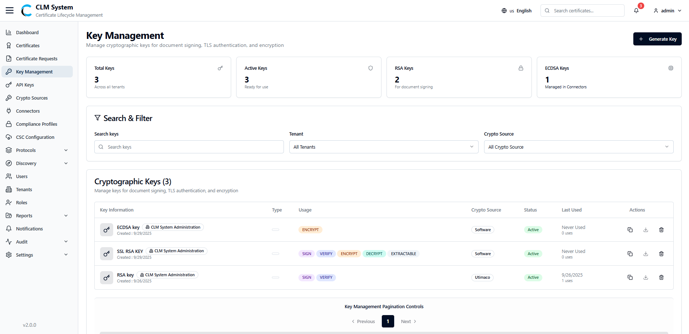
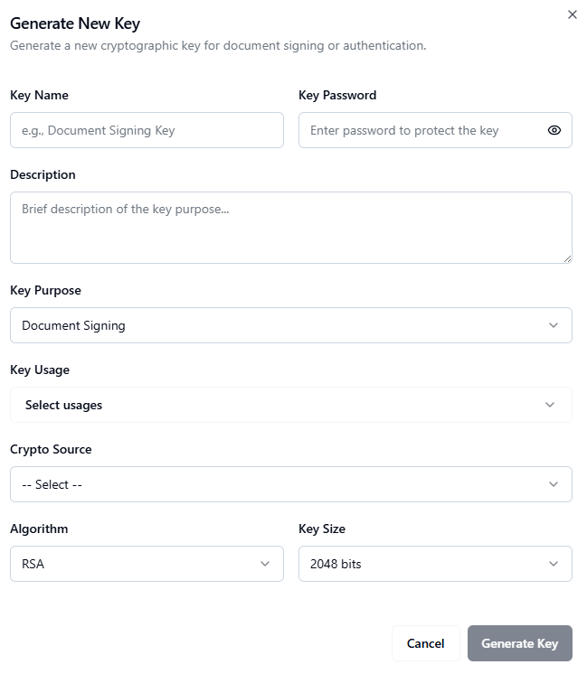

# Key Management

## Overview
*(Paste the full Key Management Overview text from the PDF — describe how key management functions within CLM, including key generation, storage, and lifecycle operations.)*

## Accessing Key Management
*(Insert the detailed instructions for navigating to the Key Management section in the CLM Admin Portal.)*

## Search and Filter
*(Paste the text explaining how to search and filter existing keys in the system.)*
- Use the search bar to locate keys by alias, type, or associated crypto source.  
- Apply filters for status, creation date, or key type (RSA, ECDSA, etc.).  

## Keys List
*(Paste the content describing the list view — include table column names, available key actions, and any notes about visibility.)*
- Key Alias  
- Key Type  
- Algorithm  
- Associated Crypto Source  
- Status  
- Actions (View, Edit, Delete)

## Creating a New Key
*(Paste the full step-by-step guide from the PDF for creating or importing a new key, converting numbered lists into bullet points.)*
- Click **Add Key** or **Create New Key**.  
- Select a crypto source from the list.  
- Choose the key type and algorithm.  
- Define key parameters such as size, curve (if applicable), and usage.  
- Save to generate or import the key.  

## Key Details
*(Paste any extra content explaining how to view details for an existing key, including metadata, usage, and related certificates.)*

## Key Operations
*(Paste content covering available operations like export, rotation, and deletion of keys.)*
- Export public key material if needed.  
- Rotate keys periodically for enhanced security.  
- Delete retired or compromised keys with appropriate authorization.  

