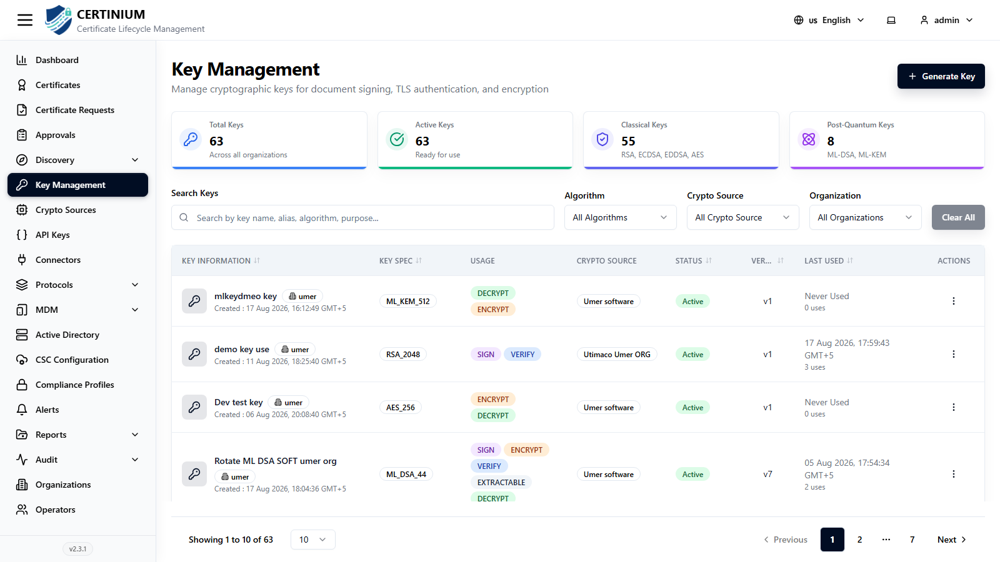
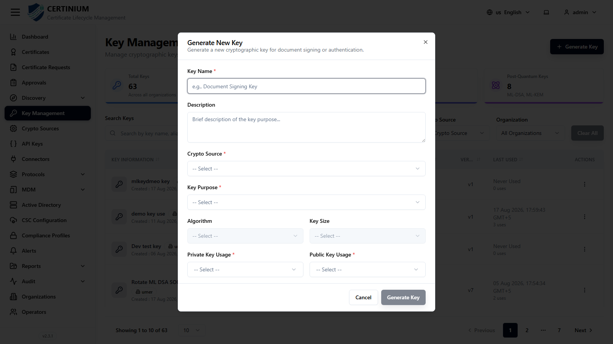

# Key Management

**Key Management** is where cryptographic key pairs are generated and tracked. Keys are created on a chosen [Crypto Source](crypto_sources.md) and are later selected when generating a [Certificate Request](certificate_requests.md).

## Accessing Key Management

From the sidebar, select **Key Management**.

### Key Management overview

Summary cards show:

- **Total Keys**
- **Active Keys**
- **Classical Keys** — traditional algorithms (RSA, ECDSA, EdDSA).
- **Post-Quantum Keys** — quantum-resistant algorithms (e.g. the ML-DSA / Dilithium family).

### Search and filter

- **Search Keys** — by key name, alias, algorithm, or purpose.
- **Algorithm**, **Crypto Source**, **Organization** — narrow the list.
- **Clear All** — resets all filters.

### Keys list

| Column | Description |
|---|---|
| Key Information | Key name and owning organization. |
| Type | Algorithm and size/curve, e.g. `RSA_2048`, `AES_256`, `ML_DSA_44`, `ED25519`. |
| Usage | Tags such as `SIGN`, `VERIFY`, `ENCRYPT`, `DECRYPT`, `EXTRACTABLE`. |
| Crypto Source | The store the key lives on. |
| Status | Active or Inactive. |
| Version | Key version number — incremented on rotation. |
| Last Used | Timestamp of last use, or "Never Used". |
| Actions | Row-level actions. |

## Generating a new key

1. Click **Generate Key** (top right).
2. Fill in the form:

    

    - **Key Name*** — e.g. "Document Signing Key".
    - **Description**
    - **Crypto Source*** — which store (see [Crypto Sources](crypto_sources.md)) generates and holds the key.
    - **Key Purpose*** — e.g. Signing, Encryption, TLS/Authentication.
    - **Algorithm** — the available options depend on the selected Key Purpose and Crypto Source, and include classical algorithms (RSA, ECDSA, EdDSA) and post-quantum algorithms (the ML-DSA family).
    - **Key Size** — algorithm-dependent (e.g. 2048/3072/4096 for RSA; curve name for ECDSA/EdDSA).
    - **Private Key Usage*** and **Public Key Usage*** — the cryptographic operations each half of the key pair is allowed to perform (sign, verify, encrypt, decrypt, etc.).

3. Click **Generate Key** to save.

!!! tip "Rotation"
    Generating a new version of an existing key (rather than a brand-new key) increments its **Version** number, which is how CLM tracks key rotation history while keeping the same logical key identity for dependent certificates.
