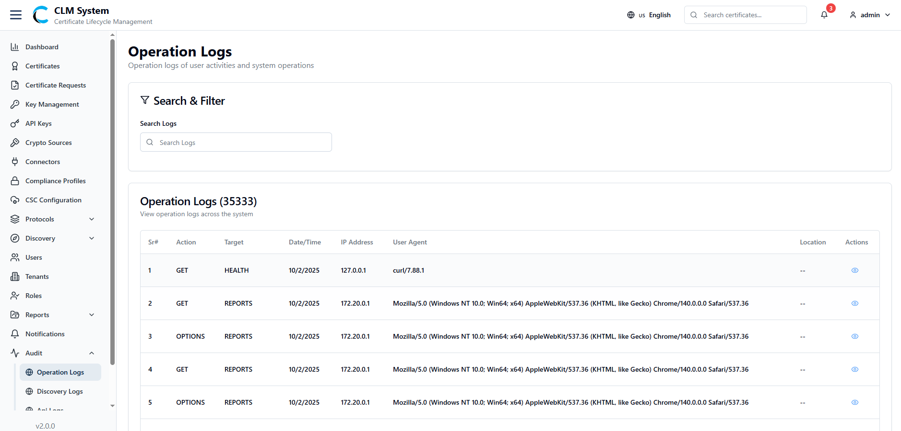
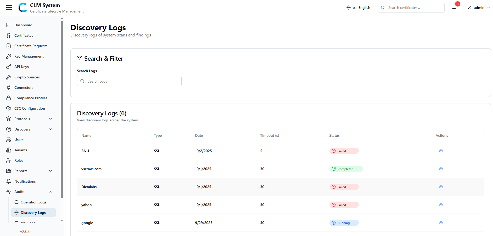

# Managing Audit Logs

The **Audit** section provides administrators with visibility into user activities, system operations, and discovery scans. Audit logs are organized into two categories: **Operation Logs** and **Discovery Logs**

### Operation Logs

**Description**  
Operation logs capture all user activities and system operations performed within CLM.

**Accessing Operation Logs**

1. Navigate to **Audit > Operation Logs**.
    
2. The **Operation Logs** page opens.

**Operation Logs Screen**

- A **Search and Filter** section allows administrators to refine log results.
    
- Below this section, a **list of operation logs** is displayed, typically including details such as:
    
    - User
        
    - Operation Type
        
    - Status (Success/Failure)
        
    - Ip Address
        
    - Actions (Veiw the request)
        

This view helps track user actions and system changes for auditing and compliance purposes.

### Discovery Logs

**Description**  
Discovery logs record the results of system scans and findings, providing insights into detected certificates, services, or assets.

**Accessing Discovery Logs**

1. Navigate to **Audit > Discovery Logs**.
    
2. The **Discovery Logs** page opens.

**Discovery Logs Screen**

- A **Search and Filter** section allows administrators to refine log results.
    
- Below this section, a **list of discovery logs** is displayed, typically including:
    
    - Name
        
    - Type
        
    - Date
        
    - Status (Active/Expired/Invalid)
        
    - Timeout (s)
        
    - Actions
        

This helps administrators monitor automated discovery scans and review system findings efficiently.

	