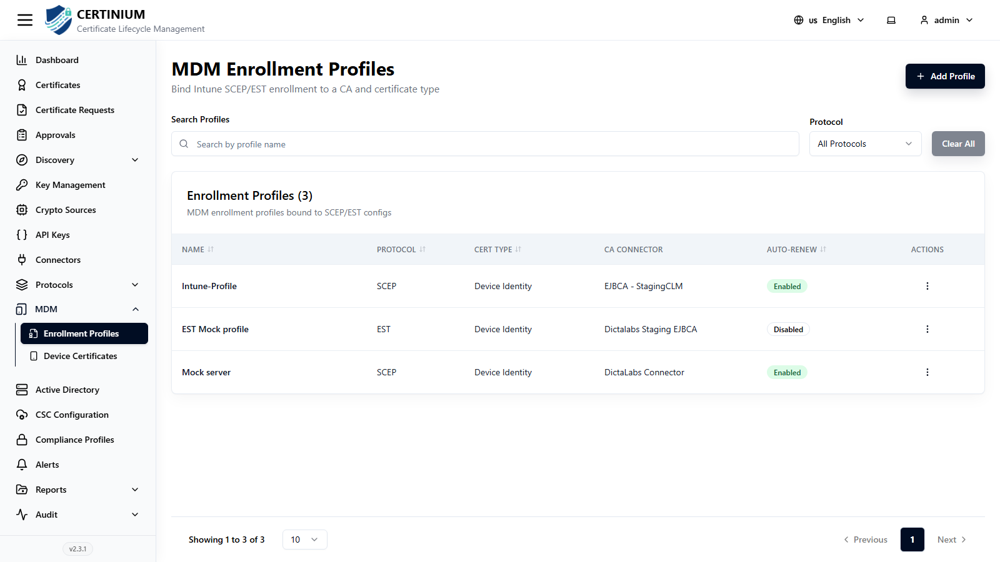
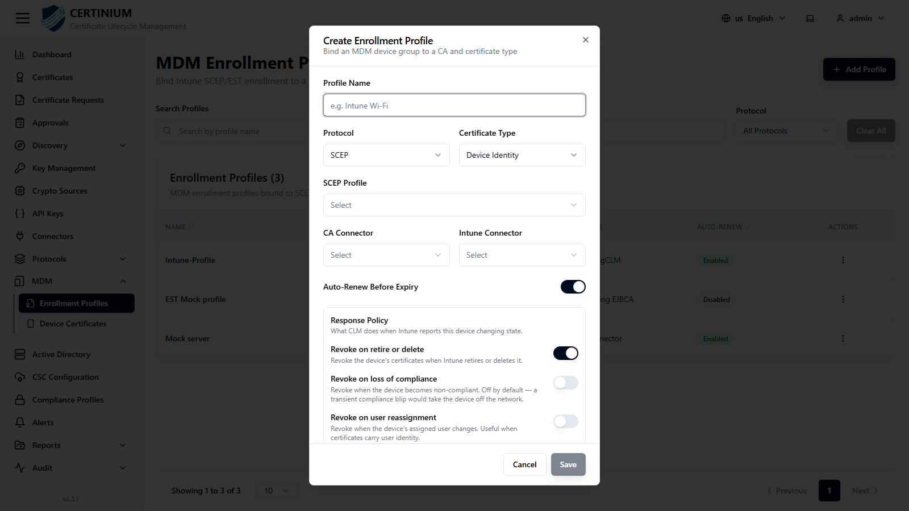
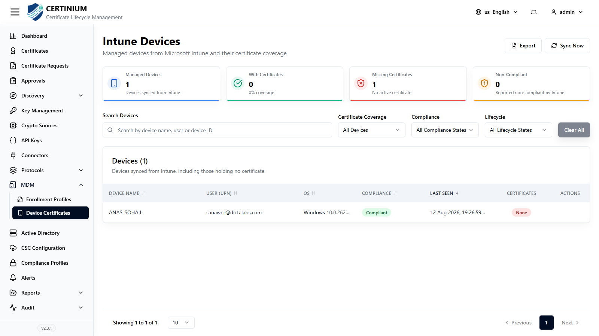

# MDM

!!! note "Optional integration"
    Only relevant if you manage devices with **Microsoft Intune**. Skip this section otherwise.

**MDM** integrates CLM with Microsoft Intune so managed devices can automatically receive and renew certificates.

## Enrollment Profiles

Enrollment Profiles define how a certificate is issued to Intune-managed devices, and what happens to that certificate over the device's lifecycle.

From the sidebar, select **MDM → Enrollment Profiles**.

### Search and filter

- **Search** — by name.
- **Protocol** — narrow by enrollment protocol.
- **Clear All** — resets all filters.

### Enrollment Profiles list

| Column | Description |
|---|---|
| Name | Profile name. |
| Protocol | Enrollment protocol used, e.g. SCEP. |
| Cert Type | e.g. Device Identity. |
| CA Connector | The connector/CA issuing the certificate. |
| Auto-renew | Whether certificates are automatically renewed before expiry. |
| Actions | View, edit, or delete. |

### Creating a new enrollment profile

1. Click **Add Profile** (top right).
2. Fill in the form:

    

    - **Profile Name*** — e.g. "Intune Wi-Fi".
    - **Protocol** — e.g. SCEP.
    - **Certificate Type** — e.g. Device Identity.
    - **SCEP Profile** — the [SCEP profile](scep_server.md) used for enrollment.
    - **CA Connector**, **Intune Connector** — which connectors provide the CA and Intune integration.
    - **Auto-Renew Before Expiry** — toggle automatic renewal.

    **Response Policy** — what happens to the device's certificate under specific Intune events:

    - **Revoke on retire or delete** — revoke the device's certificates when Intune retires or deletes it.
    - **Revoke on loss of compliance** — revoke when the device becomes non-compliant. Off by default, since a transient compliance blip would otherwise take the device off the network.
    - **Revoke on user reassignment** — revoke when the device's assigned user changes. Useful when certificates carry user identity.

3. Click **Save**.

## Device Certificates

Shows every device synced from Intune and its certificate coverage.

From the sidebar, select **MDM → Device Certificates**.

Summary cards show **Managed Devices**, **With Certificates** (coverage %), **Missing Certificates**, and **Non-Compliant** (as reported by Intune).

### Search and filter

- **Search Devices** — by device name, user, or device ID.
- **Certificate Coverage**, **Compliance**, **Lifecycle** — narrow the list.
- **Clear All** — resets all filters.

### Devices list

| Column | Description |
|---|---|
| Device Name | The device's Intune name. |
| User (UPN) | The assigned user's principal name. |
| OS | Operating system and version. |
| Compliance | Intune compliance state. |
| Last Seen | Last check-in time. |
| Certificates | How many certificates the device holds, if any. |
| Actions | Row-level actions. |

Use **Sync Now** to pull the latest device list from Intune on demand, or **Export** to download the current list.
