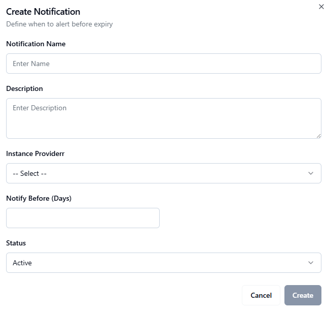

# Managing Notifications

The **Notifications** section allows administrators to configure and monitor system notifications such as alerts, reminders, and scheduled reports.

### Notifications Overview

At the top of the **Notifications** page, administrators can view summary information displayed in cards:

- **Total Notifications** – The total number of notifications configured in the system.
    
- **Active Notifications** – The number of currently active notifications.
    
- **Daily Notifications** – The number of notifications scheduled to run daily.
    

### Search and Filter

Below the summary cards, a **Search and Filter** section allows administrators to:

- Search notifications by name or keyword.
    
- Apply filters such as notification type, status.
    

### Notifications List

The notifications list displays all configured notifications in a table format, typically including:

- **Notification Name**
    
- **Description**
    
- **Instance Provider**
    
- **Status** (Active/Inactive)
    
- **Notify Before (Days)**
    
- **Actions** (e.g. Edit, or Delete)
    

This view helps administrators manage and maintain system-wide notification settings effectively.

## Creating a New Notification

To configure a new notification in CLM, follow these steps:

### 1. Navigate to the Notifications Page

From the sidebar menu, select **Notifications**.

On the top-right corner of the page, click the **Add Notification** button.

### 2. Fill in the Notification Form

A form will open with the following fields:

- **Notification Name** – Enter a unique name for the notification.
    
- **Description** – Provide a short description of the notification.
    
- **Instance Provider (Dropdown)** – Select the instance/provider associated with this notification.
    
- **Notify Before (Days)** – Specify the number of days before the event or expiry when the notification should be triggered.
    
- **Status (Dropdown)** – Choose whether the notification is Active or Inactive.
    

### 3. Save the Notification

After completing the form, click the **Create Notification** button.

### 4. Post-Creation

The new notification will appear in the **Configured Notifications List**.  
Administrators can manage the notification by viewing, editing, disabling, or deleting it as needed.

