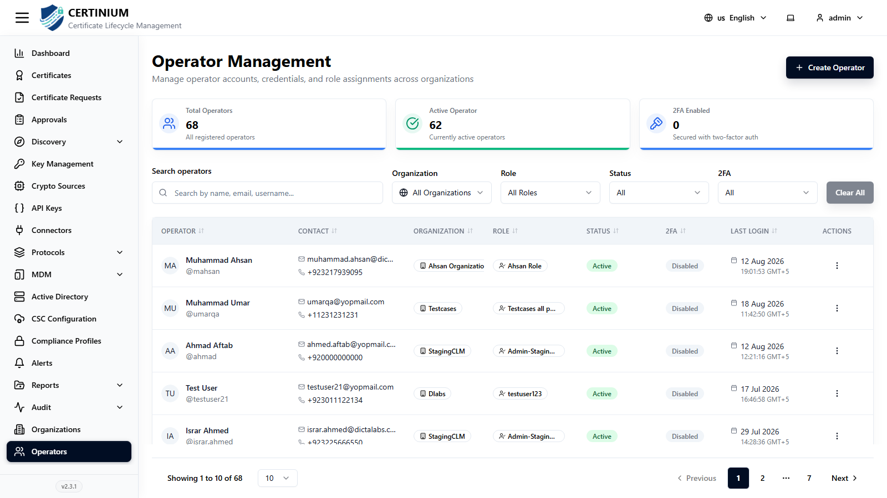
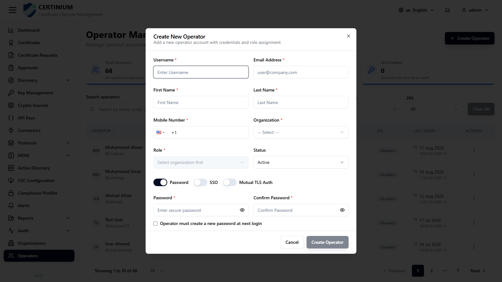
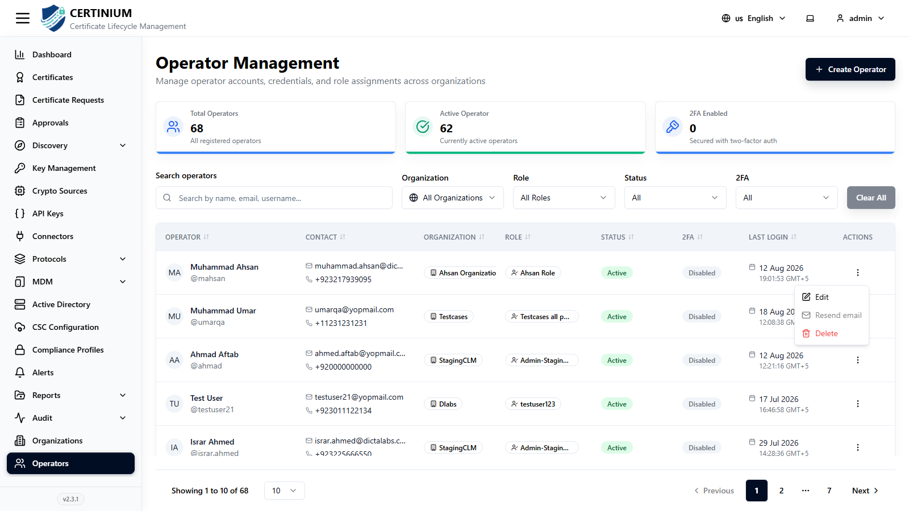

# Operators

**Operators** are the individual user accounts that sign in to CLM — administrators, security team members, and anyone else granted access. Every operator belongs to one organization and is assigned one role.

## Accessing Operators

From the sidebar, select **Operators**.

### Operators overview

Summary cards show:

- **Total Operators**
- **Active Operator** — operators with an active account status.
- **2FA Enabled** — operators who have Two-Factor Authentication turned on.

### Search and filter

- **Search operators** — search by name, email, or username.
- **Organization**, **Role**, **Status**, **2FA** — narrow the list by any combination of these.
- **Clear All** — resets all filters.

### Operators list

| Column | Description |
|---|---|
| Operator | Name and @username. |
| Contact | Email and phone number. |
| Organization | The operator's organization. |
| Role | The operator's assigned role. |
| Status | Active or Inactive. |
| 2FA | Whether Two-Factor Authentication is enabled. |
| Last Login | Timestamp of the operator's last successful login. |
| Actions | See [Row actions](#row-actions) below. |

## Creating a new operator

1. Click **Create Operator** (top right).
2. Fill in the form:

    

    - **Username*** and **Email Address***
    - **First Name*** and **Last Name***
    - **Mobile Number*** — includes a country-code selector.
    - **Organization*** and **Role*** — the Role dropdown is populated based on the selected organization.
    - **Status** — Active or Inactive (defaults to Active).
    - **Authentication method** — choose one:
        - **Password** — set a **Password*** and **Confirm Password*** directly. Optionally check **Operator must create a new password at next login** to force a reset on first sign-in.
        - **SSO** — the operator signs in via your configured single sign-on provider instead of a local password.
        - **Mutual TLS Auth** — the operator authenticates with a client certificate instead of a password.

3. Click **Create Operator** to save.

## Row actions

Click the **⋮** menu on any operator row:

- **Edit** — update the operator's details, role, or organization.
- **Resend email** — resend the account's welcome/setup email (useful if the operator never received or lost it).
- **Delete** — permanently remove the operator account.

## Related: Profile & 2FA

Operators manage their own contact details, password, and Two-Factor Authentication from their **Profile** screen — see [User Profile](user_profile.md). Administrators cannot see another operator's password, and 2FA setup must be completed by the operator themselves (it requires scanning a QR code with their own authenticator app).
