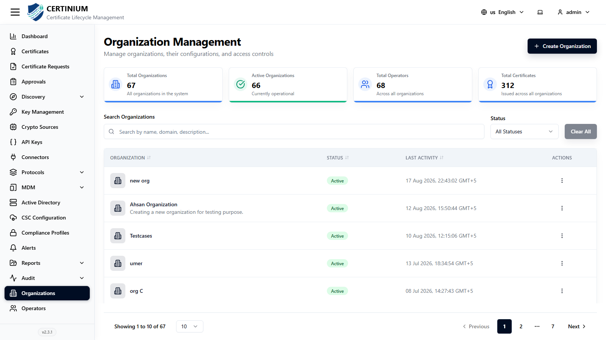
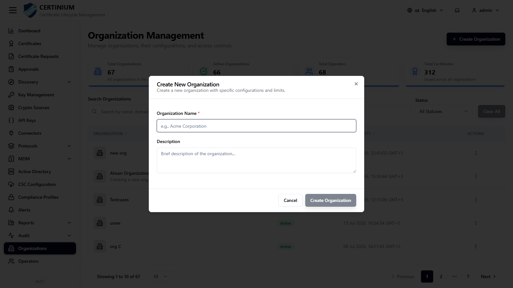

# Organizations

**Organizations** are the top-level tenants in CLM. Every certificate, request, connector, crypto source, key, role, and operator belongs to (or is scoped to) an organization, so this is typically one of the first things a new administrator sets up.

## Accessing Organizations

From the sidebar, select **Organizations**.

### Organizations overview

Summary cards at the top show:

- **Total Organizations** — the count of active organizations.

### Search and filter

- **Search Organizations** — search by name, domain, or description.
- **Status** — filter by organization status (e.g. Active/Inactive).
- **Clear All** — resets all filters.

### Organizations list

The table lists:

| Column | Description |
|---|---|
| Organization | The organization's name. |
| Status | Active or Inactive. |
| Last Activity | Timestamp of the most recent activity recorded for the organization. |
| Actions | Row-level actions (view, edit, delete, depending on your role's permissions). |

## Creating a new organization

1. Click **Create Organization** (top right).
2. Fill in the form:

    

    - **Organization Name*** — required, e.g. "Acme Corporation".
    - **Description** — optional free-text description.

3. Click **Create Organization** to save.

The new organization immediately becomes available in the **Organization** dropdown used throughout the rest of the app — when creating operators, roles, connectors, crypto sources, certificate requests, and more.

!!! tip
    Every operator, role, and most resources in CLM are scoped to a single organization. Plan your organization structure (e.g. by business unit, customer, or environment) before bulk-creating other resources, since moving resources between organizations later generally isn't a simple edit.
