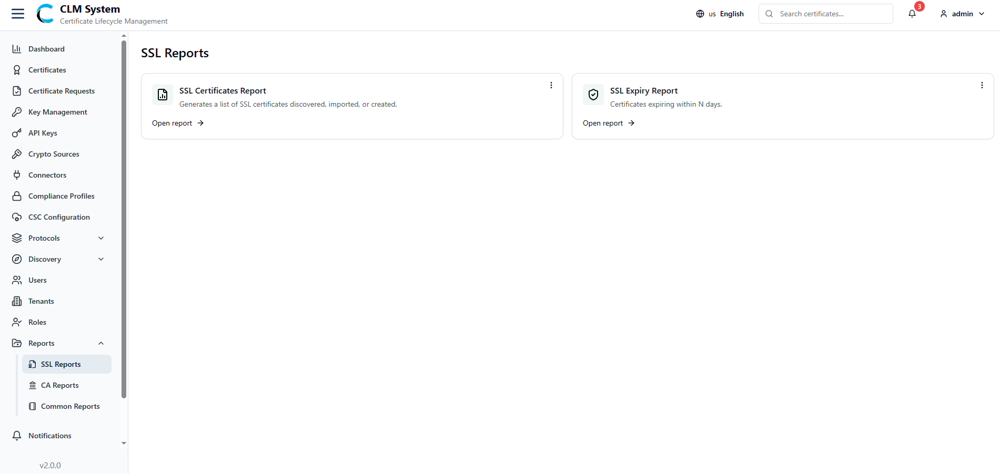
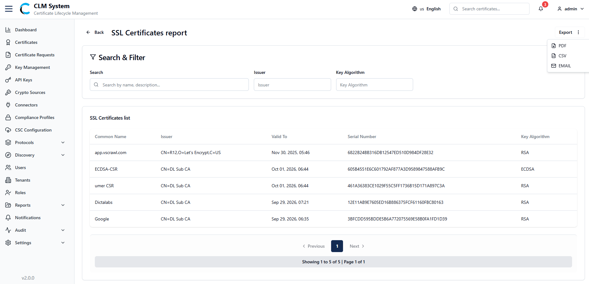
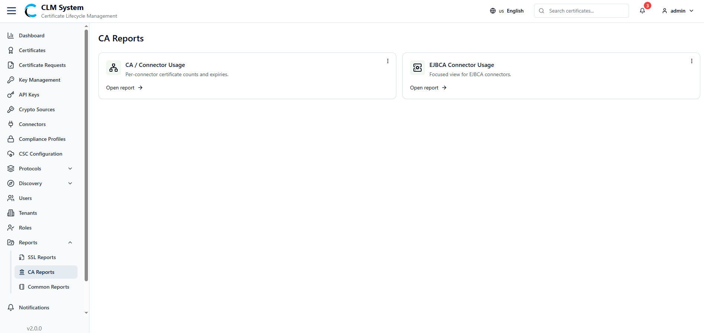
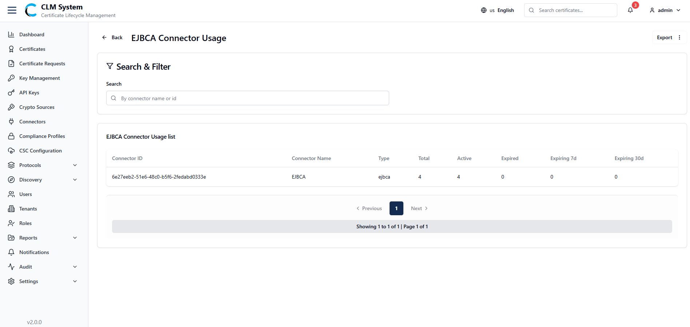

# Managing Reports

The **Reports** section provides administrators with insights into SSL certificates and CA/connector usage. Reports are organized into two main categories: **SSL Reports** and **CA Reports**.

### SSL Reports

Under the **SSL Reports** tab, administrators can access two types of reports:

- **SSL Certificate Report** – Displays detailed information about SSL certificates.
    
- **SSL Expiry Report** – Shows SSL certificates approaching or past their expiry date.

**Accessing Reports**

1. Navigate to **Reports > SSL Reports**.
    
2. Click the **Open Report** button for the desired report type.
    

**SSL Certificate Report Screen**

- A **Search and Filter** section is available to refine SSL certificate data.
    
- The report results are displayed in a list/table below.
    
- From the top-right corner, administrators can export the report in multiple formats:
    
    - **PDF**
        
    - **CSV**
        
    - **Email**

**SSL Expiry Report Screen**

- A **Search and Filter** section is available to refine expiry-related results.
    
- The report results are displayed in a list/table below.
    
- From the top-right corner, administrators can export the report in:
    
    - **PDF**
        
    - **CSV**
        
    - **Email**

### CA Reports

Under the **CA Reports** tab, administrators can access two types of reports:

- **CA / Connector Usage** – Provides usage statistics of CAs and their associated connectors.
    
- **EJBCA Connector Usage** – Displays detailed usage information specific to EJBCA connectors.

**Accessing Reports**

1. Navigate to **Reports > CA Reports**.
    
2. Click the **Open Report** button for the desired report type.

**CA / Connector Usage Screen**

- A **Search and Filter** section is available to refine connector usage data.
    
- The report results are displayed in a list/table below.
    
- From the top-right corner, administrators can export the report in:
    
    - **PDF**
        
    - **CSV**
        
    - **Email**
        

**EJBCA Connector Usage Screen**

- A **Search and Filter** section is available to refine EJBCA usage data.
    
- The report results are displayed in a list/table below.
    
- From the top-right corner, administrators can export the report in:
    
    - **PDF**
        
    - **CSV**
        
    - **Email**

 

