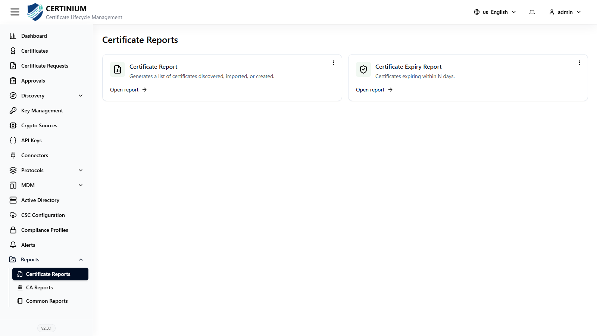
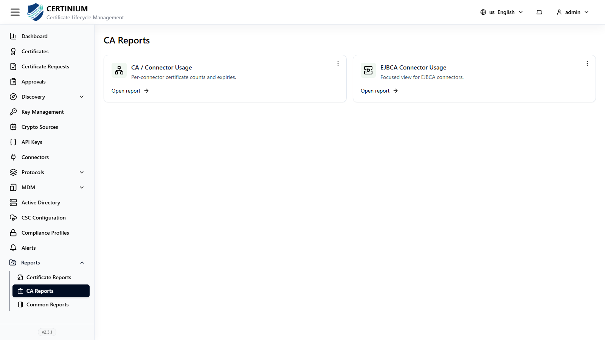
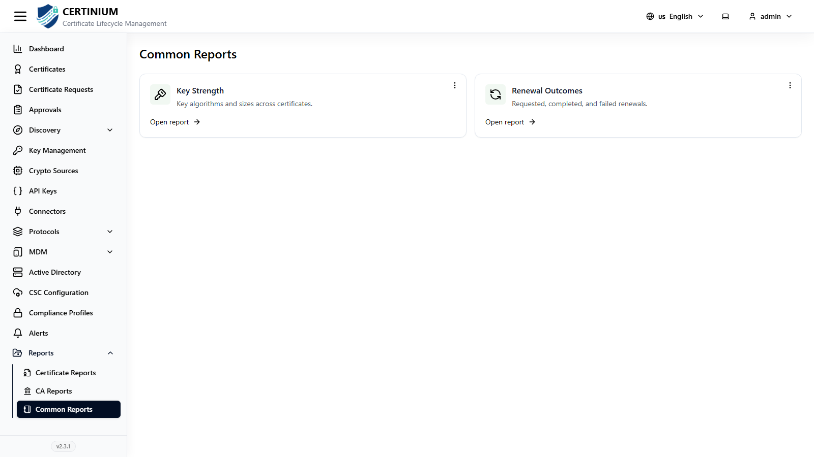
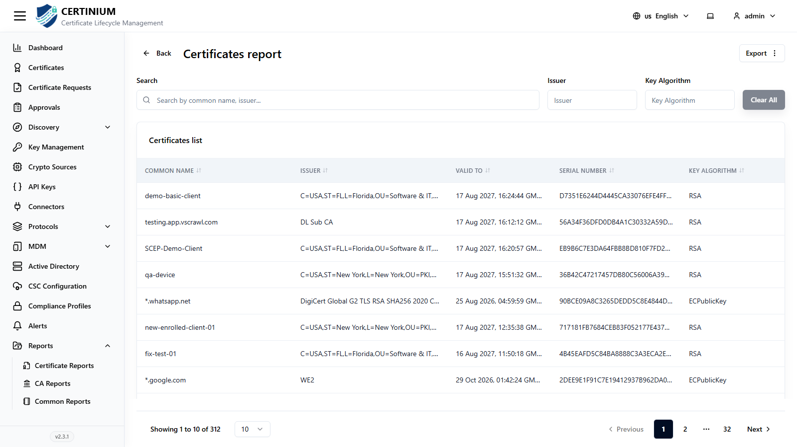

# Reports

**Reports** provides pre-built, filterable reports across your certificate inventory, organized into three categories: **Certificate Reports**, **CA Reports**, and **Common Reports**. Each report is presented as a launcher card — click **Open report** to view it.

## Certificate Reports

From the sidebar, select **Reports → Certificate Reports**.

- **Certificate Report** — generates a list of certificates discovered, imported, or created.
- **Certificate Expiry Report** — certificates expiring within N days.

## CA Reports

From the sidebar, select **Reports → CA Reports**.

- **CA / Connector Usage** — per-connector certificate counts and expiries.
- **EJBCA Connector Usage** — a focused view for EJBCA connectors specifically.

## Common Reports

From the sidebar, select **Reports → Common Reports**.

- **Key Strength** — key algorithms and sizes across certificates.
- **Renewal Outcomes** — requested, completed, and failed renewals.

## Using a report

Click **Open report** on any card to view it:

- Use the **Search** box and report-specific filters (e.g. Issuer, Key Algorithm) to narrow the results.
- Click **Export** (top right) to download the current results, or use the **⋮** menu on a report's launcher card for additional options.
