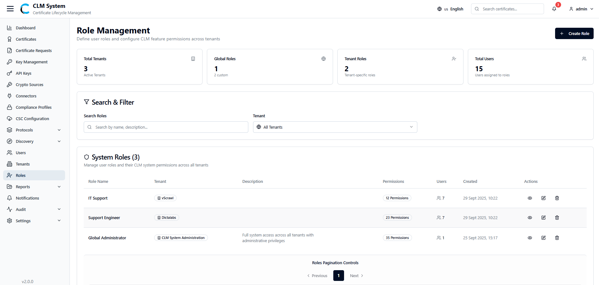
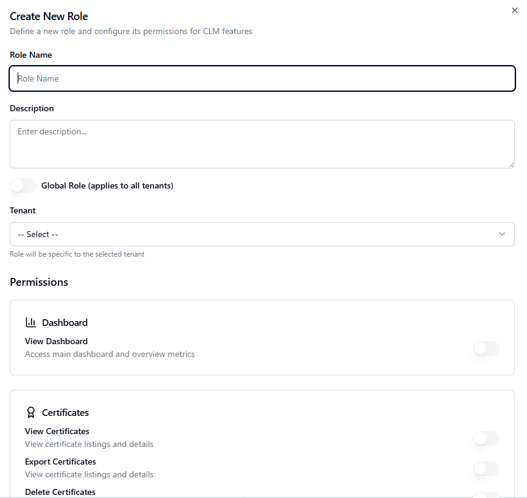

# Managing Roles

Roles in CLM define the level of access and permissions that users have within the system. After creating a tenant, the next recommended step is to configure roles to control user privileges.

## Accessing Roles
1. From the **sidebar menu**, navigate to **Roles**.
    
2. The **Roles page** opens, providing an overview of all roles available in the system.

## Roles Overview
At the top of the page, administrators can view summary information displayed in **cards**:

- **Total Tenants** – The number of tenants configured in the system.
    
- **Global Roles** – Roles that apply across all tenants and are managed at the system level.
    
- **Tenant Roles** – Roles specific to individual tenants.
    
- **Total Users** – The total number of users assigned to roles.
## Search and Filter
Below the summary cards, a **Search and Filter** section allows administrators to:

- Search roles by name or keyword.
    
- Apply filters (e.g., by role type, tenant association, or status).

## Roles List
The **roles list table** provides detailed information about each role, typically including:

- **Role Name**
    
- **Associated Tenant** (if applicable)
    
- **Number of Users Assigned**
    
- **Description**
    
- **Actions** (e.g., View, Edit, Delete)
    

This view helps administrators manage role-based access control across the entire CLM environment.

## Creating a New Role

To define a new role in CLM, follow these steps:

1. **Navigate to the Roles Page**
    
    - From the sidebar, select **Roles**.
        
    - On the **top-right corner** of the page, click the **Create Role** button.

2. **Fill in the Role Form**  
    A form will open with the following fields:
    
    - **Role Name** – Enter a unique name for the role.
        
    - **Description** – Provide a short description of the role’s purpose.
        
    - **Tenant (Dropdown)** – If the role is **tenant-specific**, select the tenant from the dropdown list.
        
    - **Permissions (Toggle List)** – A list of all modules will be displayed (e.g., Certificates, Tenants, Users, Compliance, Protocols).
        
        - Use toggle switches to enable or disable permissions for each module.
            
3. **Save the Role**
    
    - After configuring the details and permissions, click the **Create Role** button.
        
    - The new role will be saved and added to the **Roles List**.
        
4. **Post-Creation**
    
    - Assign users to this role through the **Users Management** section.
        
    - Roles can be edited later to adjust permissions as needed.
