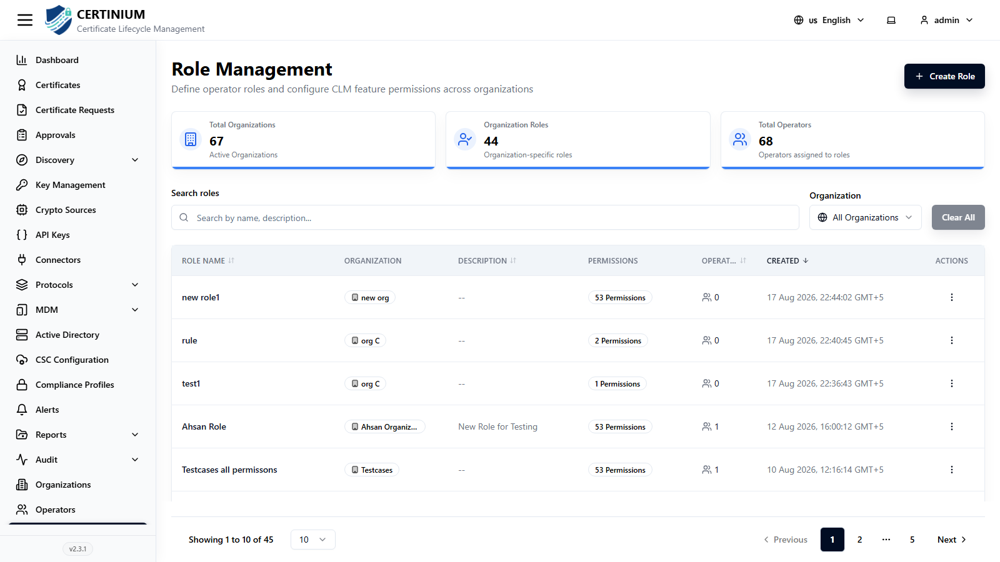
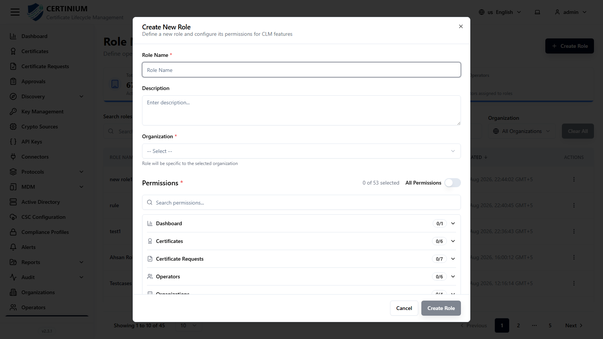

# Roles

**Roles** define what an operator is allowed to see and do in CLM. Every role belongs to a single organization, and every operator is assigned exactly one role.

## Accessing Roles

From the sidebar, select **Roles**.

### Roles overview

Summary cards show:

- **Total Organizations** — organizations that have at least one role defined.
- **Organization Roles** — total number of roles across all organizations.
- **Total Operators** — operators currently assigned to a role.

### Search and filter

- **Search roles** — search by role name or description.
- **Organization** — filter roles by organization.
- **Clear All** — resets all filters.

### Roles list

| Column | Description |
|---|---|
| Role Name | The role's name. |
| Organization | The organization the role belongs to. |
| Description | Optional description. |
| Permissions | Number of permissions granted to this role. |
| Operators | Number of operators currently assigned this role. |
| Created | When the role was created. |
| Actions | View, edit, or delete the role. |

## Creating a new role

1. Click **Create Role** (top right).
2. Fill in the form:

    

    - **Role Name*** — required.
    - **Description** — optional.
    - **Organization*** — required; the role only applies to operators within this organization.
    - **Permissions*** — a searchable, module-by-module permission tree. Each module shows how many of its permissions are currently selected (e.g. `Certificates 0/6`). Use **All Permissions** to grant everything at once, or expand each module to select individual permissions.

### Permission modules

The permission tree is organized by module. As of this version, the modules are:

| Module | Covers |
|---|---|
| Dashboard | Viewing the dashboard |
| Certificates | View, create, modify, delete, export, revoke, renew, issue |
| Certificate Requests | View, create, modify, delete, halt, approve, reject (CSR workflow) |
| Operators | View, create, modify, delete, manage (operator accounts) |
| Organizations | View, create, modify, delete |
| Key Management | View, generate, export, delete, modify (cryptographic keys) |
| Crypto Sources | View, manage |
| Connectors | View, create, modify, delete, share |
| Protocols | View, manage (SCEP/ACME/EST/CMP profiles) |
| Compliance Profiles | View (read), manage (create/edit rules and profiles) |
| CSC Configuration | Governed by the Settings permissions (view/modify) |
| Reports | View/read reports |
| Notifications | View, configure (this covers the **Alerts** feature) |
| Log | View audit/operation logs |
| Discovery | View, modify (run scans, manage discovery tasks) |
| Settings | View, modify |
| Scheduler | View, manage |

Most modules expose separate **view** vs. **create/modify/delete** permissions so you can grant read-only access without granting the ability to change anything — follow least-privilege and only grant what a role actually needs.

3. Click **Create Role** to save.

!!! note "Scope"
    Roles are always created within a specific organization from this screen. The platform's initial administrator account uses a separate, built-in system-level role that isn't created or edited here.
