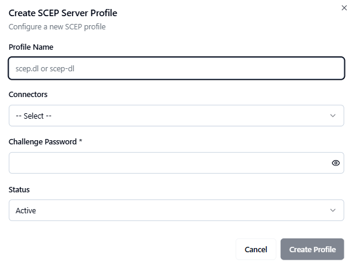

# Managing SCEP Server

## Overview
*(Paste the full SCEP Server Overview from the PDF — describe what SCEP is, how it works in CLM, and its role in automated certificate enrollment for devices and systems.)*

## Accessing SCEP Server
*(Insert the detailed instructions from the PDF for navigating to the SCEP Server module in the CLM Admin Portal.)*

## Search and Filter
*(Paste the content explaining the search and filter options available for SCEP profiles.)*
- Use the search bar to locate specific SCEP profiles by name or associated CA.  
- Filter profiles by status, creation date, or configuration parameters.  

## SCEP Server Profiles List
*(Paste the description of the SCEP profile list view — include table columns and available management actions.)*
- Profile Name  
- Associated CA  
- Authentication Mode  
- Status  
- Actions (View, Edit, Delete)

## Creating a New SCEP Profile
*(Paste the complete step-by-step process for creating a new SCEP profile, converting any numbered steps into bullet points.)*
- Click **Add Profile** or **Create New SCEP Profile**.  
- Enter profile name and select associated issuing CA.  
- Define authentication settings (Challenge Password, RA Mode, etc.).  
- Configure enrollment parameters and validity periods.  
- Save the new profile.  

## Navigate to the SCEP Server Page
*(Paste detailed navigation guidance or screenshots from the PDF if included.)*

## Fill in the SCEP Profile Form
*(Paste the detailed breakdown of the SCEP profile creation form fields.)*
- Profile Name  
- Description  
- Associated CA  
- Challenge Password  
- RA Key or Certificate  
- Validity Period  

## Save the SCEP Profile
*(Include the saving and validation instructions from the PDF.)*
- Review all details.  
- Click **Save** to finalize.  
- The new profile appears in the list view.  

## Post-Creation
*(Paste any content from the PDF about verifying or testing the SCEP profile after creation.)*
- Test enrollment with a sample device or client.  
- Review logs for enrollment activity.  
- Confirm certificate issuance and renewal behavior.  

