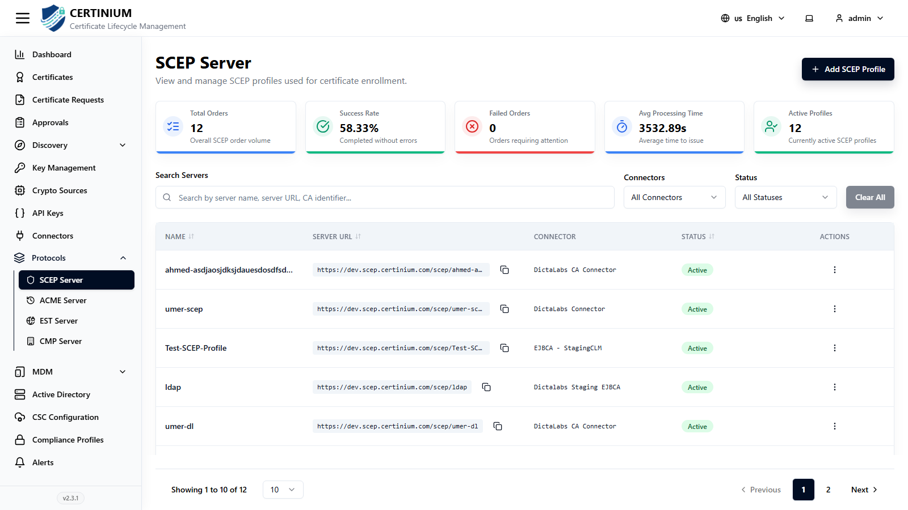
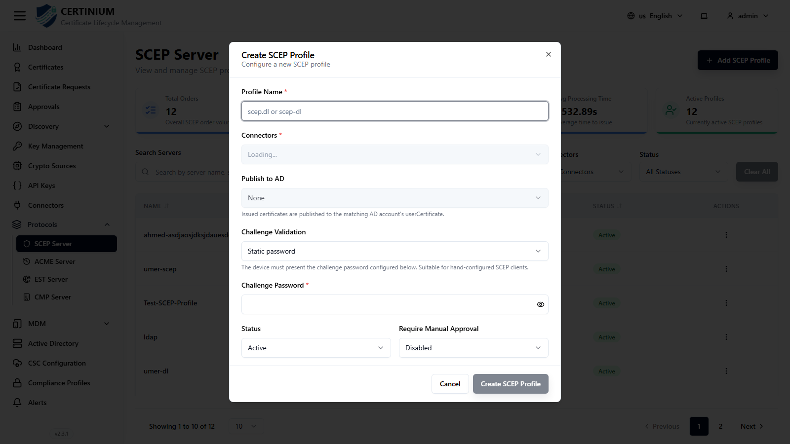

# SCEP Server

**SCEP** (Simple Certificate Enrollment Protocol) profiles let clients and devices enroll for certificates automatically using a shared challenge password.

## Accessing SCEP Server

From the sidebar, select **Protocols → SCEP Server**.

### SCEP Server overview

Summary cards show **Total Orders**, **Success Rate**, **Active Failed Orders**, **Average Processing** time, and **Active Accounts**.

### Search and filter

- **Search** — by name or keyword.
- **Connectors**, **Status** — narrow the list.
- **Clear All** — resets all filters.

### SCEP profiles list

| Column | Description |
|---|---|
| Name | Profile name. |
| Server URL | The SCEP enrollment endpoint clients connect to. |
| Connector | The [connector](connectors.md)/CA backing this profile. |
| Status | Active or Inactive. |
| Actions | View, edit, or delete. |

## Creating a new SCEP profile

1. Click **Add SCEP Profile** (top right).
2. Fill in the form:

    

    - **Profile Name*** — e.g. `scep.dl` or `scep-dl`.
    - **Connectors***
    - **Publish to AD** — optionally publish issued certificates to the matching Active Directory identity (see [Active Directory](active_directory.md)).
    - **Challenge Validation** — `None` or `Static password`. When set to Static password, a **Challenge Password*** field appears — clients must present this shared secret to enroll.
    - **Status** — Active or Inactive.
    - **Require Manual Approval** — route enrollments through [Approvals](approvals.md) before issuance.

3. Click **Create SCEP Profile** to save.
