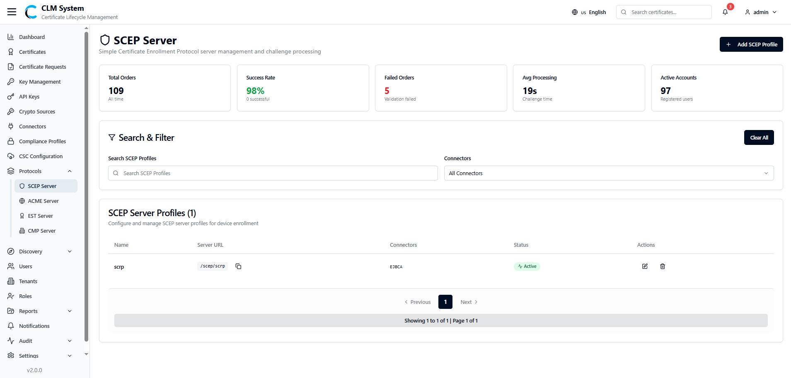

# Managing SCEP Server

The **Simple Certificate Enrollment Protocol (SCEP)** server module in CLM allows administrators to configure and manage SCEP profiles used for certificate enrollment. This includes handling certificate signing requests, challenge validation, and monitoring enrollment activity.

## Accessing SCEP Server

From the sidebar menu, navigate to **Protocols > SCEP Server**.

The **SCEP Server** page opens, displaying an overview of all configured SCEP server profiles.

### SCEP Server Overview

At the top of the page, administrators can view summary information displayed in cards:

- **Total Orders** – The total number of certificate enrollment requests processed.
    
- **Success Rate** – The percentage of successfully completed enrollment requests.
    
- **Active Failed Orders** – The number of failed requests currently marked as active.
    
- **Average Processing** – The average processing time for SCEP enrollment requests.
    
- **Active Accounts** – The number of accounts actively using SCEP.

## Search and Filter

Below the summary cards, a **Search and Filter** section allows administrators to:

- Search SCEP profiles by name or keyword.
    
- Apply filters to refine results (e.g., by status, tenant, connectors).

## SCEP Server Profiles List

The SCEP Server Profiles list table provides detailed information about each profile, typically including:

- **Profile Name**
    
- **Status (Active/Inactive)**
    
- **Associated Tenant**
    
- **Server URL**
    
- **Connectors**
    
- **Actions** (e.g., View, Edit, or Delete)
    

This centralized view enables administrators to efficiently monitor and manage SCEP enrollment across the CLM system.

## Creating a New SCEP Profile

To add a new SCEP profile in CLM:

### 1. Navigate to the SCEP Server Page

From the sidebar, select **Protocols > SCEP Server**.

On the top-right corner of the page, click the **Add SCEP Profile** button.

### 2. Fill in the SCEP Profile Form

A form will appear with the following fields:

- **Profile Name** – Enter a unique name for the SCEP profile.
    
- **Connectors (Dropdown)** – Select the connector associated with this profile.
    
- **Challenge Password** – Specify the challenge password to secure certificate enrollment requests.
    
- **Status (Dropdown)** – Set the profile status (Active/Inactive).
    

### 3. Save the SCEP Profile

After completing the form, click the **Create Profile** button.

The profile will be created and added to the SCEP Server Profiles list.

### 4. Post-Creation

The new SCEP profile will appear in the list with its details.

