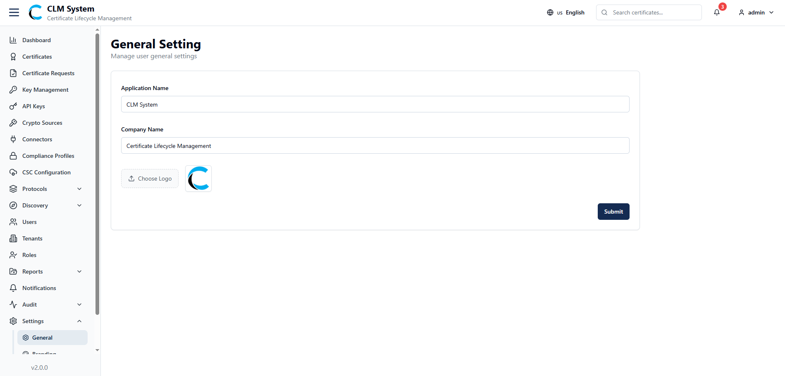
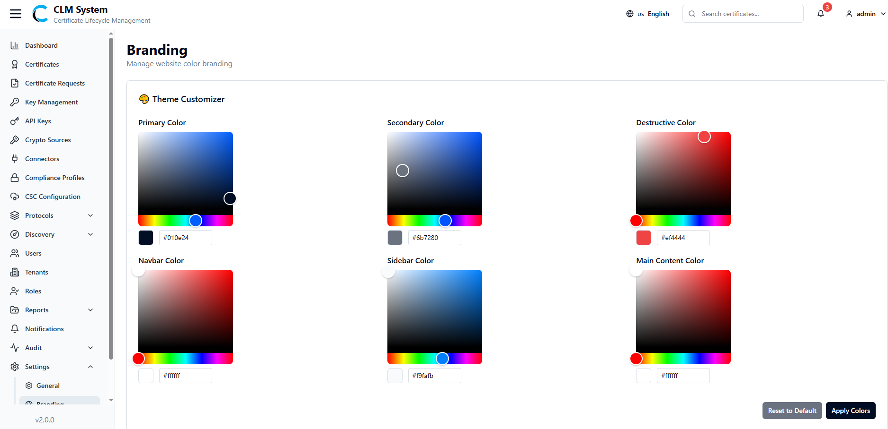

# Settings

The **Settings** section allows administrators to configure system-wide preferences, including general application details, branding options, and scheduling configurations.

### General Settings

From the sidebar, navigate to **Settings > General Settings**.

The **General Settings** page allows administrators to configure core application details:

- **Application Name** – The name of the application (displayed on the admin web).
    
- **Company Name** – The organization name (displayed on the admin web).
    
- **Logo** – Upload a company or application logo to be displayed in the admin web interface.
    

### Branding Settings

From the sidebar, navigate to **Settings > Branding**.

The **Branding** page allows administrators to customize the visual identity of the admin web:

- **Primary Color** – The main color applied to buttons and highlights.
    
- **Secondary Color** – The supporting color used for secondary actions.
    
- **Destructive Color** – A color used for failed states or critical actions (e.g., revoke, delete).
    
- **Navigation Bar Color** – The color theme applied to the navigation bar.
    
- **Sidebar Color** – The background color of the sidebar.
    
- **Main Content Color** – The background color of the main content area.
    

These settings allow organizations to align the CLM system with their brand identity.

