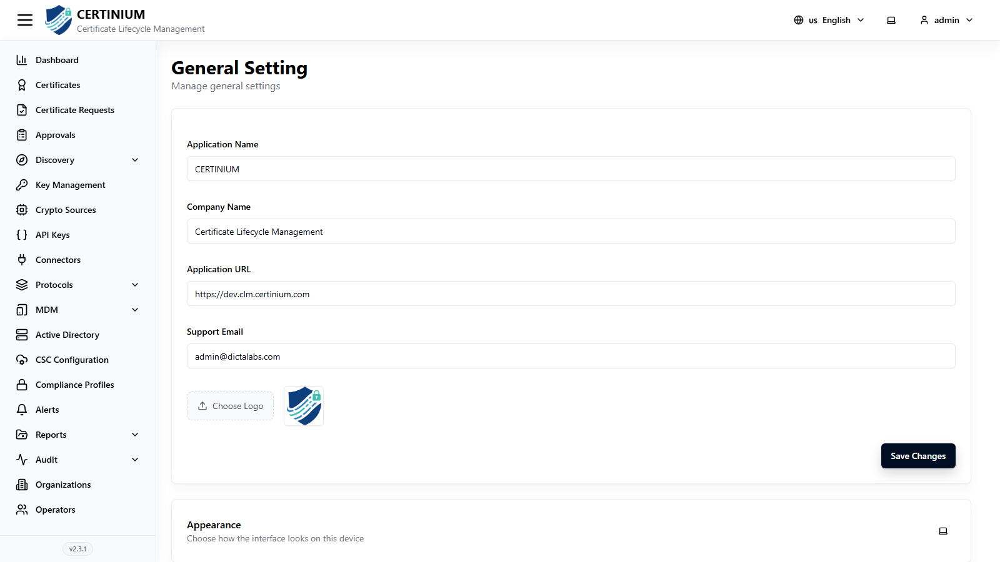
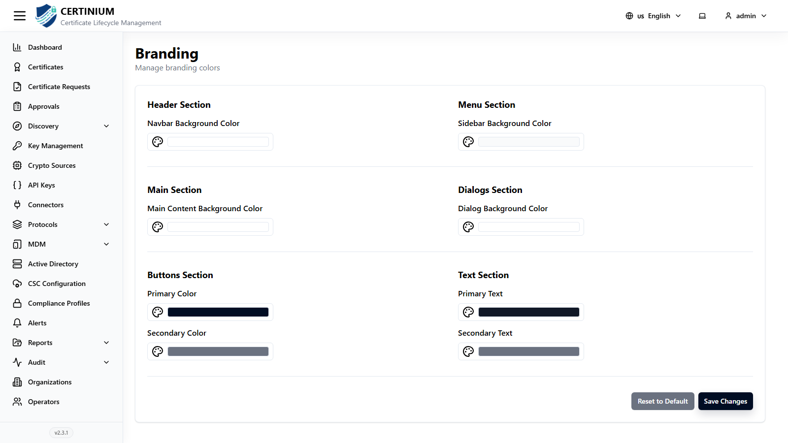
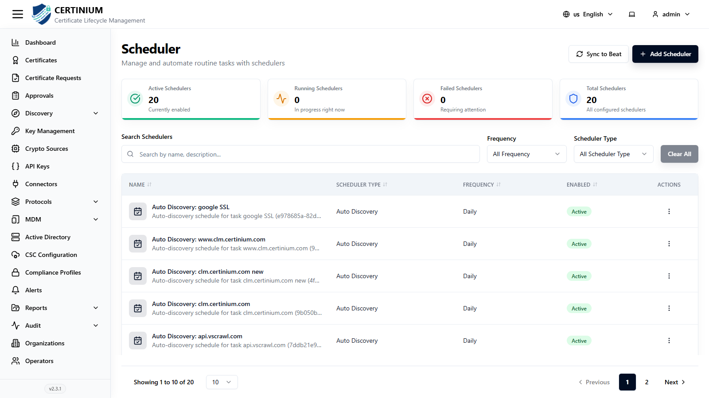
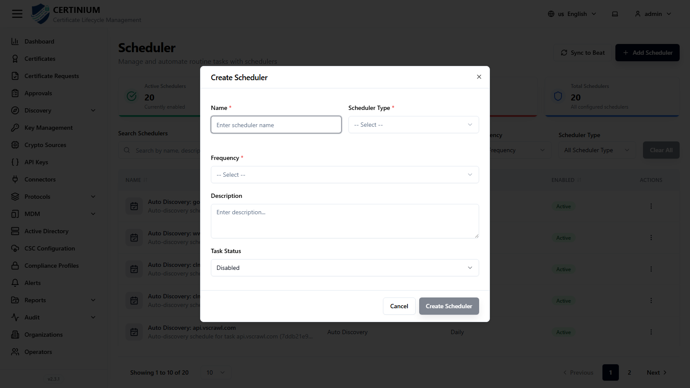

# Settings

**Settings** covers system-wide configuration: general application details, UI branding, and scheduled/automated tasks.

## General

From the sidebar, select **Settings → General**.

- **Application Name**, **Company Name**
- **Application URL** — the public URL of your CLM instance.
- **Support Email**
- **Choose Logo** — upload a logo file.

Click **Save Changes** to apply.

## Branding

From the sidebar, select **Settings → Branding**.

Branding is organized into six sections, each with one or more color pickers:

| Section | Field(s) |
|---|---|
| Header Section | Navbar Background Color |
| Menu Section | Sidebar Background Color |
| Main Section | Main Content Background Color |
| Dialogs Section | Dialog Background Color |
| Buttons Section | Primary Color, Secondary Color |
| Text Section | Primary Text, Secondary Text |

Click **Save Changes** to apply, or **Reset to Default** to discard your customizations.

## Scheduler

**Scheduler** manages and automates routine tasks — most commonly, the recurring runs created when you enable **Auto Discovery** on a [Discovery](discovery.md) task.

From the sidebar, select **Settings → Scheduler**.

Summary cards show **Active Schedulers**, **Running Schedulers**, **Failed Schedulers**, and **Total Schedulers**.

### Search and filter

- **Search Schedulers** — by name or description.
- **Frequency**, **Scheduler Type** — narrow the list.
- **Clear All** — resets all filters.

### Schedulers list

| Column | Description |
|---|---|
| Name | Scheduler name — auto-discovery schedulers are named `Auto Discovery: <task name>`. |
| Scheduler Type | e.g. `Auto Discovery`. |
| Frequency | e.g. `Daily`. |
| Enabled | Active or Inactive. |
| Actions | Row-level actions. |

Use **Sync to Beat** (top right) to push the current scheduler configuration to the background task runner.

### Adding a scheduler

1. Click **Add Scheduler** (top right).
2. Fill in the form:

    

    - **Name***
    - **Scheduler Type***
    - **Frequency***
    - **Description**
    - **Task Status** — enabled or disabled.

3. Click **Create Scheduler** to save.

!!! tip
    In practice, most schedulers you'll see here are created automatically when an administrator enables **Auto Discovery** on a scan in [Discovery](discovery.md), rather than being hand-built from this screen.
