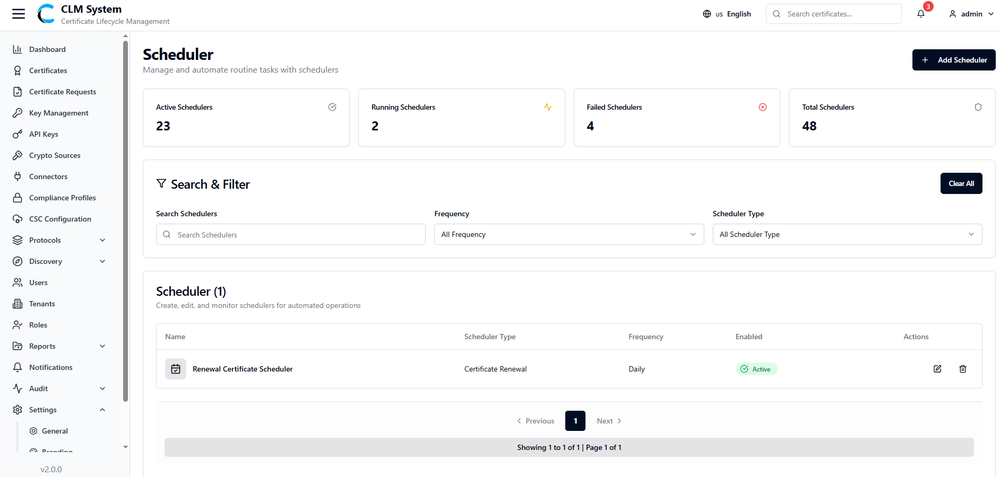
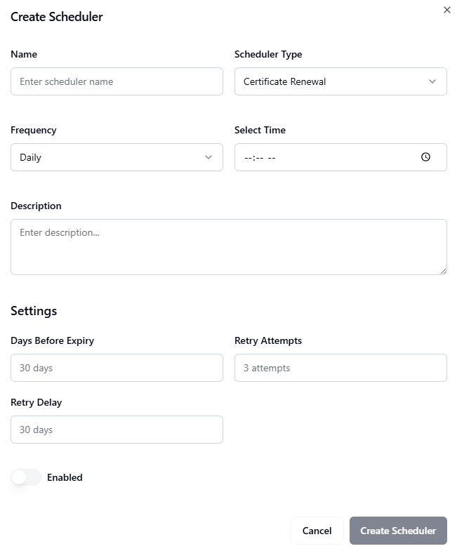

# Settings

The **Settings** section allows administrators to configure system-wide preferences, including general application details, branding options, and scheduling configurations.

## General Settings

From the sidebar, navigate to **Settings > General Settings**.

The **General Settings** page allows administrators to configure core application details:

- **Application Name** – The name of the application (displayed on the admin web).
    
- **Company Name** – The organization name (displayed on the admin web).
    
- **Logo** – Upload a company or application logo to be displayed in the admin web interface.
    

## Branding Settings

From the sidebar, navigate to **Settings > Branding**.

The **Branding** page allows administrators to customize the visual identity of the admin web:

- **Primary Color** – The main color applied to buttons and highlights.
    
- **Secondary Color** – The supporting color used for secondary actions.
    
- **Destructive Color** – A color used for failed states or critical actions (e.g., revoke, delete).
    
- **Navigation Bar Color** – The color theme applied to the navigation bar.
    
- **Sidebar Color** – The background color of the sidebar.
    
- **Main Content Color** – The background color of the main content area.
    

These settings allow organizations to align the CLM system with their brand identity.

View and manage scheduled tasks that automate operations such as notifications, certificate checks, and compliance validations.

## Schedulers

View and manage scheduled tasks that automate operations such as notifications, certificate checks, and compliance validations.
### Accessing Schedulers

From the sidebar menu, navigate to **Settings > Scheduler**.

The **Schedulers** page opens, showing an overview of all configured schedulers in the system.

### Schedulers Overview

At the top of the page, administrators can view summary information displayed in cards:

- **Active Schedulers** – The number of schedulers currently active.
    
- **Running Schedulers** – The number of schedulers that are in execution.
    
- **Failed Schedulers** – The number of schedulers that encountered errors.
    
- **Total Schedulers** – The total number of schedulers configured.

### Search and Filter

Below the summary cards, a **Search and Filter** section allows administrators to:

- Search schedulers by name, type, or status.
    
- Apply filters to refine results (e.g., by Frequency, or Scheduler Type).

### Schedulers List

The schedulers list table provides detailed information about each scheduler, typically including:

- **Scheduler Name**
    
- **Type** (e.g., Notifications, Certificate Expiry, Compliance Checks)
    
- **Status** (Active / Inactive)
    
- **Last Run** (timestamp of last execution)
    
- **Next Run** (upcoming scheduled execution time)
    
- **Actions** (Edit, Delete)
    

This view helps administrators track and manage automated operations efficiently across the CLM system.

### Creating a New Scheduler

To add a new scheduler in CLM:

#### 1. Navigate to the Schedulers Page

From the sidebar, go to **Settings > Scheduler**.

On the top-right corner of the page, click the **Create Scheduler** button.

#### 2. Fill in the Scheduler Form

A form will appear with the following fields:

##### **Basic Information**

- **Name** – Enter a unique name for the scheduler.
    
- **Scheduler Type (Dropdown)** – Select the type of scheduler:
    
    - **Certificate Renewal**
        
    - **Log Archiver**
        
    - **Compliance Check**
        
- **Frequency (Dropdown)** – Choose how often the scheduler should run:
    
    - Every Hour
        
    - Daily
        
    - Weekly
        
    - Monthly

##### Type-Specific Settings

- **If Certificate Renewal is selected:**
    
    - **Days Before Expiry** – Define how many days before expiry renewal should start.
        
    - **Retry Attempts** – Set the maximum number of retry attempts.
        
    - **Retry Delay** – Define the delay between retry attempts.
        
- **If Log Archiver is selected:**
    
    - **Retention Period** – Specify the duration (in days) to retain archived logs.
        
    - **Include Debug Logs (Toggle)** – Enable if debug logs should be included.
        
    - **Compress Archives (Toggle)** – Enable to compress archived files for storage optimization.
        
- **Enable (Toggle)** – Toggle button to enable or disable the scheduler.

#### 3. Save the Scheduler

After filling in the form, click the **Create Scheduler** button.

The scheduler will be saved and added to the schedulers list.

#### 4. Post-Creation

The new scheduler will appear in the **Schedulers List Table** with its configured details.

Admins can edit, enable/disable, or delete the scheduler as needed.

