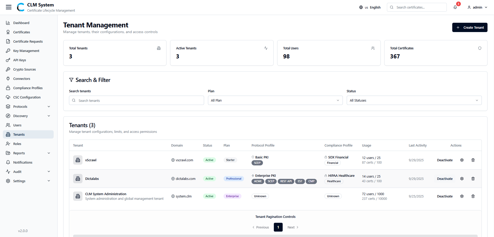
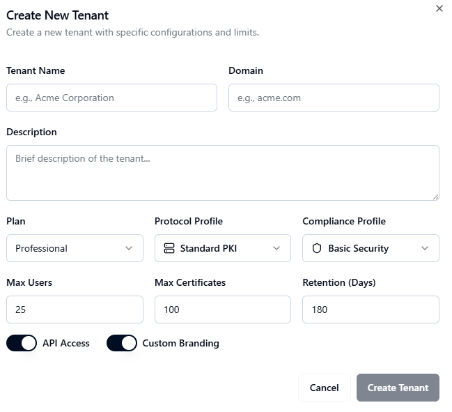

# Managing Tenants

After logging in to CLM with the **default operator account** for the first time, it is strongly recommended to create a new **Tenant**, along with appropriate **Roles** and **Users**, before starting certificate operations.

## Accessing Tenants
1. From the **sidebar menu**, navigate to **Tenants**.
    
2. The **Tenants page** opens, showing an overview of all tenants in the system.

## Tenants Overview

At the top of the page, administrators can view summary information displayed in **cards**:

- **Total Tenants** – The total number of tenants created in the system.
    
- **Active Tenants** – The number of tenants currently active.
    
- **Total Users** – The total number of users associated with all tenants.
    
- **Total Certificates** – The total number of certificates issued under all tenants.
## Search and Filter
Below the summary cards, a **Search and Filter** section allows administrators to:

- Search tenants by name or keyword.
    
- Apply filters to refine results (e.g., by active status, creation date, or Plan).

## Tenants List
The **tenant list table** provides detailed information about each tenant, typically including:

- Tenant Name
    
- Domain
    
- Status (Active/Inactive)
    
- Number of Users
    
- Number of Certificates
    
- Compliance Profile
    
- Actions (e.g., View, Deactivate, or Delete)
    

This view helps administrators manage multiple tenants efficiently.

## Creating a New Tenant
To add a new tenant in CLM:

1. **Navigate to the Tenants Page**
    
    - From the sidebar, select **Tenants**.
        
    - On the **top-right corner** of the page, click the **Create Tenant** button.

2. **Fill in the Tenant Form**  
    A form will appear with the following fields:
    
    - **Tenant Name** – Enter a unique name for the tenant.
        
    - **Domain** – Specify the tenant’s domain name (e.g., `tenantname.company.com`).
        
    - **Description** – Provide a brief description of the tenant.
        
    - **API Access (Toggle)** – Enable or disable API access for this tenant.
        
3. **Save the Tenant**
    
    - After completing the form, click the **Create Tenant** button.
        
    - The tenant will be created and added to the tenant list.
        
4. **Post-Creation**
    
    - The new tenant will appear in the **Tenants List Table** with its details.
