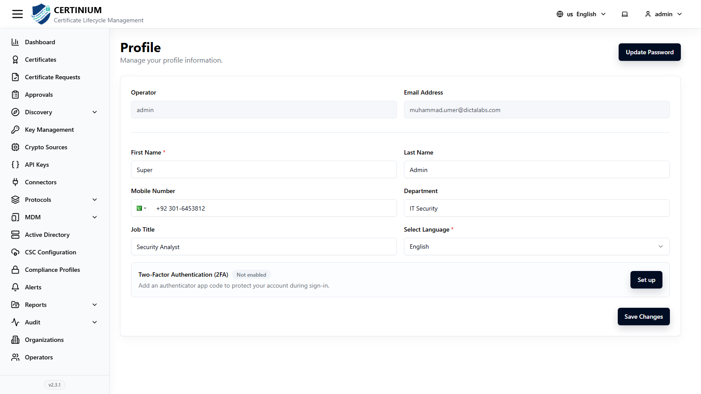

# User Profile

Every operator manages their own contact details, language, password, and Two-Factor Authentication from their **Profile** screen.

## Accessing your profile

Click the **account menu** (top right, showing your username) and select **Profile**.

## Basic information

- **Operator** — your username (read-only).
- **Email Address** — your registered email (read-only).
- **First Name*** and **Last Name**
- **Mobile Number** — includes a country-code selector.
- **Department**, **Job Title**
- **Select Language*** — your preferred interface language.

Click **Save Changes** to apply any edits.

## Two-Factor Authentication (2FA)

The 2FA card shows whether it's currently **Not enabled** or **Enabled**.

1. Click **Set up**.
2. A dialog opens: *"Connect an authenticator app to generate secure sign-in codes."* Scan the displayed QR code with an authenticator app (e.g. Google Authenticator or Microsoft Authenticator).
3. Enter the 6-digit verification code the app generates.
4. Click **Continue** to confirm and enable 2FA.

Once enabled, you'll be prompted for a 6-digit code after your password on every future login (see [Login](index.md#login)).

## Updating your password

1. Click **Update Password** (top right of the Profile screen).
2. Fill in the form:
    - **Current Password***
    - **New Password***
    - **Confirm New Password***
3. Click **Update** to save.

!!! note
    Operators whose account uses SSO or Mutual TLS authentication (see [Operators](operators.md)) don't have a local password to update here.
