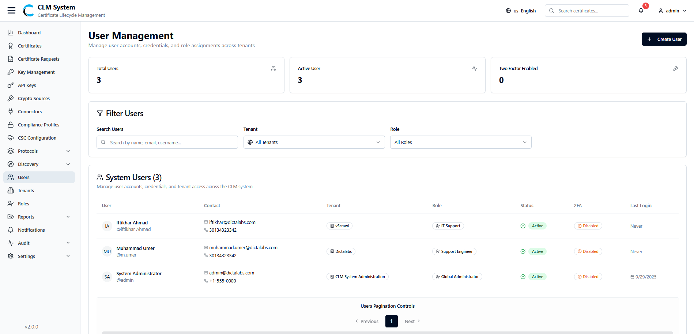
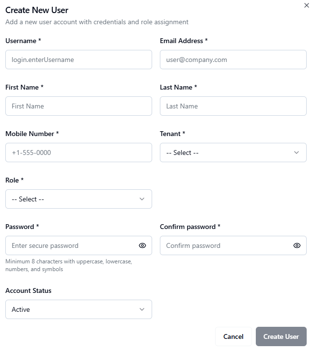

# Managing Users

Users in CLM represent the individual accounts that can log in and perform actions within the system. Each user is assigned to one or more roles, which define their permissions and access levels.

## Accessing Users
1. From the **sidebar menu**, navigate to **Users**.
    
2. The **Users page** opens, displaying an overview of all users in the system.

## Users Overview
At the top of the page, administrators can view summary information displayed in **cards**:

- **Total Users** – The total number of user accounts created.
    
- **Active Users** – The number of users currently active.
    
- **Two-Factor Enabled** – The number of users with two-factor authentication (2FA) enabled.

## Search and Filter
Below the summary cards, the **Search and Filter** section allows administrators to:

- Search users by name, email, or username.
    
- Apply filters (e.g., by tenant, role, status, or 2FA enabled/disabled). 

## Users List
The **users list table** provides detailed information about each user, typically including:

- **Username / Email**
    
- **Associated Tenant**
    
- **Assigned Role(s)**
    
- **Status** (Active / Inactive)
    
- **2FA Status** (Enabled / Disabled)
    
- **Last Login**
    
- **Actions** (e.g., Edit, Disable, Delete)
    

This section enables administrators to efficiently manage the system’s user base and enforce security policies.

## Creating a New User
To add a new user in CLM:

1. **Navigate to the Users Page**
    
    - From the sidebar, select **Users**.
        
    - On the **top-right corner** of the page, click the **Create User** button.  

2. **Fill in the User Form**  
    A form will appear with the following fields:
    
    - **Username** – Enter a unique username for the user.
        
    - **Email Address** – Provide the user’s email address (used for login and notifications).
        
    - **First Name / Last Name** – Enter the user’s personal details.
        
    - **Mobile Number** – Add the user’s contact number (may be used for MFA).
        
    - **Tenant (Dropdown)** – Select the tenant the user will belong to.
        
    - **Role (Dropdown)** – Assign one or more roles to the user to define their access rights.
        
    - **Password** – Set an initial password for the user.
        
    - **Confirm Password** – Re-enter the password to confirm.
        
    - **Account Status (Dropdown)** – Choose whether the account is **Active** or **Inactive**.
        
3. **Save the User**
    
    - After completing the form, click the **Create User** button.
        
    - The new user will be saved and appear in the **Users List**.
        
4. **Post-Creation**
    
    - The user can log in using their **username/email and password**.